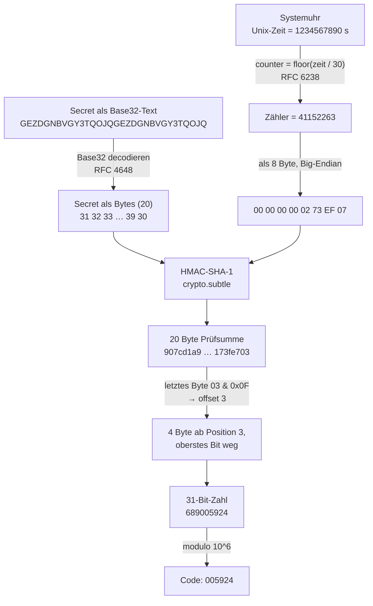

# Clockwork

**TOTP Authenticator.** Erzeugt Zwei-Faktor-Codes vollständig im Browser. Der
Algorithmus ist von Hand implementiert (RFC 4226 und RFC 6238) — es wird **keine
fertige OTP-Bibliothek** benutzt. Die einzige geliehene Krypto-Primitive ist HMAC
aus der Web Crypto API.

```
  CL◍CKW◯RK          TOTP AUTHENTICATOR · RFC 6238        ● OFFLINE

  CODES        ╱⁻⁻╲     GitHub                        SHA-1 · 6 STELLEN · 30 S
              │  ·│▏    983 593                            [ KOPIEREN ]
               ╲__╱     FOLGT 125 051
                23s
```

---

## Schnellstart

```bash
npm install      # einmalig
npm run dev      # Dev-Server, danach http://localhost:5173 öffnen
npm test         # 203 Tests
npm run build    # dist/ (PWA) + dist/clockwork.html (eine Datei)
```

Weitere Skripte: `npm run typecheck`, `npm run lint`, `npm run format`,
`npm run preview`, `npm run test:watch`, `npm run shots` (Screenshots über
Playwright).

**Zum Ausprobieren** — der Testschlüssel aus RFC 4226 (das ist Base32 für den
Text `12345678901234567890`):

```
GEZDGNBVGY3TQOJQGEZDGNBVGY3TQOJQ
```

Der Knopf **Demo einsetzen** fügt ihn zusammen mit einer Beispiel-`otpauth://`-URI
direkt ein.

### Zwei Build-Ziele

| Ziel                  | Was es ist                                                           |
| --------------------- | -------------------------------------------------------------------- |
| `dist/`               | Installierbare PWA: Manifest, Service Worker, Icons, offline nutzbar |
| `dist/clockwork.html` | **Eine einzige Datei**, ~256 kB, alles inline — auch die Schriften   |

`dist/clockwork.html` ist die Datei für den täglichen Gebrauch: irgendwohin
kopieren, doppelklicken, fertig. Kein Server, keine Internetverbindung. Sie hat
bewusst **keinen** Service Worker — eine einzelne Datei braucht keinen Cache, und
ohne Worker gilt dort die schärfere Sicherheitsrichtlinie mit `connect-src 'none'`.

### Eingabeformate

| Eingabe                              | Beispiel                             |
| ------------------------------------ | ------------------------------------ |
| Rohes Base32                         | `JBSWY3DPEHPK3PXP`                   |
| … mit Leerzeichen, klein geschrieben | `jbsw y3dp ehpk 3pxp`                |
| Mit selbst vergebenem Namen          | `GitHub: JBSWY3DPEHPK3PXP`           |
| Vollständige URI aus dem QR-Code     | `otpauth://totp/ACME:kevin?secret=…` |
| Google-Authenticator-Sammelexport    | `otpauth-migration://offline?data=…` |
| Notiz                                | `# eigene Anmerkung`                 |

Alles gemischt in einem Textfeld, ein Eintrag pro Zeile.

`Name: SECRET` ist kein Standard, sondern eine Zutat dieser App — ohne sie wären
alle Konten namenlos. Verwechslungsgefahr gibt es keine: Ein Doppelpunkt kommt in
Base32 nie vor.

### QR-Codes einlesen

Vier Wege, weil keiner davon überall funktioniert:

- **QR aus Bild** — funktioniert immer, auch bei einer per Doppelklick geöffneten
  Datei. Deshalb steht dieser Knopf zuerst.
- **Kamera** — braucht einen sicheren Kontext und eine Erlaubnis. Bei `file://`
  sperren die meisten Browser sie; Clockwork sagt das dann, statt einen leeren
  Sucher zu zeigen.
- **Ziehen** — Screenshot ins Fenster ziehen.
- **Einfügen** — Screenshot mit <kbd>Strg</kbd>+<kbd>V</kbd>.

Decodiert wird mit dem eingebauten `BarcodeDetector`, wo es ihn gibt, sonst mit
dem mitgelieferten [jsQR](https://github.com/cozmo/jsQR). Eine QR-Bibliothek ist
Bildverarbeitung, keine Kryptografie: Sie sieht Pixel und liefert Text zurück —
die OTP-Berechnung bleibt vollständig die eigene.

---

## Wie TOTP funktioniert

### Die Idee in einem Absatz

Beim Einrichten einigen sich Server und App auf ein gemeinsames Geheimnis (das
`secret`, meist per QR-Code übertragen). Danach rechnen beide unabhängig
voneinander alle 30 Sekunden aus demselben Geheimnis und derselben Uhrzeit
dieselben sechs Ziffern aus. Wer die richtigen sechs Ziffern nennt, muss das
Geheimnis kennen — ohne es je über die Leitung zu schicken. Es gibt keine
Kommunikation zwischen App und Server, nur zwei Uhren und eine Rechenvorschrift.

### Der Weg vom Secret zum Code

Alle Zahlen im folgenden Diagramm gehören zusammen und stammen aus einem echten
Testvektor (RFC 6238 Anhang B, Zeitpunkt 1234567890). Du kannst sie nachrechnen —
`npm test` prüft genau diesen Fall.



### Die vier Schritte im Detail

**1 — Base32 decodieren** (`src/lib/base32.ts`)

Das Secret ist eigentlich eine Folge roher Bytes. Damit man es abtippen und in
einen QR-Code packen kann, wird es als Text codiert — mit einem Alphabet aus nur
32 Zeichen (`A–Z` und `2–7`), von dem jedes genau 5 Bit trägt. Die Ziffern `0`,
`1` und `8` fehlen absichtlich, weil man sie mit `O`, `I` und `B` verwechselt.
Byte- und Zeichengrenzen treffen sich erst bei 40 Bit: 5 Byte = 8 Zeichen.

**2 — Die Uhrzeit wird zum Zähler** (`src/lib/totp.ts`)

Das ist die einzige Zeile, die TOTP von seinem Vorgänger HOTP unterscheidet:

```ts
counter = Math.floor(unixSeconds / period); // period = 30
```

Der Zähler erhöht sich alle 30 Sekunden um 1 — bei allen Beteiligten
gleichzeitig, ohne dass irgendetwas synchronisiert werden müsste. Wichtig: Der
Wechsel passiert an _absoluten_ Grenzen der Unix-Zeit (bei :00 und :30 jeder
Minute), nicht 30 Sekunden nachdem man die Seite geöffnet hat. Deshalb ist die
erste angezeigte Restzeit meistens kürzer als 30 Sekunden.

**3 — HMAC** (`src/lib/hotp.ts`)

```
prüfsumme = HMAC-SHA-1(secret, zählerBytes)      → 20 Byte
```

Warum HMAC und nicht einfach `SHA-1(secret ‖ counter)`? Weil ein simples
Hash-über-alles bei SHA-1 anfällig für **Length-Extension-Angriffe** ist: Wer
`H(secret ‖ x)` kennt, kann daraus `H(secret ‖ x ‖ y)` berechnen, ohne das Secret
zu kennen. HMAC hasht deshalb zweimal mit zwei aus dem Secret abgeleiteten
Padding-Blöcken und schließt diese Angriffsklasse aus.

**4 — Dynamic Truncation** (`src/lib/hotp.ts`)

Aus 20 Byte müssen 6 Ziffern werden. Man könnte die ersten 4 Byte nehmen — aber
dann läge die verwendete Stelle für immer fest. Stattdessen bestimmt die
Prüfsumme selbst, welche 4 Byte gelten:

```ts
const offset = letztesByte & 0x0f; // 0…15
const zahl = vierByteAb(offset) & 0x7fffffff; // Big-Endian, oberstes Bit weg
const code = String(zahl % 10 ** 6).padStart(6, '0');
```

Das ausmaskierte oberste Bit hat einen sehr praktischen Grund: 1998 gab es weit
verbreitete Sprachen ohne vorzeichenlose 32-Bit-Zahlen (Java). Wäre das oberste
Bit gesetzt, läse die eine Implementierung eine negative Zahl und die andere eine
positive — und `modulo` lieferte unterschiedliche Codes.

Das abschließende `padStart` ist kein Schönheitsfehler: Führende Nullen gehören
zum Code. Aus `42` wird `000042`.

---

## Der Tresor

Standardmäßig speichert Clockwork **nichts**. Tab zu, Secret weg. Das ist die
einfachste denkbare Sicherheitsaussage und deshalb die Voreinstellung.

Wer sie aufgibt, bekommt dafür etwas, das ohne Passphrase wertlos ist
(`src/lib/vault.ts`):

```
Passphrase ──► PBKDF2-SHA-256, 600 000 Iterationen, 16 Byte Salt ──► 256-Bit-Schlüssel
                                                                            │
Secrets ─────────────────────────────────────► AES-256-GCM, 12 Byte IV ◄────┘
                                                        │
                                          { v, kdf, iterations, salt, iv, data }
                                                        │
                                                  localStorage
```

**Was gespeichert wird:** ausschließlich dieser Umschlag. Kein Klartext, keine
Passphrase, kein abgeleiteter Schlüssel. Beides existiert nur im Arbeitsspeicher
und nur, solange der Tresor offen ist.

**Warum so viele Iterationen?** Eine Passphrase hat viel weniger Entropie als ein
256-Bit-Schlüssel. Wer den Umschlag in die Hände bekommt, kann offline beliebig
viele Passphrasen durchprobieren — dagegen hilft nur, jeden Versuch teuer zu
machen. 600 000 Iterationen sind die aktuelle OWASP-Empfehlung für
PBKDF2-SHA-256. Auf diesem Rechner gemessen: **77 ms** pro Ableitung (Node mit
SHA-NI-Beschleunigung); im Browser typischerweise ein Mehrfaches davon. Einmal
beim Aufsperren kaum spürbar, für einen Angreifer 600 000-mal die Kosten pro
Rateversuch.

**Warum AES-GCM?** Es verschlüsselt UND erkennt jede nachträgliche Veränderung.
Wer ein Byte kippt, bekommt beim Entsperren einen Fehler statt stillschweigend
falscher Daten.

**Warum die Kopfdaten mitauthentifiziert werden:** Version, Verfahren und
Iterationszahl gehen als `additionalData` in die Verschlüsselung ein. Ohne das
könnte ein Angreifer die gespeicherte Iterationszahl von 600 000 auf 1
herunterschreiben, und das Durchprobieren würde 600 000-mal billiger. Mit AAD
schlägt die Entschlüsselung fehl, sobald jemand daran dreht. Genau das prüft ein
Test.

**Sperre:** nach einstellbarer Untätigkeit (1/5/15 Minuten, Vorgabe 5) und
wahlweise beim Verlassen des Tabs. Zusperren leert das Textfeld — der Klartext
verschwindet aus dem DOM. Dazu ein zweistufiger **Alles löschen**-Knopf.

**Was NICHT verschlüsselt gespeichert wird:** die beiden Sperr-Einstellungen. Sie
enthalten kein Geheimnis, nur eine Zahl und ein Häkchen.

**Argon2id wäre besser** (speicherhart, also auch gegen GPUs teuer) — die Web
Crypto API kennt es aber nicht, und eine mitgelieferte WASM-Implementierung wäre
fremder Krypto-Code im Bundle. Clockwork bleibt bei dem, was der Browser selbst
mitbringt.

---

## Google-Authenticator-Import

Die App bietet unter „Konten exportieren" einen QR-Code an, der keine normale
`otpauth://`-URI enthält, sondern eine Sammel-URI mit mehreren Konten:

```
otpauth-migration://offline?data=<Base64 einer Protobuf-Nachricht>
```

Clockwork liest sie mit einem **selbst geschriebenen Protobuf-Leser**
(`src/lib/protobuf.ts`, rund 120 Zeilen) — keine Protobuf-Bibliothek. Für sechs
Felder wären Codegenerator und Schema-Laufzeit unnötiger Apparat, und das
Wire-Format ist ohnehin lehrreicher als jede Abstraktion darüber.

Zwei Fallen, an denen solche Importe typischerweise scheitern, und wie sie hier
umgangen sind:

1. **Das Secret liegt als ROHE Bytes vor**, nicht als Base32. Wer das übersieht,
   bekommt ein scheinbar funktionierendes Konto mit durchgehend falschen Codes.
2. **`URLSearchParams` zerstört die Nutzdaten.** Das `data`-Feld ist
   Standard-Base64 und enthält damit `+`-Zeichen; in einem Query-String liest
   `URLSearchParams` `+` als Leerzeichen. Deshalb schneidet der Parser den
   Rohwert selbst heraus. Beides ist getestet.

Das Ergebnis sind gewöhnliche `otpauth://`-Zeilen, die im Textfeld landen und
danach durch denselben Parser laufen wie eine von Hand eingefügte URI. Zwei
Gründe: Es gibt nur einen Weg ins System — also auch nur eine Stelle, an der
etwas falsch sein kann. Und man SIEHT, was importiert wurde. Ein Import, der
Schlüsselmaterial still im Hintergrund anlegt, wäre hier das falsche Verhalten.

HOTP-Konten und MD5 werden übersprungen und einzeln benannt, statt sie falsch zu
übernehmen.

---

## Gestaltung

### Art Direction: Präzisionsinstrument

Clockwork ist ein Messgerät für Zeit, gestaltet im Geist von Dieter Rams
(„So wenig Design wie möglich"). Konkret heißt das:

- **Keine Karten.** Konten liegen als Kanalzüge untereinander wie Module in
  einem Rack, getrennt nur durch eine Haarlinie. Die Hierarchie entsteht aus
  Größe und Schwärze, nicht aus Kästen.
- **Keine Verläufe, kein Glow, kein Glassmorphism.** Flächen sind flächig.
- **Der Code ist das Zifferblatt:** größtes Element, gruppiert `123 456`,
  dicktengleiche Ziffern mit `tabular-nums`, damit beim Wechsel nichts wackelt.
- **Der Countdown ist ein mechanisches Element** — siehe unten.
- **Genau ein Akzent**, nur für Zustände mit Bedeutung: die letzten fünf
  Sekunden, ein bestätigter Kopiervorgang, ein offener Tresor, der Sucherrahmen.
  Nie als Dekoration.
- **Beschriftung ist Gravur:** kleine gesperrte Versalien, wie auf ein Gehäuse
  siebgedruckt.

Die Zonenspalte am linken Rand (EINGABE / TRESOR / CODES) ist das tragende
Layout-Element. Sie ist kein Zierstreifen: Jede Zeile darin benennt einen echten
Funktionsblock, so wie ein Gerät seine Bedienfelder beschriftet.

### Markensystem

Alle drei Zeichen aus `branding/` sind im Einsatz — sie teilen dieselbe
Formsprache (Ticks, stumpfe Strichenden, genau ein Signalpunkt):

| Zeichen           | Rolle              | Wo                                   |
| ----------------- | ------------------ | ------------------------------------ |
| **C — Wortmarke** | Die Marke          | App-Kopf und dieses README           |
| **A — Skala**     | Das Emblem         | Countdown jedes Kontos + Leerzustand |
| **B — C-Werk**    | Icon und Monogramm | PWA-Icons 192/512/maskable, Favicon  |

**Die Wortmarke** ist in der UI-Schrift neu gesetzt statt im Platzhalter-Schnitt
der Vorlage. Beide O sind Zifferblätter, das erste trägt den Signal-Index auf
12 Uhr. Die Ringe sind echte Elemente in CSS, kein Bild: Sie skalieren mit der
Schriftgröße und tragen im dunklen Modus dieselbe Tinte wie die Buchstaben. Die
Maße stammen aus der Vorlage (Ringstärke 0,131 des Durchmessers).

**Das Emblem ist die Anzeige.** Der Countdown neben jedem Code ist keine
Nachempfindung, sondern dieselbe Geometrie: 30 Marken im 12°-Schritt, Marke
0,20·R lang und 0,048·R stark, Signalzeiger 0,30·R lang und 0,073·R stark, Nabe
0,052·R. Diese Verhältnisse stehen als Tokens in `src/styles/tokens.css` und
werden in `src/ui/gauge.ts` gezeichnet. Der einzige Unterschied zur Vorlage: Der
Signalzeiger dreht sich, eine Umdrehung pro Periode.

Das ist ausdrücklich **kein Donut-Ring**. Es gibt keinen Kreisbogen, der sich
leert — 30 einzelne Striche, ein Zeiger, eine Nabe. Ein Zeiger auf einer Teilung
zeigt eine ablesbare Position („noch acht Marken"), und darum geht es bei einem
Code, der in einer zählbaren Anzahl Sekunden ungültig wird. Bei Perioden über
60 s wird die Teilung ausgedünnt; bei 60 s stehen 60 Marken.

**Das Icon** entsteht in `scripts/icons.mjs` aus den Maßen von Zeichen B
(21 Hemmungszähne im 12°-Schritt, Werkbrücke r = 62 mit 84°-Maul, Lager r = 8,5
im Maul). Gezeichnet wird mit drei Punkt-in-Form-Tests und 3×3-Überabtastung
direkt in einen RGBA-Puffer; PNG schreibt Node mit dem eingebauten `zlib`. Das
spart über 50 MB native Bildbibliotheken für vier Bilder aus einem Bogen, ein paar
Strichen und einem Punkt.

Beide vom Markenhandbuch geforderten Gründe wurden gebaut und verglichen —
`public/icon-alt-signal.png` ist die verworfene Variante auf Signal-Orange.
Gewählt ist **Nacht**: Auf orangem Grund müsste das Werk in Tinte stehen, die
Fläche konkurriert dann mit jedem anderen bunten Icon auf dem Homescreen, und das
Lager — der einzige Signalpunkt der Marke — verschwindet im Grund. Auf Nacht
bleibt die Regel „genau ein Akzent" sichtbar.

### Farbe

Die Palette ist verbindlich aus `branding/README-BRANDING.md` übernommen:

| Rolle  | Hex       | Verwendung                      |
| ------ | --------- | ------------------------------- |
| Tinte  | `#171614` | Schrift und Gravur im Hellmodus |
| Papier | `#F5F3EF` | Gehäusefläche hell              |
| Nacht  | `#131210` | Gehäusefläche dunkel            |
| Signal | `#F05A28` | der eine Akzent                 |

Dazu abgeleitete Zwischentöne für Nebenbeschriftung und versenkte Flächen, die
eine Vier-Farben-Palette naturgemäß nicht mitliefert — alle gemessen:

| Token           | Hell      | Kontrast | Dunkel    | Kontrast |
| --------------- | --------- | -------- | --------- | -------- |
| `--ink`         | `#171614` | 16,7:1   | `#f5f3ef` | 16,9:1   |
| `--ink-2`       | `#5c5852` | 6,3:1    | `#9a948b` | 6,2:1    |
| `--ink-3`       | `#6b665e` | 5,1:1    | `#8a857c` | 5,1:1    |
| `--signal`      | `#f05a28` | 3,1:1    | `#f05a28` | 5,5:1    |
| `--signal-text` | `#c4400f` | 4,6:1    | `#f05a28` | 5,5:1    |

**Warum zwei Signal-Token?** Der Markenwert `#f05a28` erreicht auf Papier 3,05:1.
Für Flächen und Marken (Zeiger, Skalenmarke, Leuchte, Rahmen) genügt das — WCAG
verlangt dort 3:1. Für kleine Schrift reicht es nicht. Deshalb gibt es
`--signal-text`: derselbe Farbton, nur tiefer, gemessene 4,6:1. Die Marke wird
nicht verwässert, sie bekommt für Fließtext eine lesbare Variante. Auf Nacht
trägt der Markenwert selbst und beide Token sind identisch.

### Schrift

Genau zwei Familien, beide **lokal im Repository** unter `src/assets/fonts/`
(SIL Open Font License, Lizenztexte liegen daneben):

- **Instrument Sans** für die Oberfläche — neutrale Grotesk, technisch, ohne
  Manierismen. Bewusst nicht Inter oder Space Grotesk: Das sind die Schriften,
  zu denen generisches Interface-Design greift.
- **Chivo Mono** für die Codes — geometrische Mono mit gleichmäßigen,
  geschlossenen Ziffern.

Kein Google-Fonts-Link, kein CDN: Ein Font-Download wäre eine Netzwerkanfrage.
Beide sind Variable Fonts im Latin-Subset (30 kB und 26 kB) und werden im
Single-File-Build als `data:`-URI eingebettet.

`font-display: swap` statt `block` — `block` verschweigt den Text bis zu drei
Sekunden lang, und das bemängelt Lighthouse zu Recht. Bewusst **kein**
`<link rel="preload">`: Im Single-File-Build würde derselbe Font ein zweites Mal
in die Datei geschrieben und sie ohne Nutzen um rund 80 kB aufblähen.

### Bewegung

- **Codewechsel:** Nur die Ziffern, die sich tatsächlich ändern, klappen um — wie
  an einer Fallblattanzeige, wo auch nur die rollenden Blätter fallen. Der
  Umsprung staucht die Ziffer auf 45 %, nicht auf 6 %: Die genauere Nachbildung
  wäre für den Bruchteil einer Sekunde unlesbar, und bei einem Code, den jemand
  gerade abtippt, ist das ein Nutzungsfehler und kein Charme.
- **Tastendruck:** Die Taste kehrt sich um. Kein Schatten, keine Animation.
- **Zeiger:** eine Umdrehung pro Periode, angetrieben von einer einzigen
  CSS-Variablen.
- `prefers-reduced-motion` schaltet alles davon ab.

---

## Sicherheit

### Was hier gut ist

**Das Secret verlässt den Rechner nicht.** Alles rechnet lokal. Der Build hängt
zusätzlich eine Content-Security-Policy in die HTML-Datei — in zwei Fassungen,
weil die beiden Build-Ziele unterschiedlich funktionieren:

```
PWA:          default-src 'none'; script-src 'self' 'unsafe-inline';
              style-src 'self' 'unsafe-inline'; img-src 'self' data:;
              font-src 'self'; connect-src 'self'; worker-src 'self';
              manifest-src 'self'; base-uri 'none'; form-action 'none'

Single-File:  … font-src 'self' data:; connect-src 'none'; …
```

`default-src 'none'` bedeutet: Die Seite darf von sich aus nichts laden und
nichts senden. Alles Erlaubte steht danach einzeln da — wer die Policy liest,
sieht die vollständige Liste dessen, was diese App tun kann. Die Single-File-Datei
hat `connect-src 'none'` und kann damit nachweislich keine einzige
Netzwerkverbindung aufbauen.

Nachgemessen im Bundle: **keine** Treffer für `fetch`, `XMLHttpRequest`,
`WebSocket`, `sendBeacon`, `EventSource` oder `serviceWorker`.

Dazu passend:

- **Eine einzige Laufzeit-Abhängigkeit:** jsQR. Sonst nur `devDependencies`.
- **Keine Web-Fonts von außen**, keine CDN-Einbindung, kein Analytics.
- **Favicon inline** — sonst fragt der Browser von sich aus `/favicon.ico` an.
- **Ohne Tresor wird nichts gespeichert.** Kein `localStorage`, kein
  `sessionStorage`, keine Cookies. Mit Tresor: nur der verschlüsselte Umschlag.
- **Keine Eingabe wird je als HTML interpretiert.** Kanalzüge entstehen durch
  Klonen von `<template>`-Elementen, alle Werte gehen über `textContent`.
- **Der HMAC-Schlüssel wird als `extractable: false` importiert** — nach dem
  Import kann selbst der eigene Code ihn nicht mehr auslesen. Dasselbe gilt für
  den aus der Passphrase abgeleiteten Schlüssel.
- **Keine regulären Ausdrücke mit Rückzugs-Explosion.** Alle Muster, die auf
  Nutzereingaben laufen, sind linear (siehe „Gefundene Fehler" unten).
- **Kamera aus, sobald der Tab in den Hintergrund geht.**

### Wo die Grenzen sind

**Uhrzeit-Abweichung.** TOTP hat keinen anderen Anker als die Systemuhr. Geht
deine Uhr mehr als ~30 Sekunden falsch, erzeugt Clockwork gültige Codes für den
falschen Zeitraum, und der Server lehnt sie ab. Die App zeigt bewusst keine
„korrigierte" Zeit an: Ihr Wert liegt gerade darin, dass sie exakt das rechnet,
was auf der Systemuhr steht.

**Secret-Diebstahl ist total und dauerhaft.** Anders als bei einem Passwort merkt
niemand etwas davon. Wer dein Secret kopiert, kann bis in alle Ewigkeit gültige
Codes erzeugen — parallel zu dir, ohne dass irgendwo eine Anmeldung auffällt. Der
einzige Ausweg ist, 2FA beim Anbieter komplett neu einzurichten.

**TOTP schützt nicht gegen Echtzeit-Phishing.** Das ist die wichtigste Grenze
überhaupt, und sie betrifft jede TOTP-App gleichermaßen. Eine gefälschte
Anmeldeseite fragt dich nach Passwort _und_ Code und reicht beides binnen
Sekunden weiter. Dein Code ist zwar nur 30 Sekunden gültig — der Angreifer
braucht aber nur zwei. Dagegen hilft ausschließlich ein Verfahren, das die Domain
mitprüft: **Passkeys** oder ein **FIDO2-Sicherheitsschlüssel**.

**Der Tresor ist nur so gut wie die Passphrase.** 600 000 Iterationen machen
jeden Rateversuch teuer, aber nicht unmöglich. Eine kurze Passphrase bleibt eine
kurze Passphrase.

**Der Bildschirm ist offen.** Solange der Tab offen ist, stehen alle Codes gut
lesbar da. Der Knopf **Leeren** und die automatische Sperre begrenzen das Fenster.

**Ein kompromittierter Rechner ist ein kompromittierter Rechner.** Wer
Schadsoftware oder eine bösartige Browser-Erweiterung auf dem System hat, liest
die Secrets direkt aus dem Textfeld. Keine Web-App kann daran etwas ändern.

### Wem du vertrauen musst

Bei `dist/clockwork.html` per Doppelklick: nur dir selbst und deinem Browser. Eine
statische Datei ohne Server, ohne Update-Mechanismus. Du kannst sie mit einem
Texteditor öffnen.

Bei der PWA von einem Webserver: zusätzlich diesem Server — er muss dir morgen
dieselbe Datei ausliefern wie heute. Genau dieses Problem hat jede gehostete
2FA-Seite.

---

## Aufbau des Codes

```
src/
├── lib/                    Reine Logik, kein DOM, vollständig getestet
│   ├── base32.ts           RFC 4648 — Base32 codieren und decodieren
│   ├── hotp.ts             RFC 4226 — Zähler → HMAC → Truncation → Ziffern
│   ├── totp.ts             RFC 6238 — Uhrzeit → Zähler
│   ├── otpauth-uri.ts      otpauth://totp/… zerlegen
│   ├── protobuf.ts         Minimaler Protobuf-Leser (eigener)
│   ├── google-auth.ts      otpauth-migration:// → otpauth://-Zeilen
│   ├── vault.ts            PBKDF2 + AES-GCM
│   ├── accounts.ts         Eine Textzeile → Konto oder Fehlermeldung
│   ├── bytes.ts            Typ-Alias Uint8Array<ArrayBuffer>
│   └── format.ts           Ziffern gruppieren, Karten beschriften
├── ui/
│   ├── clock.ts            Die driftfreie Uhr
│   ├── gauge.ts            Das Zifferblatt (Emblem A)
│   ├── dial.ts             Fallblatt-Umsprung der Ziffern
│   ├── strip.ts            Kanalzug: Code, Zifferblatt, Kopiertaste
│   ├── scan.ts             QR: Kamera, Datei, Ziehen, Einfügen
│   ├── qr-decode.ts        BarcodeDetector mit jsQR-Rückfall
│   ├── vault-panel.ts      Tresor-Bedienung und Zeitschaltung
│   ├── app.ts              Verdrahtung
│   ├── tokens.ts           Motion-Tokens aus dem CSS lesen
│   └── dom.ts              Kleine Helfer, Zwischenablage
├── styles/
│   ├── tokens.css          Farbe, Typo, Raster, Motion, Zifferblatt-Maße
│   ├── fonts.css           @font-face, lokal
│   ├── mark.css            Wortmarke und Zifferblatt
│   └── panels.css          Tresor und Sucher
├── main.ts
└── style.css               Gehäuse, Zonen, Kanalzug
```

### Warum die Codes nicht wegdriften

Ein `setInterval(tick, 1000)` wäre der naheliegende Weg und wäre falsch. Der
Browser garantiert nur „frühestens nach 1000 ms": Jeder Tick kommt ein paar
Millisekunden zu spät, und diese Verspätungen summieren sich.

`src/ui/clock.ts` zählt deshalb gar nicht, sondern fragt bei jedem Tick die
Systemuhr neu (`Date.now()`). Ein verspäteter Tick zeigt trotzdem den richtigen
Wert — er _kann_ sich nicht verzählen. Zwei Antriebe sichern sich gegenseitig ab:
`requestAnimationFrame` für den flüssigen Zeiger (pausiert im Hintergrund-Tab)
und ein `setTimeout`, dessen Wartezeit jedes Mal neu als `1000 - (now % 1000)`
berechnet wird und der dadurch von selbst auf die Sekundengrenze einrastet.

---

## Tests

```bash
npm test
```

203 Tests. Die wichtigsten stammen unverändert aus den Standards:

| Datei                 | Tests | Inhalt                                                                              |
| --------------------- | ----- | ----------------------------------------------------------------------------------- |
| `hotp.test.ts`        | 42    | Alle 10 Vektoren aus RFC 4226 Anhang D, geprüft auf drei Ebenen                     |
| `totp.test.ts`        | 30    | Alle 18 Vektoren aus RFC 6238 Anhang B (SHA-1/256/512)                              |
| `google-auth.test.ts` | 30    | Dokumentierter Beispiel-Export, selbst gebaute Exporte, Protobuf-Leser              |
| `base32.test.ts`      | 29    | RFC 4648 Abschnitt 10, Round-trip 1–40, Toleranz, Laufzeit-Regression               |
| `vault.test.ts`       | 24    | Roundtrip, falsche Passphrase, manipuliertes Chiffrat, heruntergesetzte Iterationen |
| `otpauth-uri.test.ts` | 22    | URIs von GitHub, Google, Microsoft, AWS; Parameter; Fehlerfälle                     |
| `accounts.test.ts`    | 14    | Gemischte mehrzeilige Eingaben, Kommentare, kaputte Zeilen                          |
| `format.test.ts`      | 12    | Ziffern-Gruppierung, Kartentitel, Kürzung                                           |

Die HOTP-Vektoren werden auf drei Ebenen geprüft — HMAC, Truncation und Endcode.
Geht etwas kaputt, sagt der Test sofort, _welcher_ Schritt schuld ist.

Bei RFC 6238 lauert eine klassische Falle: Der Fließtext sagt „the same secret",
die Seed-Tabelle darunter listet aber drei verschiedene, unterschiedlich lange
Secrets (20/32/64 Byte). Nur mit denen kommen die Testwerte heraus.

Der Protobuf-Leser wird gegen einen **eigenen Schreiber** im Test geprüft, der
keine Zeile Code mit ihm teilt — sonst würde ein Vorzeichenfehler auf beiden
Seiten gleich passieren und der Test bliebe grün.

Dazu prüft `npm run shots` über Playwright die ganze App im Browser: Tresor
speichern/zusperren/falsche Passphrase/aufsperren/löschen, Google-Import und
Konsolenfehler — und erzeugt dabei die Screenshots unter `screenshots/`.

---

## Messwerte

Lighthouse gegen `dist/` (Chromium headless):

| Kategorie      | Wert    |
| -------------- | ------- |
| Performance    | **99**  |
| Accessibility  | **100** |
| Best Practices | **100** |
| SEO            | **100** |

Die verbleibenden Performance-Hinweise betreffen render-blockierendes CSS
(4 kB) und `registerSW.js` (0,4 kB) auf einem lokalen Preview-Server.

Laufzeit-Netzwerkanfragen: nur eigene Dateien vom selben Origin. Die
Single-File-Variante erzeugt genau **eine** Anfrage — das Dokument selbst.

---

## Bewusste Abweichungen

Aus dem Audit gegen die [Web Interface Guidelines](https://github.com/vercel-labs/web-interface-guidelines)
sind drei Regeln absichtlich nicht befolgt:

- **„URL reflects state."** Bei einer App, deren Zustand Schlüsselmaterial ist,
  wäre das ein Sicherheitsfehler: URLs landen im Verlauf, in Lesezeichen und in
  Server-Logs. Clockwork schreibt nichts in die Adresszeile.
- **„Placeholders end with `…`."** Der Platzhalter im Textfeld ist ein
  mehrzeiliges Beispiel gültiger Eingaben. Eine Ellipse dahinter sähe aus wie
  Teil der Syntax.
- **„Title Case for headings/buttons (Chicago style)."** Die Oberfläche ist
  deutsch; Title Case gibt es hier nicht.

Alle übrigen Befunde sind behoben: `<h1>` ergänzt, `<main>`-Landmark,
`touch-action`, `-webkit-tap-highlight-color`, `env(safe-area-inset-*)`,
`scroll-margin-top`, `translate="no"` auf Codes und Secrets, geschützte
Leerzeichen, `font-display: swap`, sowie die Kontrastwerte oben.

## Weitere Entscheidungen

**Base32 ist tolerant gegenüber Restbits.** Nach RFC müssten die übrig bleibenden
Bits eines unvollständigen Blocks alle 0 sein. Manche Anbieter erzeugen aber
Secrets mit „krummen" Längen, und jede etablierte Authenticator-App akzeptiert
die. Bei ungültigen _Zeichen_ und unmöglichen _Längen_ ist der Decoder streng.

**Zeichen werden vor der Länge geprüft.** „Ungültiges Zeichen »0« an Stelle 5"
hilft beim Suchen mehr als „ungültige Länge".

**Der `issuer`-Parameter schlägt das Label-Präfix**, so sieht es die
Key-Uri-Spezifikation vor.

**Kein T0-Parameter.** RFC 6238 erlaubt einen Startzeitpunkt T0 ≠ 0. Kein
Anbieter benutzt das, das `otpauth://`-Format sieht kein Feld dafür vor. Fest
auf 0.

**6 bis 8 Stellen.** Die Truncation liefert eine 31-Bit-Zahl; ab 10 Stellen wären
die führenden Stellen nicht mehr gleichverteilt.

**Kein Umschalter für Hell/Dunkel.** Clockwork folgt der Systemeinstellung
(`prefers-color-scheme`).

**`'unsafe-inline'` in der CSP.** Der Single-File-Build hat JS und CSS als
Inline-Tags; ohne diese Erlaubnis würde die Datei nicht starten. Unkritisch, weil
es keine fremde Datenquelle gibt, kein `eval` (`'unsafe-eval'` ist bewusst nicht
gesetzt) und keine Eingabe je als HTML ins DOM gelangt.

**`frame-ancestors` fehlt in der CSP.** Die Direktive wirkt nur als HTTP-Header.
Wer die App hostet, sollte sie als Header setzen.

## Gefundene Fehler

Im Verlauf der Arbeit selbst gefunden und behoben — hier dokumentiert, weil sie
lehrreich sind:

- **Quadratische Regex.** `cleaned.replace(/=+$/, '')` im Base32-Decoder hatte
  quadratische Laufzeit: Bei n Gleichheitszeichen mit einem anderen Zeichen am
  Ende probiert die Regex-Maschine an jeder Position alle Längen durch. Gemessen:
  10 k Zeichen 32 ms, 80 k Zeichen 1838 ms — ein eingefrorener Tab durch einen
  unbedachten Copy&Paste. Ersetzt durch eine lineare Schleife, mit
  Laufzeit-Regressionstest.
- **Kaskaden-Kollision.** `.slot__field` und `.vault__pass` hatten dieselbe
  Spezifität in verschiedenen Dateien — welche gewann, entschied die Reihenfolge
  der `@import`-Zeilen. Das Passwortfeld war dadurch 6 rem hoch. Behoben durch
  eine gemeinsame `.field`-Basis ohne Höhe.
- **`hidden` wirkungslos.** `.key { display: inline-flex }` schlug die
  Browser-Vorgabe für das `hidden`-Attribut; die Tresor-Knöpfe waren im Zustand
  „aus" sichtbar. Behoben durch `[hidden] { display: none !important }`.
- **Farbfläche statt Marken.** Im Ablaufzustand setzte eine Regel `background`
  auf den Skalen-Container statt `color` auf die Marken — aus der Teilung wurde
  ein oranger Balken.
- **`fetch` im Bundle.** Vites modulepreload-Polyfill enthielt einen
  `fetch()`-Aufruf, der nie gefeuert hätte. In einer App mit diesem Versprechen
  soll er gar nicht erst im Code stehen — Polyfill abgeschaltet.

## Was Clockwork nicht kann (TODO)

- **QR-Code erzeugen**, um ein Konto in eine Handy-App zu übertragen.
- **Konten neu sortieren** per Drag & Drop.
- **Zeitversatz anzeigen** — ohne Netzwerk schwer festzustellen.
- **HOTP** (zählerbasiert). Bräuchte einen gespeicherten Zählerstand.
- **Argon2id** statt PBKDF2, sobald die Web Crypto API es anbietet.

## Standards

- [RFC 4226](https://www.rfc-editor.org/rfc/rfc4226) — HOTP
- [RFC 6238](https://www.rfc-editor.org/rfc/rfc6238) — TOTP
- [RFC 4648](https://www.rfc-editor.org/rfc/rfc4648) — Base32
- [Key Uri Format](https://github.com/google/google-authenticator/wiki/Key-Uri-Format) — `otpauth://`
