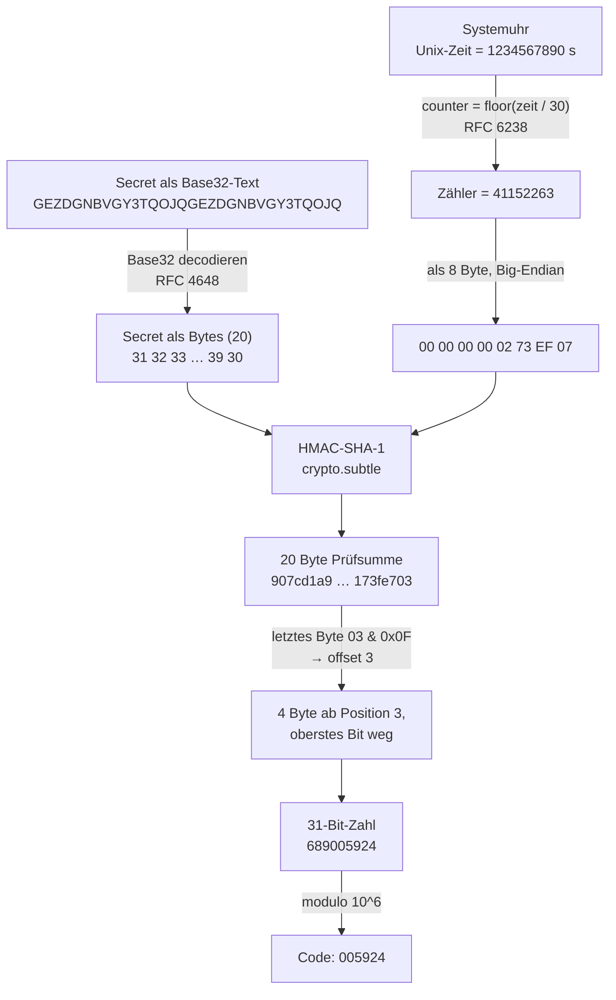

# 2FA Live

Ein TOTP-Generator, der komplett im Browser rechnet: Base32-Secret rein,
6-stelliger Code mit Countdown raus. Der Algorithmus ist von Hand implementiert
(RFC 4226 und RFC 6238) — es wird **keine fertige OTP-Bibliothek** benutzt.
Die einzige geliehene Krypto-Primitive ist HMAC aus der Web Crypto API des
Browsers.

```
┌─────────────────────────────────────────────────────────────┐
│  GitHub                                              ◜ 23 ◝ │
│  kevin@example.com                                          │
│                                                             │
│  983 593                                       [ Kopieren ] │
│  ─────────────────────────────────────────────────────────  │
│  NÄCHSTER  125 051                   SHA-1 · 6 STELLEN · 30 S│
└─────────────────────────────────────────────────────────────┘
```

---

## Schnellstart

```bash
npm install      # einmalig
npm run dev      # Dev-Server, danach http://localhost:5173 öffnen
npm test         # alle Tests (RFC-Testvektoren)
npm run build    # dist/ + dist/2fa-live.html
```

Weitere Skripte: `npm run typecheck`, `npm run lint`, `npm run format`,
`npm run preview`, `npm run test:watch`.

**Zum Ausprobieren** — der Testschlüssel aus RFC 4226 (das ist Base32 für den
Text `12345678901234567890`):

```
GEZDGNBVGY3TQOJQGEZDGNBVGY3TQOJQ
```

Der Knopf **Demo einfügen** setzt ihn zusammen mit einer Beispiel-`otpauth://`-URI
direkt ein.

### Die Offline-Datei

`npm run build` erzeugt zwei Dinge:

| Datei                | Wofür                                                       |
| -------------------- | ----------------------------------------------------------- |
| `dist/index.html`    | Normaler Build mit separatem JS/CSS (für `npm run preview`) |
| `dist/2fa-live.html` | **Eine einzige Datei**, ~28 kB, alles inline                |

`dist/2fa-live.html` ist die Datei für den täglichen Gebrauch: irgendwohin
kopieren, doppelklicken, fertig. Sie braucht keinen Server, keine
Internetverbindung und lädt nichts nach — nachgemessen im Browser:
**genau eine Netzwerkanfrage, nämlich die Datei selbst.**

### Eingabeformate

Ein Eintrag pro Zeile, gemischt erlaubt:

```
JBSWY3DPEHPK3PXP                          rohes Base32-Secret
jbsw y3dp ehpk 3pxp                       Kleinbuchstaben und Leerzeichen sind egal
GitHub: JBSWY3DPEHPK3PXP                  mit selbst vergebenem Namen
otpauth://totp/ACME:kevin?secret=JBSW…    komplette URI aus dem QR-Code
# eigene Notiz                            Kommentar, wird übersprungen
```

`Name: SECRET` ist kein Standard, sondern eine Zutat dieser App — ohne sie wären
alle Karten namenlos, sobald man mehr als ein Konto hat. Ein Doppelpunkt kommt in
Base32 nie vor, also kann nichts durcheinandergeraten.

---

## Wie TOTP funktioniert

### Die Idee in einem Absatz

Beim Einrichten einigen sich Server und App auf ein gemeinsames Geheimnis (das
`secret`, meist per QR-Code übertragen). Danach rechnen beide unabhängig
voneinander alle 30 Sekunden aus demselben Geheimnis und derselben Uhrzeit
dieselben sechs Ziffern aus. Wer die richtigen sechs Ziffern nennt, muss das
Geheimnis kennen — ohne es je über die Leitung zu schicken. Es gibt keine
Kommunikation zwischen App und Server, nur zwei Uhren und eine Rechenvorschrift.

### Der Weg vom Secret zum Code

Alle Zahlen im folgenden Diagramm gehören zusammen und stammen aus einem echten
Testvektor (RFC 6238 Anhang B, Zeitpunkt 1234567890). Du kannst sie nachrechnen —
`npm test` prüft genau diesen Fall.



### Die vier Schritte im Detail

**1 — Base32 decodieren** (`src/lib/base32.ts`)

Das Secret ist eigentlich eine Folge roher Bytes. Damit man es abtippen und in
einen QR-Code packen kann, wird es als Text codiert — mit einem Alphabet aus
nur 32 Zeichen (`A–Z` und `2–7`), von dem jedes genau 5 Bit trägt. Die Ziffern
`0`, `1` und `8` fehlen absichtlich, weil man sie mit `O`, `I` und `B`
verwechselt. Byte- und Zeichengrenzen treffen sich erst bei 40 Bit:
5 Byte = 8 Zeichen.

**2 — Die Uhrzeit wird zum Zähler** (`src/lib/totp.ts`)

Das ist die einzige Zeile, die TOTP von seinem Vorgänger HOTP unterscheidet:

```ts
counter = Math.floor(unixSeconds / period); // period = 30
```

Der Zähler erhöht sich alle 30 Sekunden um 1 — bei allen Beteiligten
gleichzeitig, ohne dass irgendetwas synchronisiert werden müsste. Wichtig: Der
Wechsel passiert an _absoluten_ Grenzen der Unix-Zeit (bei :00 und :30 jeder
Minute), nicht 30 Sekunden nachdem man die Seite geöffnet hat. Deshalb ist die
erste angezeigte Restzeit meistens kürzer als 30 Sekunden.

Der Zähler geht als 8 Byte in Big-Endian-Reihenfolge in die HMAC-Berechnung.
Beides ist nicht verhandelbar: HMAC rechnet über Bytes, also müssen beide Seiten
die Zahl bitgenau gleich darstellen.

**3 — HMAC** (`src/lib/hotp.ts`)

```
prüfsumme = HMAC-SHA-1(secret, zählerBytes)      → 20 Byte
```

Warum HMAC und nicht einfach `SHA-1(secret ‖ counter)`? Weil ein simples
Hash-über-alles bei SHA-1 anfällig für **Length-Extension-Angriffe** ist: Wer
`H(secret ‖ x)` kennt, kann daraus `H(secret ‖ x ‖ y)` berechnen, ohne das Secret
zu kennen. HMAC hasht deshalb zweimal mit zwei aus dem Secret abgeleiteten
Padding-Blöcken und schließt diese Angriffsklasse aus.

Das ist die einzige Primitive, die diese App nicht selbst implementiert.
Eigene SHA-1-Implementierungen in JavaScript sind langsam, schwer zu prüfen und
praktisch nie seitenkanalfrei — `crypto.subtle` ist im Browser eingebaut.

**4 — Dynamic Truncation** (`src/lib/hotp.ts`)

Aus 20 Byte müssen 6 Ziffern werden. Man könnte die ersten 4 Byte nehmen — aber
dann läge die verwendete Stelle für immer fest. Stattdessen bestimmt die
Prüfsumme selbst, welche 4 Byte gelten:

```ts
const offset = letztesByte & 0x0f; // 0…15
const zahl = vierByteAb(offset) & 0x7fffffff; // Big-Endian, oberstes Bit weg
const code = String(zahl % 10 ** 6).padStart(6, '0');
```

Das ausmaskierte oberste Bit hat einen sehr praktischen Grund: 1998 gab es weit
verbreitete Sprachen ohne vorzeichenlose 32-Bit-Zahlen (Java). Wäre das oberste
Bit gesetzt, läse die eine Implementierung eine negative Zahl und die andere eine
positive — und `modulo` lieferte unterschiedliche Codes. Ein Bit wegzuwerfen ist
der Preis dafür, dass der Algorithmus überall identisch rechnet.

Das abschließende `padStart` ist kein Schönheitsfehler: Führende Nullen gehören
zum Code. Aus `42` wird `000042`.

---

## Sicherheit

### Was hier gut ist

**Das Secret verlässt den Rechner nicht.** Alles rechnet lokal. Der Build hängt
zusätzlich eine Content-Security-Policy in die HTML-Datei:

```
default-src 'none'; script-src 'self' 'unsafe-inline'; style-src 'self' 'unsafe-inline';
img-src 'self' data:; connect-src 'none'; base-uri 'none'; form-action 'none'
```

`default-src 'none'` bedeutet: Die Seite darf _nichts_ nachladen und nichts
senden — kein `fetch`, kein WebSocket, kein Bild, keine Schrift. Damit ist „das
Secret bleibt hier" nicht bloß eine Behauptung, sondern vom Browser erzwungen.
Dass es funktioniert, ist nachgemessen: beim Öffnen von `dist/2fa-live.html`
entsteht genau eine Netzwerkanfrage — das Dokument selbst.

Dazu passend:

- **Keine Laufzeit-Abhängigkeiten.** `package.json` hat ausschließlich
  `devDependencies`. Im ausgelieferten Bundle steckt kein einziger fremder
  Code-Schnipsel. Es gibt keine Lieferkette, die kompromittiert werden könnte.
- **Keine Web-Fonts.** Ein Font-Download wäre eine Netzwerkanfrage. Die App nutzt
  System-Schriften.
- **Favicon inline.** Ohne das `<link rel="icon" href="data:…">` würde der Browser
  von sich aus `/favicon.ico` anfragen.
- **Nichts wird gespeichert.** Kein `localStorage`, kein `sessionStorage`, keine
  Cookies, kein IndexedDB. Tab zu, Secret weg.
- **Keine Eingabe wird je als HTML interpretiert.** Karten entstehen durch Klonen
  von `<template>`-Elementen, alle Werte gehen über `textContent`.
- **Der HMAC-Schlüssel wird als `extractable: false` importiert.** Nach dem Import
  kann selbst der eigene Code ihn nicht mehr auslesen.
- **Keine regulären Ausdrücke mit Rückzugs-Explosion.** Alle Muster, die auf
  Nutzereingaben laufen, sind linear. Das naheliegende
  `cleaned.replace(/=+$/, '')` im Base32-Decoder war es nicht: bei n
  Gleichheitszeichen mit einem anderen Zeichen am Ende probiert die
  Regex-Maschine an jeder Position alle Längen durch (gemessen: 80 000 Zeichen
  ≈ 1,8 s, 500 000 Zeichen ≈ eine Minute eingefrorener Tab). Ersetzt durch eine
  Schleife; `base32.test.ts` hat dafür einen Laufzeit-Regressionstest.

### Wo die Grenzen sind

**Uhrzeit-Abweichung.** TOTP hat keinen anderen Anker als die Systemuhr. Geht
deine Uhr mehr als ~30 Sekunden falsch, erzeugt diese App gültige Codes für den
falschen Zeitraum, und der Server lehnt sie ab. Die meisten Server akzeptieren
ein Fenster von ±1 Periode, viel mehr aber nicht. Die App zeigt bewusst keine
„korrigierte" Zeit an: Ihr Wert liegt gerade darin, dass sie exakt das rechnet,
was auf der Systemuhr steht. Bei Problemen: Zeitsynchronisation des
Betriebssystems einschalten.

**Secret-Diebstahl ist total und dauerhaft.** Anders als bei einem Passwort merkt
niemand etwas davon. Wer dein Secret kopiert, kann bis in alle Ewigkeit gültige
Codes erzeugen — parallel zu dir, ohne dass irgendwo eine Anmeldung auffällt. Der
einzige Ausweg ist, 2FA beim Anbieter komplett neu einzurichten. Deshalb:

- Secrets nicht in Screenshots, Chatverläufen oder Notiz-Apps ablegen.
- Diese App nur mit Code benutzen, dem du vertraust (siehe „Wem du hier
  vertrauen musst").
- Sie **niemals** auf einer fremden Website eingeben, egal wie überzeugend die
  aussieht.

**TOTP schützt nicht gegen Echtzeit-Phishing.** Das ist die wichtigste Grenze
überhaupt, und sie betrifft jede TOTP-App gleichermaßen. Eine gefälschte
Anmeldeseite fragt dich nach Passwort _und_ Code und reicht beides binnen
Sekunden an die echte Seite weiter. Dein Code ist zwar nur 30 Sekunden gültig —
der Angreifer braucht aber nur 2. Gegen diese Angriffsart hilft ausschließlich
ein Verfahren, das die Domain mitprüft: **Passkeys** oder ein
**FIDO2-Sicherheitsschlüssel**. TOTP schützt gegen geleakte Passwortlisten und
gegen Wiederverwendung — nicht gegen jemanden, der dich in Echtzeit an der Nase
herumführt.

**Der Bildschirm ist offen.** Solange der Tab offen ist, stehen alle Codes gut
lesbar da — Schultersurfen, Bildschirmfreigabe, Screenshot-Tools. Der Knopf
**Leeren** entfernt die Secrets aus dem Textfeld.

**Ein kompromittierter Rechner ist ein kompromittierter Rechner.** Wer
Schadsoftware oder eine bösartige Browser-Erweiterung auf dem System hat, liest
die Secrets direkt aus dem Textfeld. Keine Web-App kann daran etwas ändern.

### Wem du hier vertrauen musst

Wenn du `dist/2fa-live.html` lokal per Doppelklick benutzt: nur dir selbst und
deinem Browser. Die Datei ist eine einzige statische HTML-Datei ohne Server,
ohne Update-Mechanismus und ohne Abhängigkeiten — du kannst sie mit einem
Texteditor öffnen und nachlesen, was drinsteht.

Wenn du sie irgendwann auf einen Webserver legst, verschiebt sich das: Dann musst
du dem Server vertrauen, dass er dir morgen dieselbe Datei ausliefert wie heute.
Genau dieses Problem hat jede gehostete 2FA-Seite — auch das Vorbild
[2fa.live](https://2fa.live/).

---

## Aufbau des Codes

```
src/
├── lib/                    Reine Logik, kein DOM, vollständig getestet
│   ├── base32.ts           RFC 4648 — Base32 codieren und decodieren
│   ├── hotp.ts             RFC 4226 — Zähler → 8 Byte → HMAC → Truncation → Ziffern
│   ├── totp.ts             RFC 6238 — Uhrzeit → Zähler, Restzeit, Fortschritt
│   ├── otpauth-uri.ts      otpauth://totp/… zerlegen
│   ├── accounts.ts         Eine Textzeile → fertiges Konto oder Fehlermeldung
│   ├── bytes.ts            Typ-Alias Uint8Array<ArrayBuffer> (siehe Datei)
│   └── format.ts           Ziffern gruppieren, Karten beschriften
├── ui/
│   ├── clock.ts            Die driftfreie Uhr
│   ├── card.ts             Code- und Fehlerkarte
│   ├── app.ts              Verdrahtung Textfeld → Parser → Karten
│   └── dom.ts              Kleine Helfer, Zwischenablage
├── main.ts                 Einstiegspunkt
└── style.css               Design-Tokens und Layout
```

Jede Datei ist ausführlich kommentiert — nicht nur _was_ passiert, sondern
_warum_ es so und nicht anders gemacht ist.

### Warum die Codes nicht wegdriften

Ein `setInterval(tick, 1000)` wäre der naheliegende Weg und wäre falsch. Der
Browser garantiert nur „frühestens nach 1000 ms": Jeder Tick kommt ein paar
Millisekunden zu spät, und diese Verspätungen summieren sich. Nach ein paar
Minuten läge der Codewechsel sichtbar neben der echten Sekunde.

`src/ui/clock.ts` zählt deshalb gar nicht, sondern fragt bei jedem Tick die
Systemuhr neu (`Date.now()`) und rechnet daraus aus, was anzuzeigen ist. Ein
verspäteter Tick zeigt trotzdem den richtigen Wert — er _kann_ sich nicht
verzählen. Zwei Antriebe sichern sich gegenseitig ab:

- `requestAnimationFrame` für den flüssigen Ring (pausiert im Hintergrund-Tab —
  das ist gewollt, für unsichtbare Pixel muss kein Strom fließen),
- ein `setTimeout`, dessen Wartezeit jedes Mal neu als `1000 - (now % 1000)`
  berechnet wird und der dadurch von selbst wieder auf die Sekundengrenze
  einrastet.

Beim Zurückkehren auf den Tab feuert sofort ein Tick, damit nach Standby nie ein
alter Code stehen bleibt.

---

## Tests

```bash
npm test
```

149 Tests. Die wichtigsten stammen unverändert aus den Standards:

| Datei                 | Tests | Inhalt                                                                            |
| --------------------- | ----- | --------------------------------------------------------------------------------- |
| `hotp.test.ts`        | 42    | Alle 10 Vektoren aus RFC 4226 Anhang D, geprüft auf drei Ebenen; Zähler-Codierung |
| `totp.test.ts`        | 30    | Alle 18 Vektoren aus RFC 6238 Anhang B (SHA-1/256/512); Zähler und Restzeit       |
| `base32.test.ts`      | 29    | RFC 4648 Abschnitt 10; Round-trip Länge 1–40; Toleranz- und Fehlerfälle           |
| `otpauth-uri.test.ts` | 22    | URIs von GitHub, Google, Microsoft, AWS; Parameter; Fehlerfälle                   |
| `accounts.test.ts`    | 14    | Gemischte mehrzeilige Eingaben, Kommentare, kaputte Zeilen                        |
| `format.test.ts`      | 12    | Ziffern-Gruppierung, Kartentitel, Kürzung                                         |

Die HOTP-Vektoren werden bewusst auf drei Ebenen geprüft — HMAC, Truncation und
Endcode. Geht etwas kaputt, sagt einem der Test sofort, _welcher_ Schritt schuld
ist, statt nur „Code stimmt nicht".

Bei RFC 6238 lauert eine klassische Falle: Der Fließtext sagt „the same secret",
die Seed-Tabelle darunter listet aber drei verschiedene, unterschiedlich lange
Secrets (20 / 32 / 64 Byte). Nur mit denen kommen die Testwerte heraus. Wer stur
20 Byte für alle drei nimmt, sucht den Fehler stundenlang im eigenen HMAC.

---

## Entscheidungen, die ich getroffen habe

Der Prompt ließ eine Reihe von Details offen, mit der Priorität
Sicherheit > Lernwert > Einfachheit. Was dabei herauskam:

**Base32 ist tolerant gegenüber Restbits.** Nach RFC müssten die übrig
bleibenden Bits eines unvollständigen Blocks alle 0 sein. Manche Anbieter
erzeugen aber Secrets mit „krummen" Längen, und jede etablierte Authenticator-App
akzeptiert die. Ein harter Fehler würde nur funktionierende Secrets kaputt machen.
Bei ungültigen _Zeichen_ und unmöglichen _Längen_ ist der Decoder dagegen streng —
das sind echte Tippfehler.

**Zeichen werden vor der Länge geprüft.** Ein Tippfehler macht meist auch die
Länge kaputt. „Ungültiges Zeichen »0« an Stelle 5" hilft beim Suchen ungleich
mehr als „ungültige Länge".

**Der `issuer`-Parameter schlägt das Label-Präfix.** Steht der Anbieter doppelt in
der URI (einmal im Label, einmal als Parameter), gilt der Parameter — so sieht es
die Key-Uri-Spezifikation vor.

**Kein T0-Parameter.** RFC 6238 erlaubt einen Startzeitpunkt T0 ≠ 0. Kein Anbieter
benutzt das, das `otpauth://`-Format sieht kein Feld dafür vor, und alle
Testvektoren gehen von T0 = 0 aus. Fest auf 0.

**6 bis 8 Stellen.** Mehr wäre auch technisch fragwürdig: Die Truncation liefert
eine 31-Bit-Zahl (max. 2 147 483 647), ab 10 Stellen wäre `zahl % 10^n` die Zahl
selbst und die führenden Stellen wären nicht mehr gleichverteilt.

**Kein Umschalter für Hell/Dunkel.** Eine solche Einstellung will gespeichert
werden, und diese App speichert grundsätzlich nichts. Sie folgt deshalb der
Systemeinstellung (`prefers-color-scheme`), mit Dunkel als Basis.

**220 ms Wartezeit nach dem Tippen.** Ohne diese Pause blitzt beim Eintippen eines
Secrets nach jedem Zeichen eine Fehlerkarte auf. Beim Einfügen aus der
Zwischenablage entfällt die Wartezeit — da ist die Eingabe in einem Rutsch fertig.

**`'unsafe-inline'` in der CSP.** Der Single-File-Build hat JS und CSS als
Inline-Tags; ohne diese Erlaubnis würde die Datei nicht starten. Unkritisch, weil
es keine fremde Datenquelle gibt, kein `eval` (`'unsafe-eval'` ist bewusst nicht
gesetzt) und keine Eingabe je als HTML ins DOM gelangt. Die schützende Wirkung
kommt ohnehin von `default-src 'none'` und `connect-src 'none'`.

**`frame-ancestors` fehlt in der CSP.** Diese Direktive wirkt nur als
HTTP-Header; in einem `<meta>`-Tag ignoriert der Browser sie und loggt eine
Warnung. Wer die Datei hostet, sollte sie als Header setzen.

---

## Was v1 bewusst nicht kann (TODO für später)

- **Verschlüsselter Vault.** Secrets mit einer Passphrase verschlüsselt ablegen
  (PBKDF2 oder Argon2 → AES-GCM über die Web Crypto API), sodass man sie nicht
  bei jedem Start neu einfügen muss. Das ist der größte Komfortgewinn — und
  gleichzeitig der Punkt, an dem die einfache Sicherheitsaussage von v1 („es wird
  nichts gespeichert") aufgegeben wird. Deshalb bewusst nicht in v1.
- **QR-Code-Scanner.** Kamerabild über `BarcodeDetector` oder eine gebündelte
  WASM-Bibliothek einlesen, statt die `otpauth://`-URI von Hand einzufügen.
  Wichtig dabei: keine CDN-Einbindung, sonst fällt das Offline-Versprechen.
- **QR-Code erzeugen**, um ein Konto in eine Handy-App zu übertragen.
- **Konten neu sortieren** per Drag & Drop.
- **Zeitversatz anzeigen** — ein Hinweis, wenn die Systemuhr vermutlich falsch
  geht. Ohne Netzwerk allerdings schwer festzustellen, siehe „Grenzen".
- **HOTP** (zählerbasiert). Bräuchte einen gespeicherten Zählerstand und damit
  auch einen Vault.

---

## Standards

- [RFC 4226](https://www.rfc-editor.org/rfc/rfc4226) — HOTP
- [RFC 6238](https://www.rfc-editor.org/rfc/rfc6238) — TOTP
- [RFC 4648](https://www.rfc-editor.org/rfc/rfc4648) — Base32
- [Key Uri Format](https://github.com/google/google-authenticator/wiki/Key-Uri-Format) — `otpauth://`
