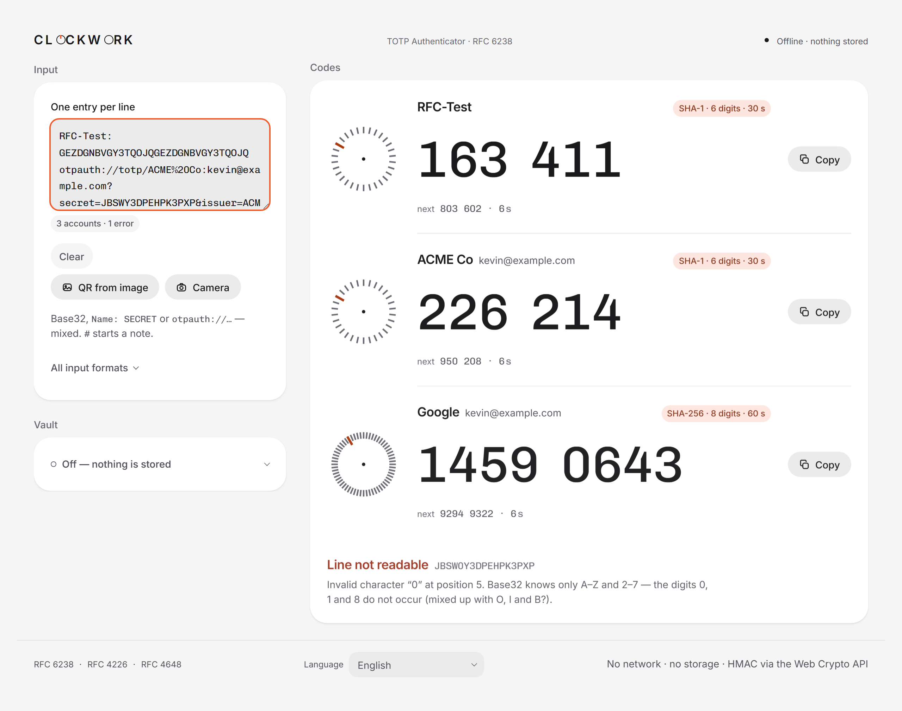
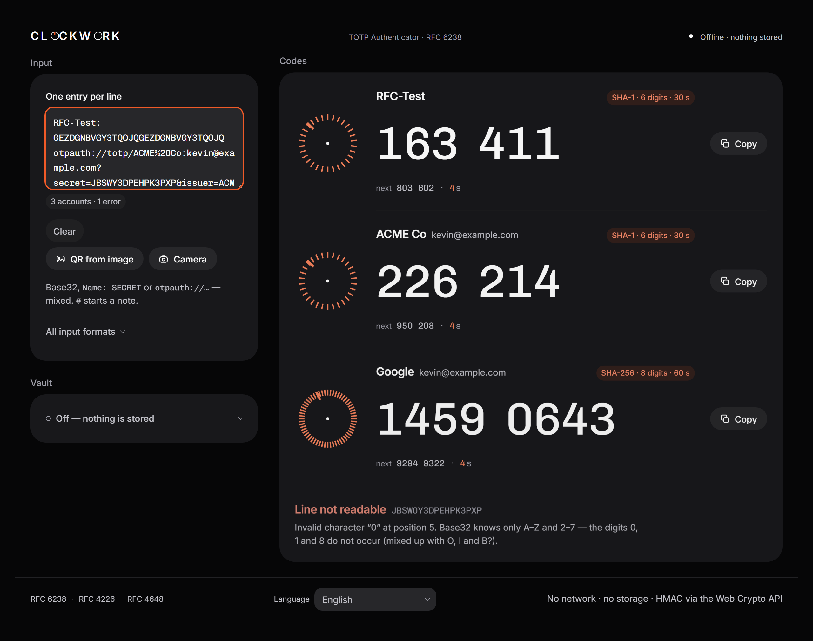

# Clockwork

**A TOTP authenticator that runs entirely in your browser.** Two-factor codes
are computed locally from RFC 4226 and RFC 6238, implemented from scratch — no
OTP library, no network requests, and nothing stored unless you ask for it.

[](https://github.com/keco216/clockwork/actions/workflows/ci.yml)
[](LICENSE)
[](package.json)

**[Open the app](https://clockwork-sage.vercel.app)** ·
[Download as a single file](https://github.com/keco216/clockwork/releases/latest/download/clockwork.html) ·
[Deutsche Fassung](docs/README.de.md)

| Light                                          | Dark                                         |
| ---------------------------------------------- | -------------------------------------------- |
|  |  |

---

## What it does

- **Generates TOTP codes** — SHA-1, SHA-256 or SHA-512, 6 to 8 digits, any
  period. The countdown is a 30-mark dial with a rotating hand, not a progress
  ring, because a hand on a scale gives you a readable position.
- **Takes input in every shape you are likely to have it.** Raw Base32, an
  `otpauth://` URI, a whole Google Authenticator export, or a QR code from the
  camera, a file, a drag or the clipboard. One entry per line, mixed freely.
- **Explains broken lines instead of failing.** `Invalid character "0" at
position 5` beats a blank screen.
- **Optionally remembers your secrets** behind a passphrase — strictly opt-in,
  AES-256-GCM over PBKDF2-SHA-256 with 600,000 iterations, with an auto-lock.
- **Speaks 37 languages**, all bundled, including right-to-left layouts.
- **Installs as a PWA**, or runs as one self-contained HTML file you can carry
  on a USB stick and open with a double click.
- **Moves with intent, not for show.** Disclosures glide, the language
  popover fades out, a spinner appears while your passphrase is stretched, and
  on a phone the header steps out of the way while you scroll down. Every one
  of those honours `prefers-reduced-motion`, and a check script proves it.
- **Puts the codes first on a phone.** Below 1024 px the code cards sit right
  under the header, copy buttons in thumb reach; input and vault fold into
  single rows until you tap them. The desktop layout is unchanged.

## Why trust this?

An authenticator asks you to paste in the one secret that protects your
accounts. That deserves more than a promise, so every claim here is meant to be
checked:

- **It is open source.** MIT licensed, and the interesting part is small enough
  to read in an afternoon: `src/lib/` is under 1,000 lines of plain TypeScript
  with no dependencies.
- **The algorithm is verified against the standards, not against itself.** The
  test suite runs all 10 HOTP vectors from RFC 4226 appendix D and all 18 TOTP
  vectors from RFC 6238 appendix B, checked on three levels — HMAC, truncation
  and final code. The Base32 decoder is checked against RFC 4648 section 10.
  If a single byte were wrong, those tests would fail. Run `npm test` yourself.
- **Offline by design, not by configuration.** After load, the app makes no
  requests at all. The single-file build ships a
  `Content-Security-Policy: connect-src 'none'` — it _cannot_ open a connection,
  even if it wanted to. The hosted version sends the same policy as a real HTTP
  header. Verify with your browser's network tab: one request, the document.
- **Zero storage is the default.** No `localStorage`, no cookies, no IndexedDB
  until you switch the vault on. Close the tab and the secrets are gone.
- **One runtime dependency**, [jsQR](https://github.com/cozmo/jsQR), and only
  for turning pixels into text. It never touches the crypto path.
- **No analytics, no telemetry, no update pings, no external fonts.** Nothing to
  turn off, because nothing is there.

```bash
# The whole promise, in one command, after `npm run build`:
for p in 'fetch(' XMLHttpRequest WebSocket sendBeacon EventSource; do
  echo "$p: $(grep -oF "$p" dist/clockwork.html | wc -l)"
done
# fetch(: 0 · XMLHttpRequest: 0 · WebSocket: 0 · sendBeacon: 0 · EventSource: 0
```

## Quick start

Use it: **[clockwork-sage.vercel.app](https://clockwork-sage.vercel.app)**, or download
`clockwork.html` from the
[latest release](https://github.com/keco216/clockwork/releases/latest) and open
it locally. No server, no connection, no install.

Run it from source:

```bash
npm ci
npm run dev        # http://localhost:5173
npm test           # 517 tests
npm run build      # dist/ (PWA) + dist/clockwork.html (single file)
```

To try it without a real account, use the test key from RFC 4226 — it is Base32
for the text `12345678901234567890`:

```
GEZDGNBVGY3TQOJQGEZDGNBVGY3TQOJQ
```

## How a code is made

Both sides agree on a shared secret once. After that, the server and the app
independently compute the same six digits from that secret and the current
time — every 30 seconds, without ever exchanging anything. There is no
communication, only two clocks and one rule:

```
secret (Base32)  ──decode──▶  20 raw bytes  ─┐
                                             ├─▶ HMAC-SHA-1 ─▶ 20-byte digest
unix time / 30   ──▶ counter ──▶ 8 bytes  ───┘                      │
                                                                    ▼
                        code ◀── mod 10⁶ ◀── 31-bit number ◀── dynamic truncation
```

The last step is the clever one: the digest picks its own offset, so which four
bytes become the code is not fixed in advance. The full walk-through, with the
reasoning behind every step and a worked example you can recompute, is in the
[German documentation](docs/README.de.md#wie-totp-funktioniert).

## The vault

By default Clockwork stores nothing. If you turn the vault on:

```
passphrase ─▶ PBKDF2-SHA-256, 600,000 iterations, 16-byte salt ─▶ 256-bit key
                                                                       │
secrets ──────────────────────▶ AES-256-GCM, 12-byte IV ◀──────────────┘
                                          │
                     { v, kdf, iterations, salt, iv, data } ─▶ localStorage
```

Only that envelope is stored — never plaintext, never the passphrase, never the
derived key. The header fields go into the encryption as `additionalData`, so an
attacker cannot quietly rewrite the iteration count from 600,000 down to 1 and
make guessing cheap; a test proves decryption fails when they try.

It locks itself after 1, 5 or 15 minutes of inactivity and optionally when you
leave the tab.

## Importing accounts

| Input                               | Example                              |
| ----------------------------------- | ------------------------------------ |
| Raw Base32                          | `JBSWY3DPEHPK3PXP`                   |
| … spaced and lowercase              | `jbsw y3dp ehpk 3pxp`                |
| With a name you choose              | `GitHub: JBSWY3DPEHPK3PXP`           |
| A full URI from a QR code           | `otpauth://totp/ACME:you?secret=…`   |
| A whole Google Authenticator export | `otpauth-migration://offline?data=…` |
| A note                              | `# my own comment`                   |

Google exports are decoded by a **hand-written protobuf reader** (about 120
lines, no protobuf library) and expanded in place into ordinary `otpauth://`
lines. You see exactly what was imported before anything is used — an import
that silently creates key material in the background would be the wrong
behaviour here.

## 37 languages

The interface ships in 37 languages, all bundled — nothing is loaded on demand,
because there is nothing to load. The language is detected from
`navigator.languages` and can be changed in the footer; the choice lives in the
URL fragment (`#lang=fr`), never in storage, so the "no storage" claim stays
literally true.

English is the source of truth and German is the editorial reference. **The
other 35 were machine-translated**: keys, placeholders and plural categories are
tested, but nobody has checked how they sound.
[Corrections from native speakers are very welcome](CONTRIBUTING.md#improving-a-translation--the-most-useful-thing-you-can-do)
— these 14 are worth a look first:

> Magyar · Slovenščina · Hrvatski · Română · Български · Ελληνικά · Eesti ·
> Latviešu · Lietuvių · العربية · עברית · हिन्दी · Tiếng Việt · ไทย

Arabic and Hebrew flip the whole layout, but the dial does not mirror and codes
stay left-to-right and Latin — they get typed into other people's login fields.

### Building fewer languages

All 37 are the default. For your own build you can cut the catalogue down:

```bash
CLOCKWORK_LANGS=de,en,fr npm run build            # bash
$env:CLOCKWORK_LANGS = 'de,en,fr'; npm run build  # PowerShell
```

| Build                  | `dist/clockwork.html` | gzip   |
| ---------------------- | --------------------- | ------ |
| default (37 languages) | 801 kB                | 331 kB |
| `de,en,fr`             | 490 kB                | 252 kB |
| `en` only              | 473 kB                | 247 kB |

Sizes are decimal kB (1000 bytes). `scripts/check-bundle.mjs` prints both that
and KiB, because mixing the two silently is a mistake this project has already
made once.

English is always included, an unknown code stops the build, and the language
switcher only ever offers what actually shipped. The selection deliberately does
**not** apply to the dev server or the test run — a completeness check you can
disable with an environment variable is not a completeness check.

## Limits worth knowing

**Set up backup codes before you rely on any authenticator.** Every provider
offers them, and they are the only thing that gets you back in when the secret
is gone — a lost phone, a wiped browser, a cleared vault. Clockwork cannot help
you there, and neither can any other authenticator app.

Beyond that:

- **TOTP does not stop real-time phishing.** A fake login page can ask for your
  password _and_ your code and replay both within seconds. Only a method that
  checks the domain — passkeys or a FIDO2 key — closes that.
- **A stolen secret is stolen for good** and nobody notices. The only cure is
  re-enrolling with the provider.
- **A wrong system clock produces wrong codes.** TOTP has no other anchor.
- **A compromised device compromises everything on it.** No web app can fix that.

The full threat model is in [SECURITY.md](SECURITY.md).

## Building

```bash
npm run typecheck   # tsc --noEmit
npm run lint        # ESLint, type-aware
npm run format      # Prettier
npm test            # Vitest
npm run build       # both targets
npm run shots       # Playwright walk-through + screenshots (needs a server on :5180)
```

`npm run build` produces two things:

| Target                | What it is                                                      |
| --------------------- | --------------------------------------------------------------- |
| `dist/`               | Installable PWA: manifest, service worker, icons, works offline |
| `dist/clockwork.html` | One file, everything inline — including the fonts. ~801 kB      |

Hosting is a plain static deploy; `vercel.json` carries the security headers,
and a test keeps them in step with the policy the build embeds.

### Android app

The repo contains a Capacitor wrapper that ships the **single-file build** in a
system WebView — the same `clockwork.html`, as an APK:

```bash
npm run android                     # web build + stage the single file + sync
cd android && ./gradlew assembleDebug
```

The app declares **no INTERNET permission** — the OS-level counterpart of the
single file's `connect-src 'none'`; check it yourself with
`aapt2 dump badging`. Camera permission exists solely for the QR scanner and
is declared optional hardware, and `allowBackup` is off so the encrypted vault
never rides along in a cloud backup.

A signed, minified release APK (`clockwork.apk`) is attached to the
[latest release](https://github.com/keco216/clockwork/releases/latest)
together with its SHA-256 checksum — verify the download before installing.

**Update rule:** Android accepts an update only when it is signed with the
same key as the installed app. An APK signed with any other key — including
your own build from source — requires uninstalling first, and uninstalling
deletes the app's data, **including a vault stored on that device**. If you
switch between the released APK and a self-built one, unlock the vault and
copy your entries out of the input field first. Details, including the
toolchain notes, are in the
[German documentation](docs/README.de.md#die-android-app-capacitor).

## Contributing

Improvements are welcome — especially translation fixes from native speakers,
which need no build setup beyond `npm test`. Please read
[CONTRIBUTING.md](CONTRIBUTING.md) first; it lists the rules that keep the
project's promises intact (no OTP libraries, `src/lib/` stays frozen, no network
at runtime).

Found a security problem? [SECURITY.md](SECURITY.md) — please do not open a
public issue.

## License

[MIT](LICENSE) © 2026 Kevin.

The fonts under `src/assets/fonts/` are Inter and Chivo Mono, both under the
SIL Open Font License; their licence texts sit next to them.

---

## Deutsch

Clockwork ist ein **TOTP-Authenticator, der vollständig im Browser rechnet**.
Der Algorithmus ist von Hand nach RFC 4226 und RFC 6238 implementiert — keine
OTP-Bibliothek, zur Laufzeit keine einzige Netzwerkanfrage, und ohne
ausdrückliches Einschalten des Tresors wird nichts gespeichert.

Die Oberfläche spricht 37 Sprachen. Deutsch ist die redaktionelle Referenz;
Englisch ist die Basissprache und der Rückfall.

```bash
npm ci
npm run dev      # http://localhost:5173
npm test
npm run build    # dist/ (PWA) + dist/clockwork.html (eine Datei)
```

Zum Ausprobieren der Testschlüssel aus RFC 4226 — Base32 für den Text
`12345678901234567890`:

```
GEZDGNBVGY3TQOJQGEZDGNBVGY3TQOJQ
```

**Die ausführliche deutsche Dokumentation steht in
[docs/README.de.md](docs/README.de.md):** wie TOTP im Einzelnen funktioniert,
warum der Tresor so gebaut ist, wie er ist, die Gestaltungsentscheidungen, die
Messwerte und die Fehler, die unterwegs gefunden wurden.

**Wichtig, unabhängig von dieser App:** Richte bei jedem Anbieter
**Backup-Codes** ein, bevor du dich auf einen Authenticator verlässt. Sie sind
das Einzige, was dich wieder hineinlässt, wenn das Secret weg ist.
