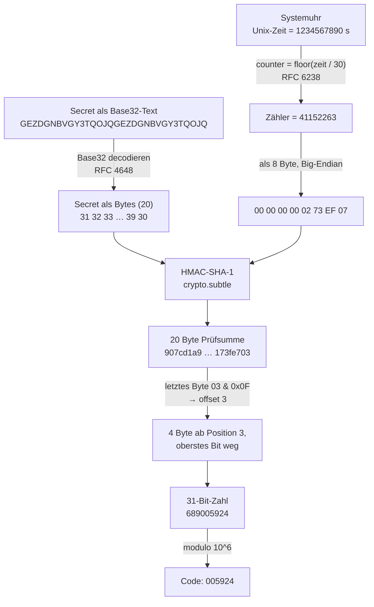

# Clockwork

**TOTP Authenticator.** Erzeugt Zwei-Faktor-Codes vollständig im Browser. Der
Algorithmus ist von Hand implementiert (RFC 4226 und RFC 6238) — es wird **keine
fertige OTP-Bibliothek** benutzt. Die einzige geliehene Krypto-Primitive ist HMAC
aus der Web Crypto API.

Seit V3 spricht die App **37 Sprachen**, von Arabisch bis Vietnamesisch, alle
mitgebündelt und ohne eine einzige Netzwerkanfrage — auch die
Übersetzungsverwaltung ist selbst geschrieben (siehe [Sprachen](#sprachen)).

```
  CL◍CKW◯RK          TOTP AUTHENTICATOR · RFC 6238        ● OFFLINE

  CODES        ╱⁻⁻╲     GitHub                        SHA-1 · 6 STELLEN · 30 S
              │  ·│▏    983 593                            [ KOPIEREN ]
               ╲__╱     FOLGT 125 051
                23s
```

---

## Schnellstart

```bash
npm install      # einmalig
npm run dev      # Dev-Server, danach http://localhost:5173 öffnen
npm test         # 517 Tests
npm run build    # dist/ (PWA) + dist/clockwork.html (eine Datei)
```

Weitere Skripte: `npm run typecheck`, `npm run lint`, `npm run format`,
`npm run preview`, `npm run test:watch`, `npm run shots` (Screenshots über
Playwright).

Drei Messwerkzeuge stehen daneben — für die Zusagen, die man nicht ansehen kann:

```bash
node scripts/check-bundle.mjs      # das Offline-Versprechen am fertigen Bündel
node scripts/check-contrast.mjs    # WCAG AA an den tatsächlich gezeichneten Pixeln
node scripts/check-tokens.mjs      # kein Bauteil setzt eigene Werte
node scripts/check-motion.mjs      # jede Bewegung läuft — und unter
                                   # prefers-reduced-motion keine
```

**Zum Ausprobieren** — der Testschlüssel aus RFC 4226 (das ist Base32 für den
Text `12345678901234567890`):

```
GEZDGNBVGY3TQOJQGEZDGNBVGY3TQOJQ
```

Diese Zeile ins Textfeld einfügen, fertig — oder den Knopf **„Testschlüssel
einfügen"** nehmen, der genau sie einträgt.

Bis v1.0.0 gab es diesen Knopf bewusst nicht: Ein Knopf, der
Beispiel-Schlüsselmaterial in dasselbe Feld schreibt wie die echten Secrets,
gehört dort nicht hin. Der Einwand galt, und die Lösung nimmt ihm die Grundlage,
statt ihn zu überstimmen. Der Knopf lebt nur im Leerzustand: Sobald eine Zeile
im Feld steht, ist er `hidden` und damit unerreichbar, und der Handler prüft
zusätzlich auf ein leeres Feld. **Es gibt keinen Zustand, in dem er echtes
Schlüsselmaterial überschreiben könnte** — bei Schlüsselmaterial ist ein zweites
Schloss billiger als die Frage, ob das erste noch hält.

### Zwei Build-Ziele

| Ziel                  | Was es ist                                                           |
| --------------------- | -------------------------------------------------------------------- |
| `dist/`               | Installierbare PWA: Manifest, Service Worker, Icons, offline nutzbar |
| `dist/clockwork.html` | **Eine einzige Datei**, ~801 kB, alles inline — auch die Schriften   |

`dist/clockwork.html` ist die Datei für den täglichen Gebrauch: irgendwohin
kopieren, doppelklicken, fertig. Kein Server, keine Internetverbindung. Sie hat
bewusst **keinen** Service Worker — eine einzelne Datei braucht keinen Cache, und
ohne Worker gilt dort die schärfere Sicherheitsrichtlinie mit `connect-src 'none'`.

### Eingabeformate

| Eingabe                              | Beispiel                             |
| ------------------------------------ | ------------------------------------ |
| Rohes Base32                         | `JBSWY3DPEHPK3PXP`                   |
| … mit Leerzeichen, klein geschrieben | `jbsw y3dp ehpk 3pxp`                |
| Mit selbst vergebenem Namen          | `GitHub: JBSWY3DPEHPK3PXP`           |
| Vollständige URI aus dem QR-Code     | `otpauth://totp/ACME:kevin?secret=…` |
| Google-Authenticator-Sammelexport    | `otpauth-migration://offline?data=…` |
| Notiz                                | `# eigene Anmerkung`                 |

Alles gemischt in einem Textfeld, ein Eintrag pro Zeile.

`Name: SECRET` ist kein Standard, sondern eine Zutat dieser App — ohne sie wären
alle Konten namenlos. Verwechslungsgefahr gibt es keine: Ein Doppelpunkt kommt in
Base32 nie vor.

### QR-Codes einlesen

Vier Wege, weil keiner davon überall funktioniert:

- **QR aus Bild** — funktioniert immer, auch bei einer per Doppelklick geöffneten
  Datei. Deshalb steht dieser Knopf zuerst.
- **Kamera** — braucht einen sicheren Kontext und eine Erlaubnis. Bei `file://`
  sperren die meisten Browser sie; Clockwork sagt das dann, statt einen leeren
  Sucher zu zeigen.
- **Ziehen** — Screenshot ins Fenster ziehen.
- **Einfügen** — Screenshot mit <kbd>Strg</kbd>+<kbd>V</kbd>.

Decodiert wird mit dem eingebauten `BarcodeDetector`, wo es ihn gibt, sonst mit
dem mitgelieferten [jsQR](https://github.com/cozmo/jsQR). Eine QR-Bibliothek ist
Bildverarbeitung, keine Kryptografie: Sie sieht Pixel und liefert Text zurück —
die OTP-Berechnung bleibt vollständig die eigene.

---

## Sprachen

Clockwork spricht **37 Sprachen**. Alle sind mitgebündelt — auch in der einen
HTML-Datei. Es wird nichts nachgeladen, weil es nichts nachzuladen gibt.

Beim Start liest die App `navigator.languages` und nimmt den ersten Eintrag, den
sie kennt. Regionalvarianten fallen auf ihre Sprache zurück (`de-AT` → `de`),
Portugiesisch und Chinesisch werden nach Region bzw. Schriftform unterschieden
(`pt-BR` bleibt `pt-BR`, `zh-TW` → `zh-Hant`, `zh-CN` → `zh-Hans`). Findet sich
nichts, gilt Englisch.

Umschalten geht im Fuß der Seite. Die Wahl landet **im URL-Hash**, nicht im
Speicher:

```
clockwork.html#lang=fr
```

### Warum die Sprachwahl im Hash steht

Im Fuß dieser App steht „kein Speicher", und dieser Satz soll wörtlich wahr
bleiben. Ein Sprachcode ist harmlos — aber sobald die App anfängt, „harmlose"
Dinge abzulegen, ist die Aussage keine Tatsache mehr, sondern eine
Ermessensfrage. Der Hash kostet nichts und steht sichtbar in der Adresszeile.

Zwei Eigenschaften fallen dabei ab, die wirklich nützlich sind: Ein Fragment
wird **nie an einen Server geschickt** — selbst wer die PWA hostet, erfährt die
Sprachwahl nicht. Und die Adresse ist weitergebbar: Man kann jemandem die App in
seiner Sprache schicken.

Der Preis: Wer die PWA vom Startbildschirm öffnet, startet ohne Hash und bekommt
wieder die automatisch erkannte Sprache. Das ist verkraftbar — die Erkennung
liest dieselbe Liste, nach der sich auch der Browser selbst richtet.

Zum Vergleich: Die beiden Tresor-Einstellungen (Sperrzeit, Sperren beim
Tabwechsel) liegen weiterhin im `localStorage`. Der Unterschied ist nicht die
Harmlosigkeit, sondern die Erwartung: Wer den Tresor einschaltet, hat sich für
Speichern entschieden. Wer nur die Sprache umstellt, nicht.

### Ziffern bleiben lateinisch

`Intl.NumberFormat` würde auf Arabisch von sich aus ٦٠٠٬٠٠٠ liefern. Clockwork
erzwingt überall `-u-nu-latn` und damit lateinische Ziffern — die Gruppierung
(600,000 / 600.000 / 600 000) bleibt selbstverständlich lokal.

Der Grund ist nicht Bequemlichkeit: Die Codes werden in fremde Anmeldefelder
getippt und müssen lateinisch sein; die Zifferblattschrift Chivo Mono kennt
ohnehin nur lateinische Ziffern. Zwei Ziffernsysteme nebeneinander auf einem
Messgerät wären ein Ablesefehler mit Ansage.

### Rechtsläufig, aber nicht spiegelverkehrt

Arabisch und Hebräisch setzen `dir="rtl"` am Dokument. Das ganze Gehäuse klappt
um, ohne eine einzige Sonderregel — alle Abstände und Positionen stehen in
logischen Eigenschaften (`margin-inline-start` statt `margin-left`). Übrig
geblieben sind genau drei physische Angaben in `mark.css`; sie zentrieren einen
Strich in der Wortmarke, die ohnehin per `dir="ltr"` festgenagelt ist.

Zwei Dinge spiegeln **nicht** mit:

- **Das Zifferblatt.** Ein Messinstrument ist richtungsneutral; Uhren laufen auch
  in Kairo und Tel Aviv im Uhrzeigersinn.
- **Codes, Secrets und Eingabefelder.** Sie tragen `dir="ltr"` und
  `unicode-bidi: isolate`. Das ist keine Kosmetik: In einem rechtsläufigen Absatz
  zieht der Bidi-Algorithmus neutrale Zeichen — Doppelpunkt, Schrägstrich,
  Gleichheitszeichen — auf die andere Seite ihrer Nachbarn. Aus
  `otpauth://totp/…?secret=X` würde sichtbar etwas anderes, als tatsächlich
  dasteht. Wer das abtippt, tippt den Fehler mit ab.

### Schriften

Nicht-lateinische Schriften werden **nicht** mitgeliefert — eine CJK-Familie
wiegt mehrere Megabyte und würde die Single-File-Datei sprengen. Stattdessen gibt
es je Schriftsystem einen kuratierten System-Stack (`src/styles/scripts.css`),
angesteuert über `data-script` am `<html>`.

Dazu kommt **ein** zweiter Schnitt: Inter `latin-ext` (85 kB — Inter deckt dort
deutlich mehr Zeichen ab als das frühere Instrument Sans mit 11). Elf Sprachen
brauchen Zeichen jenseits von Latin-1 — Polnisch (ł ą ę), Tschechisch (č ř ž),
Ungarisch (ő ű), Rumänisch (ă ș ț), Türkisch (ğ ş) und andere. Ohne diesen
Schnitt käme in einem polnischen Satz jedes zweite Wort aus einer Ersatzschrift.
Der Browser lädt ihn nur, wenn wirklich so ein Zeichen vorkommt — dafür ist
`unicode-range` da.

Kyrillisch, Griechisch und Vietnamesisch bekommen dagegen eine durchgehende
Systemschrift: Diese Schnitte sind nicht gebündelt, und eine halb gesetzte
Schrift ist schlechter als eine andere ganze.

Die **Wortmarke bleibt in jeder Sprache lateinisch** und in der Markenschrift.
Ein Logo wird nicht übersetzt.

Auch die Gravur-Beschriftung passt sich an: Kleine gesperrte Versalien setzen ein
Alphabet mit Groß- und Kleinschreibung voraus. In Arabisch, Hebräisch, Thai,
Devanagari und den CJK-Schriften entfallen Versalsatz und Sperrung — über zwei
Tokens, nicht über Sonderregeln pro Bauteil.

### Die 37 Sprachen und ihr Stand

| Stand                       | Sprachen                                                                                                                                                                                                                           |
| --------------------------- | ---------------------------------------------------------------------------------------------------------------------------------------------------------------------------------------------------------------------------------- |
| **Redaktionelle Referenz**  | Deutsch (aus V2 wörtlich übernommen)                                                                                                                                                                                               |
| **Quelle der Wahrheit**     | English (Basis- und Rückfallsprache)                                                                                                                                                                                               |
| **Maschinell übersetzt**    | Français · Italiano · Español · Português (PT/BR) · Nederlands · Polski · Čeština · Slovenčina · Svenska · Dansk · Norsk bokmål · Suomi · Русский · Українська · Türkçe · Bahasa Indonesia · 日本語 · 한국어 · 简体中文 · 繁體中文 |
| **Maschinell, prüfenswert** | Magyar · Slovenščina · Hrvatski · Română · Български · Ελληνικά · Eesti · Latviešu · Lietuvių · العربية · עברית · हिन्दी · Tiếng Việt · ไทย                                                                                        |

**Was „maschinell übersetzt" hier heißt:** Die Texte stammen nicht von
Muttersprachlern. Fachbegriffe, Anrede und Anführungszeichen sind je Sprache
einmal festgelegt und am Kopf der jeweiligen Datei unter `src/i18n/locales/`
dokumentiert; die Mehrzahlformen sind gegen die CLDR-Kategorien geprüft, die
`Intl.PluralRules` für diese Sprache meldet. Was ein Test nicht prüfen kann, ist
der Klang.

Die Zeile **„prüfenswert"** nennt die Sprachen, bei denen ich zuerst jemanden
draufschauen lassen würde: Sprachen mit reicher Formenlehre, in denen die
Mehrzahlform vom Kasus abhängt (Lettisch, Litauisch, Slowenisch mit seinem Dual,
Kroatisch, Rumänisch), und solche, deren Software-Wortschatz weniger festgefahren
ist als der deutsche oder französische.

### Nur bestimmte Sprachen bauen

Alle 37 Sprachen sind die Voreinstellung und bleiben es. Wer die App für sich
selbst baut, kann den Katalog beim Bauen aber kürzen:

```bash
CLOCKWORK_LANGS=de,en,fr npm run build
```

In PowerShell:

```powershell
$env:CLOCKWORK_LANGS = 'de,en,fr'; npm run build
```

Gemessen an der einen Datei (Stand v1.5.0, alle Zahlen frisch nachgemessen):

| Bau                       | `dist/clockwork.html` | gzip   |
| ------------------------- | --------------------- | ------ |
| ohne Angabe (37 Sprachen) | 801 kB                | 331 kB |
| `de,en,fr`                | 490 kB                | 252 kB |
| nur `en`                  | 473 kB                | 247 kB |

Drei Sprachen kosten also 311 kB weniger als alle 37. Die übrigen 473 kB sind
Schriften, jsQR und die App selbst — daran ändert die Auswahl nichts.

Gegenüber v1.2.0 ist der volle Bau um **122 kB gewachsen** (659 → 781), und
diese Zahl hat genau eine Ursache: Inter. Die Oberflächenschrift der
HeroUI-Optik wiegt als data-URI mehr als Instrument Sans — latin 48 statt
30 kB, latin-ext 85 statt 11, jeweils mal 4/3 für Base64. Nichts davon ist
Bibliothek: Die Zahl der Laufzeit-Abhängigkeiten steht unverändert bei eins.
v1.4.0 legt 13 kB darauf: der übersetzte Platzhalter in 37 Sprachen, das
Klappzeilen-Gerüst des Einspalters und die Kommentare dazu. v1.5.0 noch
einmal **7 kB** (794 → 801) für die drei neuen Bewegungsmodule
(`disclosure.ts`, `message.ts`, `scroll-edge.ts`), den Wartezeiger und die
Kommentare dazu — gemessen gegen einen frisch gebauten `main`, nicht gegen
die letzte notierte Zahl.

**Zur Einheit:** Das sind dezimale Kilobyte (1 kB = 1000 Byte), so wie ein
Dateimanager sie anzeigt. `node scripts/check-bundle.mjs` rechnet zusätzlich in
KiB (1 KiB = 1024 Byte) und nennt für denselben Bau 643.

Diese Doppelung hat schon zweimal Schaden angerichtet. Bis V4 standen beide
Zählweisen unmarkiert nebeneinander und sahen aus wie widersprüchliche
Messungen. Und bis v1.2.0 teilte `check-bundle.mjs` selbst durch 1024, schrieb
aber „kB" daran — diese Zahl ist abgeschrieben worden und hätte den Bau als
„642 kB dezimal" in die Release-Notiz gebracht, obwohl 642 die KiB-Zahl war.
Das Skript beschriftet jetzt beide Zählweisen.

**Was dabei gilt:**

- **Englisch kommt immer mit**, auch ungefragt. Auf diese Sprache fällt `t()`
  zurück, und bei ihr landet die Erkennung, wenn nichts passt.
- **Ein unbekannter Sprachcode bricht den Bau ab** und listet die gültigen.
  Ein Tippfehler in einer Umgebungsvariablen soll nicht in einem Bündel enden,
  dem stillschweigend eine Sprache fehlt.
- **Am Offline-Versprechen ändert sich nichts.** Es wird nichts nachgeladen und
  nichts nachladbar gemacht; die CSP ist Zeichen für Zeichen dieselbe.
- **Die Oberfläche zieht mit.** Der Umschalter bietet nur an, was da ist; bei
  einer einzigen Sprache verschwindet er samt Beschriftung. Ein `#lang=ja` in
  einem Bündel ohne Japanisch wird übergangen — es gilt dann die erkannte
  Sprache, statt dass eine halb übersetzte Seite entsteht.
- **Verwandtes vor Englisch.** Fehlt `pt-BR`, bekommt ein brasilianischer
  Browser europäisches Portugiesisch statt Englisch; dasselbe gilt für die
  beiden chinesischen Schriftformen.
- **Dev-Server und Tests sehen weiterhin alle 37 — auch mit gesetzter
  Variablen.** Das ist Absicht: Die Auswahl greift ausschließlich beim Bauen.
  Eine Vollständigkeitsprüfung, die sich per Umgebungsvariable abschalten lässt,
  prüft keine Vollständigkeit; `catalogue.test.ts` sähe sonst je nach Umgebung
  mal 37 und mal 3 Sprachen. `CLOCKWORK_LANGS=de npm run dev` zeigt deshalb
  ebenfalls alle 37 — wer ein Teil-Bündel ansehen will, öffnet die gebaute
  `dist/clockwork.html`.

**Wie es funktioniert** (`scripts/locale-subset.ts`): Nachladen scheidet aus —
ein `import()` je Sprache wäre eine Netzwerkanfrage. Es muss also schon beim
Bauen feststehen, was überhaupt in den Modulgraphen gerät. Ein Vite-Bauteil
leert deshalb in `catalogue.ts` die Import-Zeile und den Objekteintrag jeder
abgewählten Sprache; was niemand mehr importiert, nimmt Rollup nicht mit. Die
Datei auf der Platte bleibt unberührt — die Änderung lebt nur im Speicher des
Bauvorgangs.

Das ist Textarbeit an Quelltext und damit nur so gut wie ihre Annahmen über
dessen Form. Deshalb bricht jeder Schritt bei Unstimmigkeit ab, und am Ende
steht eine Gegenprobe mit demselben Leser: Was übrig blieb, muss genau die
gewünschte Liste sein. Der stille Fehlgriff — Muster passt nicht mehr, Bündel
enthält doch alle 37 — ist der einzige, der hier wirklich wehtäte.

### Neue Sprache in drei Schritten

1. **Datei anlegen.** `src/i18n/locales/en.ts` nach `xx.ts` kopieren und
   übersetzen. Das `satisfies Strings` am Ende stehen lassen — es ist der Grund,
   warum ein vergessener Schlüssel ein Compilerfehler ist und keine leere Stelle
   in der Oberfläche.
2. **Eintragen.** In `src/i18n/catalogue.ts` importieren und ins Objekt hängen.
3. **Beschreiben.** In `src/i18n/registry.ts` eine Zeile ergänzen: Code,
   Eigenname, Leserichtung, Schriftsystem.

Danach `npm test`. Die Tests sagen, was noch fehlt: ein Schlüssel, ein
Platzhalter, eine Mehrzahlform, die diese Sprache braucht.

---

## Wie TOTP funktioniert

### Die Idee in einem Absatz

Beim Einrichten einigen sich Server und App auf ein gemeinsames Geheimnis (das
`secret`, meist per QR-Code übertragen). Danach rechnen beide unabhängig
voneinander alle 30 Sekunden aus demselben Geheimnis und derselben Uhrzeit
dieselben sechs Ziffern aus. Wer die richtigen sechs Ziffern nennt, muss das
Geheimnis kennen — ohne es je über die Leitung zu schicken. Es gibt keine
Kommunikation zwischen App und Server, nur zwei Uhren und eine Rechenvorschrift.

### Der Weg vom Secret zum Code

Alle Zahlen im folgenden Diagramm gehören zusammen und stammen aus einem echten
Testvektor (RFC 6238 Anhang B, Zeitpunkt 1234567890). Du kannst sie nachrechnen —
`npm test` prüft genau diesen Fall.



### Die vier Schritte im Detail

**1 — Base32 decodieren** (`src/lib/base32.ts`)

Das Secret ist eigentlich eine Folge roher Bytes. Damit man es abtippen und in
einen QR-Code packen kann, wird es als Text codiert — mit einem Alphabet aus nur
32 Zeichen (`A–Z` und `2–7`), von dem jedes genau 5 Bit trägt. Die Ziffern `0`,
`1` und `8` fehlen absichtlich, weil man sie mit `O`, `I` und `B` verwechselt.
Byte- und Zeichengrenzen treffen sich erst bei 40 Bit: 5 Byte = 8 Zeichen.

**2 — Die Uhrzeit wird zum Zähler** (`src/lib/totp.ts`)

Das ist die einzige Zeile, die TOTP von seinem Vorgänger HOTP unterscheidet:

```ts
counter = Math.floor(unixSeconds / period); // period = 30
```

Der Zähler erhöht sich alle 30 Sekunden um 1 — bei allen Beteiligten
gleichzeitig, ohne dass irgendetwas synchronisiert werden müsste. Wichtig: Der
Wechsel passiert an _absoluten_ Grenzen der Unix-Zeit (bei :00 und :30 jeder
Minute), nicht 30 Sekunden nachdem man die Seite geöffnet hat. Deshalb ist die
erste angezeigte Restzeit meistens kürzer als 30 Sekunden.

**3 — HMAC** (`src/lib/hotp.ts`)

```
prüfsumme = HMAC-SHA-1(secret, zählerBytes)      → 20 Byte
```

Warum HMAC und nicht einfach `SHA-1(secret ‖ counter)`? Weil ein simples
Hash-über-alles bei SHA-1 anfällig für **Length-Extension-Angriffe** ist: Wer
`H(secret ‖ x)` kennt, kann daraus `H(secret ‖ x ‖ y)` berechnen, ohne das Secret
zu kennen. HMAC hasht deshalb zweimal mit zwei aus dem Secret abgeleiteten
Padding-Blöcken und schließt diese Angriffsklasse aus.

**4 — Dynamic Truncation** (`src/lib/hotp.ts`)

Aus 20 Byte müssen 6 Ziffern werden. Man könnte die ersten 4 Byte nehmen — aber
dann läge die verwendete Stelle für immer fest. Stattdessen bestimmt die
Prüfsumme selbst, welche 4 Byte gelten:

```ts
const offset = letztesByte & 0x0f; // 0…15
const zahl = vierByteAb(offset) & 0x7fffffff; // Big-Endian, oberstes Bit weg
const code = String(zahl % 10 ** 6).padStart(6, '0');
```

Das ausmaskierte oberste Bit hat einen sehr praktischen Grund: 1998 gab es weit
verbreitete Sprachen ohne vorzeichenlose 32-Bit-Zahlen (Java). Wäre das oberste
Bit gesetzt, läse die eine Implementierung eine negative Zahl und die andere eine
positive — und `modulo` lieferte unterschiedliche Codes.

Das abschließende `padStart` ist kein Schönheitsfehler: Führende Nullen gehören
zum Code. Aus `42` wird `000042`.

---

## Der Tresor

Standardmäßig speichert Clockwork **nichts**. Tab zu, Secret weg. Das ist die
einfachste denkbare Sicherheitsaussage und deshalb die Voreinstellung.

Wer sie aufgibt, bekommt dafür etwas, das ohne Passphrase wertlos ist
(`src/lib/vault.ts`):

```
Passphrase ──► PBKDF2-SHA-256, 600 000 Iterationen, 16 Byte Salt ──► 256-Bit-Schlüssel
                                                                            │
Secrets ─────────────────────────────────────► AES-256-GCM, 12 Byte IV ◄────┘
                                                        │
                                          { v, kdf, iterations, salt, iv, data }
                                                        │
                                                  localStorage
```

**Was gespeichert wird:** ausschließlich dieser Umschlag. Kein Klartext, keine
Passphrase, kein abgeleiteter Schlüssel. Beides existiert nur im Arbeitsspeicher
und nur, solange der Tresor offen ist.

**Warum so viele Iterationen?** Eine Passphrase hat viel weniger Entropie als ein
256-Bit-Schlüssel. Wer den Umschlag in die Hände bekommt, kann offline beliebig
viele Passphrasen durchprobieren — dagegen hilft nur, jeden Versuch teuer zu
machen. 600 000 Iterationen sind die aktuelle OWASP-Empfehlung für
PBKDF2-SHA-256. Auf diesem Rechner gemessen: **77 ms** pro Ableitung (Node mit
SHA-NI-Beschleunigung); im Browser typischerweise ein Mehrfaches davon. Einmal
beim Aufsperren kaum spürbar, für einen Angreifer 600 000-mal die Kosten pro
Rateversuch.

**Warum AES-GCM?** Es verschlüsselt UND erkennt jede nachträgliche Veränderung.
Wer ein Byte kippt, bekommt beim Entsperren einen Fehler statt stillschweigend
falscher Daten.

**Warum die Kopfdaten mitauthentifiziert werden:** Version, Verfahren und
Iterationszahl gehen als `additionalData` in die Verschlüsselung ein. Ohne das
könnte ein Angreifer die gespeicherte Iterationszahl von 600 000 auf 1
herunterschreiben, und das Durchprobieren würde 600 000-mal billiger. Mit AAD
schlägt die Entschlüsselung fehl, sobald jemand daran dreht. Genau das prüft ein
Test.

**Sperre:** nach einstellbarer Untätigkeit (1/5/15 Minuten, Vorgabe 5) und
wahlweise beim Verlassen des Tabs. Zusperren leert das Textfeld — der Klartext
verschwindet aus dem DOM. Dazu ein zweistufiger **Alles löschen**-Knopf.

**Was NICHT verschlüsselt gespeichert wird:** die beiden Sperr-Einstellungen. Sie
enthalten kein Geheimnis, nur eine Zahl und ein Häkchen.

**Argon2id wäre besser** (speicherhart, also auch gegen GPUs teuer) — die Web
Crypto API kennt es aber nicht, und eine mitgelieferte WASM-Implementierung wäre
fremder Krypto-Code im Bundle. Clockwork bleibt bei dem, was der Browser selbst
mitbringt.

---

## Google-Authenticator-Import

Die App bietet unter „Konten exportieren" einen QR-Code an, der keine normale
`otpauth://`-URI enthält, sondern eine Sammel-URI mit mehreren Konten:

```
otpauth-migration://offline?data=<Base64 einer Protobuf-Nachricht>
```

Clockwork liest sie mit einem **selbst geschriebenen Protobuf-Leser**
(`src/lib/protobuf.ts`, rund 120 Zeilen) — keine Protobuf-Bibliothek. Für sechs
Felder wären Codegenerator und Schema-Laufzeit unnötiger Apparat, und das
Wire-Format ist ohnehin lehrreicher als jede Abstraktion darüber.

Zwei Fallen, an denen solche Importe typischerweise scheitern, und wie sie hier
umgangen sind:

1. **Das Secret liegt als ROHE Bytes vor**, nicht als Base32. Wer das übersieht,
   bekommt ein scheinbar funktionierendes Konto mit durchgehend falschen Codes.
2. **`URLSearchParams` zerstört die Nutzdaten.** Das `data`-Feld ist
   Standard-Base64 und enthält damit `+`-Zeichen; in einem Query-String liest
   `URLSearchParams` `+` als Leerzeichen. Deshalb schneidet der Parser den
   Rohwert selbst heraus. Beides ist getestet.

Das Ergebnis sind gewöhnliche `otpauth://`-Zeilen, die im Textfeld landen und
danach durch denselben Parser laufen wie eine von Hand eingefügte URI. Zwei
Gründe: Es gibt nur einen Weg ins System — also auch nur eine Stelle, an der
etwas falsch sein kann. Und man SIEHT, was importiert wurde. Ein Import, der
Schlüsselmaterial still im Hintergrund anlegt, wäre hier das falsche Verhalten.

HOTP-Konten und MD5 werden übersprungen und einzeln benannt, statt sie falsch zu
übernehmen.

---

## Gestaltung

### Art Direction: Präzisionsinstrument

Clockwork ist ein Messgerät für Zeit, gestaltet im Geist von Dieter Rams
(„So wenig Design wie möglich"). Konkret heißt das:

- **Keine Karten.** Konten liegen als Kanalzüge untereinander wie Module in
  einem Rack, getrennt nur durch eine Haarlinie. Die Hierarchie entsteht aus
  Größe und Schwärze, nicht aus Kästen.
- **Keine Verläufe, kein Glow.** Flächen sind flächig. (Seit V5 gibt es genau
  ein durchsichtiges Material — siehe unten. Es ist die Ausnahme, die die Regel
  bestätigt: Sie steht an einer einzigen Stelle und muss sich dort begründen.)
- **Der Code ist das Zifferblatt:** größtes Element, gruppiert `123 456`,
  dicktengleiche Ziffern mit `tabular-nums`, damit beim Wechsel nichts wackelt.
- **Der Countdown ist ein mechanisches Element** — siehe unten.
- **Genau ein Akzent**, nur für Zustände mit Bedeutung: die letzten fünf
  Sekunden, ein bestätigter Kopiervorgang, ein offener Tresor, der Sucherrahmen.
  Nie als Dekoration.
- **Beschriftung ist Gravur:** kleine gesperrte Versalien, wie auf ein Gehäuse
  siebgedruckt.

### V5: „Instrument trifft Apple"

Von Braun zu Apple ist historisch ein kurzer Weg — Jony Ive hat Rams offen
zitiert. V5 geht denselben Weg: **Das Instrument bleibt, die Härte weicht.**
Die Vorher/Nachher-Bilder zu V5 hängen als Archiv am Release; wo die Vergleiche
aller Versionen liegen, steht in
[`aeltere-vergleiche.md`](aeltere-vergleiche.md).

Die Regel, nach der jede einzelne Entscheidung fiel: **Was man anfasst, wird
weich. Was man abliest, bleibt scharf.** Sie ist keine Formulierung im
Nachhinein, sondern der Grund, warum die Mischung nicht zu Brei wird.

**Weich geworden ist:**

- **Radien.** Drei Werte, mehr nicht: 18 px für Gehäusegruppen, 12 px für
  Eingabefelder, 8 px für Kleinteile — dazu die Pille für jede Taste. Ein
  vierter Wert „irgendwo dazwischen" wäre der Anfang vom Ende; Radien, die
  niemand mehr begründen kann, sehen aus wie Radien, die niemand gewählt hat.
- **Erhebung statt Kante.** Zwei Erhebungsebenen, nicht mehr: Ebene 1 sind die
  Gehäusegruppen auf dem Untergrund, Ebene 2 ist der klebende Kopf über allem.
  Weiche, großflächige Schatten im macOS-Fenster-Stil, dazu immer eine
  Haarlinie — ein Schatten allein trägt die Kante nicht, sobald jemand den
  Kontrast hochdreht oder die Seite ausdruckt. (Erhebung ist etwas anderes als
  die Flächenleiter weiter unten: Die hat fünf Sprossen und beschreibt, wie
  hell eine Fläche ist, nicht wie hoch sie liegt.)
- **Tasten geben nach.** 3 % Verkleinerung auf einer Federkurve, zusätzlich zur
  Umkehrung aus V2. Das eine ist die Marke, das andere die Physik; zusammen
  fühlt sich die Taste an wie eine, die man wirklich hinunterdrückt.
- **Federkurven.** `cubic-bezier(0.32, 0.72, 0, 1)` — schnell los, lange
  auslaufend, ohne Überschwinger. Kein `bounce`: Ein überschwingendes Bauteil
  behauptet Masse, die ein Messgerät nicht hat.
- **Bedien-Icons** in der Handschrift von SF Symbols: runde Ecken, runde
  Verbindungen, 1,5 px Strich.

**Scharf geblieben ist:**

- **Das Zifferblatt.** Skalenmarken, Zeiger und Nabe behalten stumpfe
  Strichenden und exakte Geometrie. Ein abgerundeter Strich auf einer Teilung
  ist eine ungenaue Angabe.
- **Die Bewegung des Zeigers.** Er rechnet weiter linear mit der Uhr. Eine
  Federkurve auf einer Zeitanzeige wäre eine Lüge über die Zeit.
- **Die Palette**, die Ein-Akzent-Regel, die Gravur-Beschriftung, die
  Zonenspalte, alle drei Markenzeichen.

#### Die Flächenleiter: fünf Sprossen, jede mit einer Aufgabe

_(Stand v1.2.0 — die heutige Leiter ist die der HeroUI-Referenz und steht
unter [v1.3.0](#v130-heroui-optik); dieser Abschnitt bleibt als Begründung
der damaligen Werte.)_

Eine Erhebung, die man sehen soll, braucht etwas, worüber sie sich erhebt. Läge
das Gerät auf derselben Fläche, aus der es besteht, bliebe vom Schatten nur ein
Schmutzrand. Seit V5 gibt es deshalb einen **Untergrund** unter der
**Gehäusefläche**; seit v1.2.0 sind daraus fünf Stufen geworden.

| Token                | Rolle                    | Hell      | Dunkel    |
| -------------------- | ------------------------ | --------- | --------- |
| `--ground`           | Werkbank, außerhalb      | `#c9c3b6` | `#030201` |
| `--case`             | Gehäuse, Deck- und Boden | `#ded9cf` | `#131210` |
| `--surface-recessed` | versenkt: Eingabeschlitz | `#e9e6e0` | `#1f1e1c` |
| `--surface`          | das Panel                | `#f5f3ef` | `#2d2b29` |
| `--surface-active`   | berührt oder fokussiert  | `#eeebe5` | `#363532` |

Bis v1.1.0 waren es drei, und **ein Token stand für zwei entgegengesetzte
Rollen**: `--surface-recessed` bezeichnete sowohl den versenkten Eingabeschlitz
als auch den hervorgehobenen Kanalzug. Zwei Bedeutungen, eine Farbe — und damit
keine.

Die Reihenfolge nach Helligkeit ist in den beiden Themes **nicht** dieselbe, und
das ist Absicht: `--surface-active` liegt immer auf der Seite des Panels, auf
der noch Platz ist. Im Dunkeln ist das oben, im Hellen unten — über Papier liegt
nur Reinweiß, und das ist seit V2 verboten.

**Im Dunkeln läuft die Leiter seit v1.2.0 nach oben.** Nacht ist jetzt das
Gehäuse, die Panels steigen darüber. Der Grund ist Physik und nicht Geschmack:
Lag Nacht auf den Panels, blieb darunter höchstens 1,122:1 bis Schwarz — für
zwei Stufen. Gemessen waren es 1,037 und 1,063, zusammen also 1,102. Das sind
zwei Grenzen, die man nicht sieht. Jetzt sind es 1,107 / 1,124 / 1,181 / 1,150,
zusammen 1,690. Gemessen am Abstand zu 1,000 — „kein Unterschied" — wächst der
Weg von 0,102 auf 0,690, also auf das 6,8-Fache.

Das Markenhandbuch nennt Papier und Nacht ausdrücklich die _Gehäuseflächen_.
Nacht auf dem Gehäuse ist damit die wörtlichere Lesart, nicht die freiere.

Im **hellen** Modus ist bewusst nichts passiert: Dort ist nur eine Sprosse
zwischen zwei bestehende gesetzt worden. Von der Werkbank bis zum Panel sind es
vorher wie nachher 1,584.

Und wo der Ton nicht mehr trägt, trägt die **Lichtkante** — eine hellere
Haarlinie an der Oberkante, wie Licht, das von oben auf eine Kante fällt. Sie
ist die genaue Umkehrung der Fräsung am Eingabefeld: Versenktes hat eine
dunklere Oberkante (`--edge-sunk`), Erhobenes eine hellere (`--edge-lit`). Zwei
Bauteile, eine Regel.

#### Die Kanten der Kanalzüge: eine Fuge, die hinter dem Zifferblatt beginnt

Die naheliegende Lesart von „Karten ~16–20 px" wäre gewesen, aus jedem Konto
eine Karte zu machen. Das wäre das genaue Gegenteil der Identität dieser App
gewesen — drei Dutzend schwebende Kärtchen statt eines Racks.

Stattdessen ist **die Gruppe** gerundet und erhoben, nicht ihr Inhalt. Die
Kanalzüge bleiben Kanalzüge, getrennt durch Haarlinien. Neu ist nur, wo die Fuge
anfängt: nicht mehr an der Gehäusekante, sondern **hinter dem Zifferblatt**. Die
Anzeige gehört zum Kanal, also läuft die Fuge nicht durch sie hindurch.

Dasselbe Detail benutzt iOS in gruppierten Listen. Hier fällt es mit der
Rack-Fuge zusammen, die vor dem ersten Bedienelement beginnt — dieselbe Linie,
zwei Begründungen.

#### Der Frost ist wieder abgeschafft — und warum das ein Fortschritt ist

Von V5 bis v1.1.0 trug der klebende Kopf ein Frostmaterial:
`backdrop-filter: blur(20px) saturate(180%)`, an genau einer Stelle, und auch
dort erst, wenn etwas darunter lag. Das hat drei Versionen lang funktioniert.

Seit v1.2.0 ist es weg. Der Kopf ist deckend im Gehäuseton. Zwei Gründe:

1. **Eine Deckplatte, durch die man hindurchsieht, ist keine.** Der Kopf ist das
   Oberteil des Gehäuses, nicht ein Fenster darin.
2. **Ein deckender Kopf hat einen nachrechenbaren Kontrast.** Der Frost hatte
   keinen: Sein Wert hing davon ab, was gerade darunter durchfuhr.

Mit ihm entfallen `--frost-surface`, `--frost-filter`, der `@supports`-Rückfall
für Browser ohne `backdrop-filter` und eine eigene Messstrecke. **`backdrop-filter`
kommt im Projekt jetzt nirgends mehr vor.** Was bleibt, ist der
`IntersectionObserver` in [`src/ui/masthead.ts`](../src/ui/masthead.ts): Der Kopf
bekommt Kante und Schatten weiterhin erst dann, wenn er anfängt, etwas zu
verdecken. Ein Schatten ohne Erhebung wäre eine Behauptung.

Was ebenfalls blieb, ist der **Tresor ohne Frostglas** — er hatte nie eins, und
der Grund von damals gilt jetzt für die ganze App: keine Ebene ohne Zweck.

#### Die Kontraste sind gemessen, nicht gerechnet

[`scripts/check-contrast.mjs`](../scripts/check-contrast.mjs) rechnet nicht aus
Tokens, sondern misst **Pixel**: Textfarbe aus `getComputedStyle`, dann denselben
Text auf `transparent` stellen und genau seine Fläche aufnehmen. Übrig bleibt der
reine Hintergrund, fertig gezeichnet vom Browser. Den PNG-Ausschnitt liest das
Skript selbst (Node bringt `zlib` mit), aus demselben Grund, aus dem
`scripts/icons.mjs` seine PNGs selbst schreibt.

Das Verfahren stammt aus einer Niederlage: Die erste Frost-Fassung sah gut aus
und kam bei 72 % Deckung auf **2,78:1**. Halbdeckende Flächen entstehen erst beim
Zeichnen; aus Tokens war das nicht zu sehen.

Die Reserveproben aus der Frost-Zeit sind geblieben, obwohl ein deckender Kopf
sie zwangsläufig besteht. Sie kosten nichts und fangen den Tag, an dem jemand den
Kopf wieder durchsichtig macht (Werte Stand v1.3.0 — der Kopf trägt jetzt den
Seitengrund):

| Was                                    | Hell   | Dunkel  |
| -------------------------------------- | ------ | ------- |
| Kopf auf dem Seitengrund (kommt vor)   | 5,14:1 | 7,72:1  |
| Zustandszeile im Kopf                  | 7,08:1 | 11,43:1 |
| Kopf über Signal-Orange (Reserveprobe) | 5,14:1 | 7,72:1  |
| Kopf über Eclipse (Reserveprobe)       | 5,14:1 | 7,72:1  |
| Kopf über Weiß (Reserveprobe)          | 5,14:1 | 7,72:1  |

**Dass in den unteren drei Zeilen dreimal derselbe Wert steht, ist das
eigentliche Ergebnis.** Genau das ist seit v1.2.0 der Selbsttest: Das Skript
verlangt, dass der Kopf über drei extrem verschiedenen Prüfflächen denselben Wert
liefert — gemessene Streuung 0,00. Diese eine Zeile fängt zwei Fehler auf einmal,
einen versehentlich durchsichtigen Kopf und einen, den das Skript gar nicht
sieht. Der zweite Fall ist nicht erfunden: Bis V7 maß das Skript wegen einer
scrollenden Elementaufnahme den Kopf überhaupt nicht mit.

Insgesamt misst das Skript **94 Paare** (47 je Modus), und alle erfüllen ihr
Maß. Der größte Block ist die Matrix **jede Textstufe auf jeder Fläche der
Leiter** — seit v1.3.0 auf den vier Flächen Werkbank, Panel, Füllung und
berührt. Seit v1.4.0 stellt ein Mobil-Durchgang das Fenster auf 375 px und
misst die drei Bauteile, die es nur dort gibt: die Zusammenfassungszeile der
Eingabe, ihren Zähler und den Testschlüssel-Knopf auf der Signal-Fläche. Sie hat in v1.3.0 wieder gearbeitet: HeroUIs helles `--muted`
(`#71717a`) hält auf der Füllfläche nur 4,06:1 und wurde deshalb eine Nuance
tiefer gesetzt (`#676770`, gemessen 4,70) — im dunklen Modus passt der
Referenzwert unverändert.

Die **Gravur-Zonenspalte am linken Rand ist entfallen.** Bis v1.1.0 stand
EINGABE / TRESOR / CODES in einer eigenen Spalte von 6,5 rem und galt als
tragendes Layout-Element. In einer Bedienseite von 368 px ist das ein Viertel der
Fläche — für Beschriftung. Die Zonennamen stehen jetzt über ihrem Panel, so wie
sie es mobil seit V2 tun.

### v1.2.0: Textur, Struktur, Klarheit

Zwischen v1.1.0 und v1.2.0 liegen drei Gestaltungsdurchgänge. Keiner davon ist
einzeln veröffentlicht worden — sie erscheinen zusammen, weil nur der letzte
Stand je öffentlich lief.

#### Textur (V6): Material, das keinen Platz kostet

- **Korn.** Gleichverteiltes Rauschen aus `feTurbulence`, als data-URI im
  Stylesheet, 2,2 % hell und 5 % dunkel. Kein Verlauf: Ein Verlauf hat eine
  Richtung und behauptet damit eine Lichtquelle. Seit V8 liegt es **nur noch auf
  der Werkbank**, außerhalb des Geräts — auf einer Fläche, die man abliest, ist
  Korn keine Materialität, sondern Unruhe. Wie viel Unruhe, lässt sich beziffern:
  Dieselben vier Vergleichsaufnahmen wiegen ohne die beiden inneren Kornlagen
  56 % weniger, weil Rauschen nicht komprimiert.
- **Die Lichtkante ist ein `inset`-Schatten geworden**, keine Rahmenfarbe mehr.
  Sie folgt damit dem Radius und kostet keinen Platz im Boxmodell.
- **Tick-Trenner** über dem Fuß, aus derselben 30er-Teilung wie das Emblem —
  `repeating-linear-gradient` mit harten Stops, also ein Muster und kein Verlauf.
- **Die Sprachwahl bekam eine eigene Listbox** ([`src/ui/listbox.ts`](../src/ui/listbox.ts)),
  als Aufsatz auf dem nativen `<select>`. Das Feld bleibt die Wahrheit; ohne
  Skript bleibt die Systemliste bedienbar. Ein nachgebautes Auswahlfeld, das ohne
  JavaScript nichts mehr ist, wäre der schlechtere Tausch.
- **Der Kanalzug hebt sich beim Überfahren um 1 px**, `:focus-within` zählt mit,
  und die Kopier-Quittung sitzt an der Nabe des Zifferblatts — als **Zustand**,
  nicht als Animation. Der Unterschied ist nicht akademisch:
  `prefers-reduced-motion` schaltet in diesem Projekt alle Übergänge ab, und eine
  Quittung als Keyframe verschwände damit für genau die Leute, die ohnehin
  weniger visuelle Signale bekommen.

#### Struktur (V7): zwei Zustände statt einer Komposition

Der eigentliche Fehler bis v1.1.0 war nicht die Spaltenzahl, sondern dass **eine
einzige Anordnung zwei völlig verschiedene Situationen bedienen musste**. Wer
nichts eingegeben hatte, bekam eine volle Bedienspalte neben einer leeren Kiste.

- **`data-stage="vacant|working"`** am Gerät, gesetzt an genau einer Stelle in
  [`src/ui/app.ts`](../src/ui/app.ts). Der Leerzustand ist eine eigene Bühne:
  Emblem in 2,2-facher Größe, ein Satz, das Feld selbst, drei Wege hinein. Kein
  Tresor, keine leere Codes-Zone.
- Ausgelöst wird er von **`entries.length === 0`**, nicht von „kein gültiger
  Eintrag": Eine unlesbare Zeile IST etwas zu zeigen, und ihre Fehlermeldung ist
  ein Kanalzug. Eine Ausnahme mit Grund: Ein **gesperrter** Tresor bleibt
  sichtbar, sonst wäre sein Passphrasenfeld beim Laden unerreichbar.
- **Die Shell:** links eine feste Bedienseite von 23 rem, rechts die fluide
  Bühne. Die Bedienseite klebt und scrollt eigenständig; unter 1024 px gibt es
  eine Spalte und kein Gehäuse.
- **Das Gehäuse ist eine echte Fläche geworden** — 1600 px statt 1216, eigener
  Ton, Haarlinie, Innenlichtkante, Schatten. Kopf und Fuß laufen über die volle
  Breite; der Fuß ist die Bodenplatte, kein freischwebender Text.
- **Ab acht Konten** erscheint die Filterzeile, ab acht Konten UND genug Breite
  wird die Bühne zweispaltig. Drei Kanäle in zwei Spalten sind kein Raster,
  sondern eine angefangene Zeile.
- **Der Filter faltet beide Seiten über NFD** und wirft kombinierende Zeichen weg
  ([`src/ui/filter.ts`](../src/ui/filter.ts)): „Müller" findet man mit „muller",
  „İSTANBUL" mit „istanbul". `toLocaleLowerCase()` ohne Sprachangabe hätte das
  nicht getan.

#### Klarheit (V8): Bauteile mit einem System

Vorbild war [HeroUI](v8-referenzen.md) — die Werte und das System, kein React,
kein Tailwind, keine Abhängigkeit. Die Flächenleiter steht oben; dazu kamen:

- **Drei Knopfvarianten auf zwei unabhängigen Achsen.** `solid` für die eine
  Haupthandlung eines Panels, `bordered` für gleichrangige Angebote, `quiet` für
  „Leeren". Die Höhe ist die zweite Achse, nicht Teil der Variante.
  Umriss-Knöpfe tragen **2 px** statt 1 — das ist der Grund, warum die Pillen
  vorher blass wirkten.
- **Eine Höhenleiter:** 32 px für das Auswahlfeld, 40 für Felder und Tasten, 44
  für die beiden Aufklapper, 48 für die Haupthandlung, 24 für Chips. Bis v1.1.0
  gab es genau eine Höhe. Keine Taste ist 32 hoch: Die Trefferfläche über ein
  Pseudo-Element aufzublasen ließe bei 8 px Abstand zwei Nachbarn überlappen.
- **Chips für Metadaten.** „SHA-1 · 6 Stellen · 30 s" steht am Kartenkopf rechts
  statt als Streutext in der Ecke. Ein Chip ist **keine Gravur** — mit Versalsatz
  und Sperrung war er 212 px breit und ließ dem Kontonamen in einer 458 px
  breiten Karte 0 px. Ohne beides sind es 136.
- **Die Code-Karte hat eine feste Geometrie:** Zifferblatt links und Kopiertaste
  rechts stehen in der Code-Zeile und sind darin zentriert, also mit dem Code auf
  einer Achse (nachgemessen: 0 Abweichung). Darunter eine Zeile „FOLGT 483 232 ·
  17 s". Das hat einen Preis, und er steht hier: **Die Zweispalten-Schwelle
  steigt von 87,5 auf 98 rem**, denn eine feste Geometrie hat eine Mindestbreite.
- **Drei Abstands-Token nach Rolle:** `--gap-pair` 8 px (was zusammengehört),
  `--gap-stack` 16 (Geschwister in einem Panel), `--gap-group` 24 (zwischen
  Panels und als Panel-Innenabstand). Die Skala hat acht Sprossen:
  4 · 8 · 12 · 16 · 24 · 32 · 48 · 64. Alle ersetzten Werte stehen mit Messwerten
  in [`v8-abstands-audit.md`](v8-abstands-audit.md).
- **`:disabled` hat endlich eine Gestaltung** (Deckkraft 0,5). Der Tresor-Knopf
  ist während der Schlüsselableitung gesperrt und sah dabei aus wie ein
  bedienbarer.
- **Die Grenze zwischen den beiden Signal-Token heißt jetzt „grobe Geometrie
  gegen feine"**, nicht mehr „Fläche gegen Schrift". `--signal` ab 2 px Strich
  und für Flächen, `--signal-text` für Schrift und feine Marken. Der Auslöser war
  gemessen: Es gibt im Hellen **keinen** Hover-Ton, der gleichzeitig sichtbar ist
  und den Zeiger über 3:1 hält — der Markenton hat auf Papier selbst nur 3,06
  Reserve.

Der Vorher/Nachher-Vergleich mit allen Messwerten liegt als
`clockwork-v8-vergleich.zip` am
[Release v1.2.0](https://github.com/keco216/clockwork/releases/tag/v1.2.0).

### v1.3.0: HeroUI-Optik

Mit v1.3.0 ist Clockwork ein **HeroUI-Theme mit Signal-Orange als Primary**:
Die Werte stammen aus `@heroui/styles@3.2.4` — dem CSS, das
[heroui.com](https://heroui.com) selbst ausliefert —, nachgebaut in
handgeschriebenem Vanilla-CSS. Kein React, kein Tailwind, keine Abhängigkeit;
die vollständige Referenzlage steht in
[`heroui-referenz.md`](heroui-referenz.md).

- **Flächen statt Kanten.** Ein Panel ist eine randlose Karte: hell Weiß auf
  Hellgrau (`#ffffff` auf `#f5f5f5`), dunkel `#18181b` auf Fast-Schwarz
  (`#060607`). Hell trennt der Surface-Schatten der Referenz, dunkel allein
  die Helligkeit — `--surface-shadow: transparent` steht dort wörtlich im
  Paket. Damit sind Haarlinien um Panels, Lichtkanten, Fräsungen, das Gehäuse
  aus V7 und das Korn ersatzlos entfallen.
- **Felder sind flat:** gefüllte Fläche (`#ebebec` / `#27272a`), kein Rahmen,
  Fokus-Ring 2 px in Signal-Orange direkt auf der Feldkante (Tasten tragen
  denselben Ring mit 2 px Versatz).
- **Drei Tastenvarianten, alle gefüllt:** `primary` in Signal-Orange für die
  eine Haupthandlung, `default` als neutrale Füllung, `flat` (halbe Füllung)
  für „Leeren". Umriss-Tasten gibt es nicht mehr. Die Schrift auf dem
  Primary-Knopf ist **gemessen, nicht übernommen**: Snow auf `#f05a28` sind
  3,39:1 — Eclipse hält 5,23, und genau so löst es die Referenz bei ihrem
  Amber (`--warning-foreground`). Der Markenwert bleibt unverfälscht auf der
  Fläche.
- **Chips getönt** (Soft-Muster): die Kontoparameter in der Signal-Tönung,
  „n Konten" neutral. Der Schalter im Tresor trägt die Referenzgeometrie
  (Bahn 40 × 20, Daumen 22 × 16) und ist eingeschaltet **orange** — in einem
  HeroUI-Theme ist der Accent die Farbe jedes Ein-Zustands.
- **Höhen touch-first wie die Referenz:** Tasten und Felder 40 px, ab 768 px
  36; die Haupthandlung 44/40; das Auswahlfeld fest 36; die Aufklapper 44;
  Chips 24. Radien: Karten und Popover 24, Listenzeilen und Chips 16, Felder
  12, Kleinteile 8.
- **Inter als Oberflächenschrift** (lokal gebündelt, +122 kB im
  Single-File-Build — die Zahl steht oben bei den Bundle-Größen). Chivo Mono
  bleibt für die Codes.
- **Die Gravur ist entfallen.** Beschriftung folgt der Referenz-Hierarchie:
  Labels 14 px im Gewicht 500, Beschreibungen 12 px auf der leisen Stufe —
  keine gesperrten Versalien mehr, und mit ihnen starb ein Sonderfall für
  Schriften ohne Versalien.
- **Was blieb:** das Zifferblatt samt Proportionen (die Marke), Chivo Mono,
  die Abstands-Token aus V8, die Federkurve — sie ist wörtlich
  `--ease-out-fluid` der Referenz —, alle Sicherheitszusagen und die Regel,
  dass jede Behauptung gemessen wird. Der Code als größtes Element der Karte
  stand im Probelauf gegen einen InputOTP-Zellenstil zur Wahl; die große
  Mono-Zahl hat gewonnen, denn Clockwork ZEIGT Codes.

### v1.4.0: Erst ablesen, dann einstellen (Mobil-Struktur)

Auf dem Schreibtisch trennt seit V7 die Shell: links wird eingestellt, rechts
abgelesen. Der Einspalter darunter hatte diese Trennung nie — er zeigte die
Bedienung ZUERST, und wer nur seinen Code wollte (der häufigste Fall
überhaupt), scrollte jedes Mal an Eingabefeld und Tresor vorbei. Gemessen bei
375 × 812 mit einem Konto: Der erste Code begann bei y = 821, also unter der
Falz; die Kopiertaste lag ganz außerhalb des Bildes.

v1.4.0 stellt die Reihenfolge um und faltet die Bedienung zusammen:

- **Die Codes-Zone steht im Dokument vor der Bedienseite.** Unter 64 rem ist
  das die sichtbare Reihenfolge — und dieselbe gilt für Tastatur und
  Screenreader: Was zuerst im Bild ist, ist auch zuerst im Fokuslauf. Die
  Desktop-Shell platziert Rail und Bühne über explizite Rasterspalten und ist
  **nachgemessen pixelgleich** (Geometrie-Sonde über 2560/1440/1280/1024 und
  den Leerzustand: identische Rechtecke).
- **Die Eingabe ist eine Zusammenfassungszeile:** „Eingabe · 1 Konto", mit
  demselben Zähler wie der Chip unter dem Feld — eine Zahl, eine Quelle.
  Tippen öffnet den Editor über eine CSS-Schublade: `grid-template-rows`
  0fr → 1fr ist der einzige Weg, eine Auto-Höhe rein in CSS zu animieren;
  die Feder kommt aus dem Token, `prefers-reduced-motion` schaltet ab, und
  die Fuge zur Zeile fährt als Innenabstand der Schublade mit zu.
- **Offen bleibt der Editor nur, wenn der Fokus beim Bühnenwechsel darin
  liegt.** Wer das erste Secret tippt oder gerade gescannt hat, dem klappt
  nichts unter den Fingern zu; wer den Tresor aufsperrt, bekommt die Codes
  obenan und die Eingabe zu — „Standard geschlossen" gilt für genau den Weg,
  auf dem man seine Codes wiederbekommt. Beim Zuklappen wird zuerst eine
  laufende Kamera über ihren eigenen Knopf beendet und der Fokus auf die
  Zeile zurückgegeben — ein Element, das den Fokus hält und verschwindet,
  gibt ihn nicht weiter.
- **Der Tresor fällt nach dem Auf- und Zusperren zu.** „Offen — Secrets
  liegen im Textfeld" sagt die Statuszeile; wer die Sperrzeit ändern will,
  tippt sie an. Ein GESPERRTER Tresor öffnet sich weiter von selbst: Beim
  Laden ist das Feld leer, weil alles in ihm liegt — sein Passphrasenfeld ist
  dann das Wichtigste auf der Seite.
- **„Leeren" wohnt mobil in der Legendenzeile**, rechts oberhalb des Feldes;
  „QR aus Bild" und „Kamera" stehen als Zweiergitter gleicher Breite, der
  Testschlüssel im Leerzustand in voller Breite darüber. Ein einzeln
  umbrechender Knopf ist in einem Raster unmöglich — die alte Flex-Zeile
  brach je nach Übersetzungslänge an zufälliger Stelle.
- **Unter 420 px trägt die Karte ein Kompaktraster:** Zifferblatt 44 px neben
  dem Namen, Chip in eigener Zeile darunter, Code in voller Kartenbreite
  (14cqi statt 10), Kopiertaste in voller Breite am Kartenende — 44 px hoch,
  die Daumenzone. Die folgt-Zeile bleibt.
- **Sektionsbeschriftungen entfallen im Einspalter-Arbeitszustand** — die
  Codes sprechen für sich, die beiden Zeilen benennen sich selbst. Die
  Überschriften bleiben als sr-only im Baum, damit die Sprungliste der
  Screenreader vollständig bleibt.
- **Der Platzhalter beginnt mit „z. B."** — in jeder der 37 Sprachen mit
  ihrem eigenen Kürzel (`p. ex.`, `např.`, `例如：` …). Drei plausible
  Beispielzeilen ohne Markierung sahen aus wie echte Einträge. Arabisch und
  Hebräisch setzen das Kürzel auf eine eigene erste Zeile: Das Feld ist per
  `dir="ltr"` festgenagelt, und in einer gemischten Zeile schöbe die
  Bidi-Regel das Kürzel ans Zeilenende. Mehr als die Kürzel-Markierung ist
  absichtlich nicht passiert: Der Platzhalter steht bereits auf der leisesten
  Textstufe, die AA auf der Feldfläche hält (gemessen 4,70:1) — noch stärker
  dimmen hieße die 4,5 reißen.

Nachgemessen ist der Gewinn in [`v10-vergleich/`](v10-vergleich/README.md):
Erster Code von y = 821 auf 206, Kopiertaste von außerhalb des Bildes auf
y = 293 in Kartenbreite, und mit einem Konto passt die ganze App auf einen
Schirm (Seitenhöhe 812 = Fensterhöhe). Der Beweis über alle Breiten, Themen
und Leserichtungen entsteht mit `node scripts/shoot-mobile.mjs <zielordner>`:
27 Aufnahmen samt Struktur-, Überlauf- und Höhenprüfung.

### Markensystem

Alle drei Zeichen aus `branding/` sind im Einsatz — sie teilen dieselbe
Formsprache (Ticks, stumpfe Strichenden, genau ein Signalpunkt):

| Zeichen           | Rolle              | Wo                                   |
| ----------------- | ------------------ | ------------------------------------ |
| **C — Wortmarke** | Die Marke          | App-Kopf und dieses README           |
| **A — Skala**     | Das Emblem         | Countdown jedes Kontos + Leerzustand |
| **B — C-Werk**    | Icon und Monogramm | PWA-Icons 192/512/maskable, Favicon  |

**Die Wortmarke** ist in der UI-Schrift neu gesetzt statt im Platzhalter-Schnitt
der Vorlage. Beide O sind Zifferblätter, das erste trägt den Signal-Index auf
12 Uhr. Die Ringe sind echte Elemente in CSS, kein Bild: Sie skalieren mit der
Schriftgröße und tragen im dunklen Modus dieselbe Tinte wie die Buchstaben. Die
Maße stammen aus der Vorlage (Ringstärke 0,131 des Durchmessers).

**Das Emblem ist die Anzeige.** Der Countdown neben jedem Code ist keine
Nachempfindung, sondern dieselbe Geometrie: 30 Marken im 12°-Schritt, Marke
0,20·R lang und 0,048·R stark, Signalzeiger 0,30·R lang und 0,073·R stark, Nabe
0,052·R. Diese Verhältnisse stehen als Tokens in `src/styles/tokens.css` und
werden in `src/ui/gauge.ts` gezeichnet. Der einzige Unterschied zur Vorlage: Der
Signalzeiger dreht sich, eine Umdrehung pro Periode.

Das ist ausdrücklich **kein Donut-Ring**. Es gibt keinen Kreisbogen, der sich
leert — 30 einzelne Striche, ein Zeiger, eine Nabe. Ein Zeiger auf einer Teilung
zeigt eine ablesbare Position („noch acht Marken"), und darum geht es bei einem
Code, der in einer zählbaren Anzahl Sekunden ungültig wird. Bei Perioden über
60 s wird die Teilung ausgedünnt; bei 60 s stehen 60 Marken.

**Das Icon** entsteht in `scripts/icons.mjs` aus den Maßen von Zeichen B
(21 Hemmungszähne im 12°-Schritt, Werkbrücke r = 62 mit 84°-Maul, Lager r = 8,5
im Maul). Gezeichnet wird mit drei Punkt-in-Form-Tests und 3×3-Überabtastung
direkt in einen RGBA-Puffer; PNG schreibt Node mit dem eingebauten `zlib`. Das
spart über 50 MB native Bildbibliotheken für vier Bilder aus einem Bogen, ein paar
Strichen und einem Punkt.

Beide vom Markenhandbuch geforderten Gründe wurden gebaut und verglichen —
`public/icon-alt-signal.png` ist die verworfene Variante auf Signal-Orange.
Gewählt ist **Nacht**: Auf orangem Grund müsste das Werk in Tinte stehen, die
Fläche konkurriert dann mit jedem anderen bunten Icon auf dem Homescreen, und das
Lager — der einzige Signalpunkt der Marke — verschwindet im Grund. Auf Nacht
bleibt die Regel „genau ein Akzent" sichtbar.

### Farbe

Die Palette ist verbindlich aus `branding/README-BRANDING.md` übernommen:

| Rolle  | Hex       | Verwendung                      |
| ------ | --------- | ------------------------------- |
| Tinte  | `#171614` | Schrift und Gravur im Hellmodus |
| Papier | `#F5F3EF` | Gehäusefläche hell              |
| Nacht  | `#131210` | Gehäusefläche dunkel            |
| Signal | `#F05A28` | der eine Akzent                 |

Dazu abgeleitete Zwischentöne für Nebenbeschriftung und versenkte Flächen, die
eine Vier-Farben-Palette naturgemäß nicht mitliefert — alle gemessen:

| Token           | Hell      | Kontrast | Dunkel    | Kontrast |
| --------------- | --------- | -------- | --------- | -------- |
| `--ink`         | `#171614` | 16,7:1   | `#f5f3ef` | 16,9:1   |
| `--ink-2`       | `#5c5852` | 6,3:1    | `#9a948b` | 6,2:1    |
| `--ink-3`       | `#6b665e` | 5,1:1    | `#8a857c` | 5,1:1    |
| `--signal`      | `#f05a28` | 3,1:1    | `#f05a28` | 5,5:1    |
| `--signal-text` | `#c4400f` | 4,6:1    | `#f05a28` | 5,5:1    |

**Warum zwei Signal-Token?** Der Markenwert `#f05a28` erreicht auf Papier 3,05:1.
Für Flächen und Marken (Zeiger, Skalenmarke, Leuchte, Rahmen) genügt das — WCAG
verlangt dort 3:1. Für kleine Schrift reicht es nicht. Deshalb gibt es
`--signal-text`: derselbe Farbton, nur tiefer, gemessene 4,6:1. Die Marke wird
nicht verwässert, sie bekommt für Fließtext eine lesbare Variante. Auf Nacht
trägt der Markenwert selbst und beide Token sind identisch.

### Schrift

Genau zwei Familien, beide **lokal im Repository** unter `src/assets/fonts/`
(SIL Open Font License, Lizenztexte liegen daneben):

- **Inter** für die Oberfläche — seit v1.3.0, und zwar mit Ansage: Es ist die
  Hausschrift der HeroUI-Referenz, und ein HeroUI-Theme in einer anderen
  Grotesk wäre eine halbe Übernahme. Bis v1.2.0 stand hier Instrument Sans,
  gewählt, WEIL es nicht Inter war; diese Begründung ist mit der
  Referenz-Entscheidung bewusst gefallen.
- **Chivo Mono** für die Codes — geometrische Mono mit gleichmäßigen,
  geschlossenen Ziffern. Sie bleibt: Ein Code wird abgetippt und braucht
  dicktengleiche Ziffern, und daran ändert keine Optik etwas.

Kein Google-Fonts-Link, kein CDN: Ein Font-Download wäre eine Netzwerkanfrage.
Beide sind Variable Fonts im Latin-Subset (48 kB und 26 kB) und werden im
Single-File-Build als `data:`-URI eingebettet.

`font-display: swap` statt `block` — `block` verschweigt den Text bis zu drei
Sekunden lang, und das bemängelt Lighthouse zu Recht. Bewusst **kein**
`<link rel="preload">`: Im Single-File-Build würde derselbe Font ein zweites Mal
in die Datei geschrieben und sie ohne Nutzen um rund 80 kB aufblähen.

### Bewegung

- **Codewechsel:** Nur die Ziffern, die sich tatsächlich ändern, klappen um — wie
  an einer Fallblattanzeige, wo auch nur die rollenden Blätter fallen. Der
  Umsprung staucht die Ziffer auf 45 %, nicht auf 6 %: Die genauere Nachbildung
  wäre für den Bruchteil einer Sekunde unlesbar, und bei einem Code, den jemand
  gerade abtippt, ist das ein Nutzungsfehler und kein Charme.

  Seit V5 landet er weicher: dieselbe Bewegung, aber auf der Federkurve und über
  190 statt 110 ms. Der Marken-Moment bleibt, er wird nur nicht mehr angestoßen,
  sondern läuft aus. Die Deckkraft startet dabei höher als vorher (0,7 statt
  0,55) — bei der längeren Dauer wäre die alte Zahl als Blinzeln sichtbar
  geworden, und eine Ziffer, die blinzelt, während jemand sie abtippt, ist genau
  der Nutzungsfehler von oben.

- **Tastendruck:** Die Taste kehrt sich um **und** gibt um 3 % nach. Die
  Umkehrung ist die Antwort dieses Geräts auf „gedrückt" und stammt aus V2; das
  Nachgeben ist die Physik, die Apple jedem Knopf mitgibt.
- **Neue Kanalzüge** federn ein: sechs Pixel von unten, gestaffelt, gedeckelt
  bei sechs Kanälen. Wer einen Google-Export mit dreißig Konten einfügt, soll
  nicht eine Sekunde lang beim Aufbauen zusehen. Bewusst `transform` und
  `opacity` statt einer aufklappenden Höhe: Das läuft auf dem Compositor, statt
  bei jedem Bild alles darunter neu zu schieben.
- **Zeiger:** eine Umdrehung pro Periode, angetrieben von einer einzigen
  CSS-Variablen — und weiter linear. Eine Federkurve auf einer Zeitanzeige wäre
  eine Lüge über die Zeit.
- `prefers-reduced-motion` schaltet alles davon ab.

**Die Kurven stehen an einer Stelle.** Bis V4 stand die Kurve der
Fallblattanzeige als Literal im JavaScript und noch einmal als Token im CSS —
zwei Wahrheiten über dieselbe Bewegung. Seit V5 liest `src/ui/tokens.ts` sie
genauso aus dem Stylesheet wie die Dauern, über `easingToken()`.

### v1.5.0: Die Micro-Interaktionen auf Referenzniveau

V9 und V10 haben Flächen, Geometrie und Zustände von HeroUI übernommen, die
Bewegungen aber nur teilweise. Dieser Pass schließt die Lücken. Alle
Referenzwerte stammen aus dem ausgelieferten CSS von `@heroui/styles@3.2.4`
(`npm pack`, `dist/components/*.css`) — nicht aus der Doku, die ihre Zahlen
clientseitig rendert.

**Was sich jetzt bewegt, und in welcher Zeit:**

| Was                            | Zeit                        | Woher                                    |
| ------------------------------ | --------------------------- | ---------------------------------------- |
| Popover auf                    | 150 ms, Fade + zoom-95      | `select.css` `[data-entering]`           |
| Popover zu                     | 100 ms, Fade + zoom-95      | `select.css` `[data-exiting]`            |
| Winkel am Auswahlfeld          | 150 ms, 180°                | `.select__indicator` `duration-150`      |
| Winkel an den Aufklappern      | 250 ms, 180°                | `.disclosure__indicator` `duration-250`  |
| Häkchen in der Liste           | 250 ms, `scale(.7)` → 1     | `.menu-item__indicator` Punkt            |
| Listenzeile gedrückt           | 250 ms, `scale(.98)`        | `.list-box-item:active`                  |
| Aufklapper (Höhe + Deckkraft)  | 250 ms, Feder               | `.disclosure__content` (Zeit hausintern) |
| Meldungszeilen                 | 150 ms Deckkraft / 250 Höhe | `.field-error` (150/350)                 |
| Wartezeiger                    | 750 ms, linear, endlos      | `--animate-spin-fast`                    |
| Kopier-Beschriftung            | 250 ms, aus 8 px + `.8`     | `slot-value-in` am OTP-Wert              |
| Scroll-Kante                   | 150 ms                      | `scroll-shadow.css` (dort ohne Übergang) |
| Kopf verstaut sich (nur mobil) | 250 ms, Feder               | Browserleiste, nicht HeroUI              |

Die Dauern sind Haus-Token (`--dur-flash` 100 · `--dur-quick` 150 ·
`--dur-calm` 250 · `--dur-spin` 750), die Kurve ist überall `--ease-spring` —
außer beim Wartezeiger, der linear dreht. Ein Wartezeiger, der pulsiert,
behauptet Fortschritt, den es nicht gibt; dieselbe Trennung wie beim
Countdown.

**Der eine Messentscheid: Wie klappt ein `<details>` auf?** Beide Wege wurden
gebaut und am `<details>` selbst gemessen (Höhe in px, alle 50 ms, Chrome 151):

| Fassung                     | auf                | zu               |
| --------------------------- | ------------------ | ---------------- |
| WAAPI (`ui/disclosure.ts`)  | 44→128→162→171→173 | 173→122→54→47→44 |
| CSS (`::details-content`)   | 44→128→162→171→173 | 173→88→54→46→44  |
| CSS ohne `interpolate-size` | **44→173 sofort**  | **44 sofort**    |

Die dritte Zeile entscheidet. `::details-content` braucht Chrome 131,
`interpolate-size` braucht 129 — `capacitor.config.json` garantiert **WebView
111**. Zwischen 111 und 130 poppt die CSS-Fassung ersatzlos, und zwar auf
genau den Geräten, für die die Untergrenze überhaupt dasteht. Der Emulator
(WebView 133) trägt beide; das entscheidet nichts, weil er nicht die
Untergrenze ist. Die CSS-Fassung war 715 Byte kleiner (506 gegen 1221
minifiziert) — 0,09 % des Bündels. Der WAAPI-Weg trägt außerdem die
Meldungszeilen und die Kopier-Beschriftung mit: ein Mechanismus statt zwei.

**Zwei Bestandsfehler kamen dabei heraus, beide gemessen und nicht gesehen:**

- Beim Öffnen des Sprach-Popovers liefen **zwei** Eintrittsanimationen
  übereinander — die richtige aus `panels.css` (150 ms, von unten) und eine
  zweite aus der Zeit vor V9 (250 ms, von **oben**, also gegen die
  Aufklapprichtung). Nachgewiesen über `getAnimations()` am laufenden Gerät.
- Der Winkel am Tresor drehte in 150 ms, der Winkel des Aufklappers **darin**
  in 250. Zwei ineinandergeschachtelte Winkel mit verschiedenem Tempo sehen
  aus wie zwei Bauteile aus zwei Systemen.

**Geprüft und verworfen** — damit die nächste Version nicht dieselbe Runde
dreht:

| Muster                            | Warum nicht                                                                                               |
| --------------------------------- | --------------------------------------------------------------------------------------------------------- |
| Federkurve am Countdown           | Der Zeiger rechnet mit der Uhr. Eine Feder darauf wäre eine Lüge über die Zeit.                           |
| Toast für Rückmeldungen           | Die Quittung bleibt am Ort der Handlung. Ein Toast nimmt sie von dort weg.                                |
| Skeleton-Flächen                  | Es gibt keine Ladezustände — alles ist da, bevor das Skript läuft.                                        |
| Tabs                              | Gibt es in diesem Gerät nicht.                                                                            |
| View Transitions am Bühnenwechsel | Der Wechsel hängt am Tippen, und Tippen darf auf nichts warten.                                           |
| Flächiges `will-change`           | V8-Messung: 66 statt 18 Compositor-Ebenen. Erlaubt ist nur das Muster der Referenz — solange etwas fährt. |
| CSS-Fassung der Aufklapper        | Siehe Messtabelle oben: poppt unterhalb von Chrome 129/131.                                               |

**Nachgemessen wird das jetzt dauerhaft**: `node scripts/check-motion.mjs`
prüft 25 Zusagen am laufenden Gerät — acht Übergänge gegen eine Soll-Tabelle,
den Wartezeiger, sechs WAAPI-Wege (je Auslöser einzeln und am richtigen
Element), vier Geometriezeilen am Popover und einen Durchgang mit
`prefers-reduced-motion`, in dem **nichts** laufen darf. Dazu prüft
`check-tokens.mjs` seit diesem Pass auch Dauern und Kurven: Ein Bauteil mit
eigener Zeit sieht aus wie eines mit `var(--dur-calm)`, bis jemand den Takt
ändert.

### v1.5.0: Zwei Layout-Befunde nebenbei

- **Die Bodenplatte hing in der Luft.** Auf einem hohen Fenster mit einem
  Konto stand der Fuß mitten im Bild, darunter lief blanker Grund weiter. Es
  gab schlicht keinen Mechanismus dafür: `body` hatte keine Mindesthöhe, und
  seit V9 ist `.device` nur noch Zentrierhülle. Das V7-Konzept „Fuß =
  Bodenplatte des Gehäuses" war richtig, solange es ein Gehäuse gab. Jetzt
  `min-block-size: 100dvh` und ein auto-Rand am Fuß; gemessen sitzt seine
  Unterkante bei 1 Konto exakt auf Fensterhöhe − 32 px (1280/1680/2560), bei
  12 Konten folgt er unverändert dem Fluss, und die V10-Zusage „Seitenhöhe =
  Fensterhöhe" bei 375 × 812 hält.
- **Der Kopf weicht auf dem Handy.** Unter 46 rem ist er dreizeilig — ein
  Zehntel eines 812-px-Schirms, dauerhaft belegt von etwas, das man einmal
  liest. Jetzt das Muster der Browserleiste: runter heißt lesen, hoch heißt
  suchen. Bewegt wird nur `transform`; die Richtung kommt aus dem gepufferten
  `window.scrollY`, die Kopfhöhe aus einem `ResizeObserver` — im Scroll wird
  nichts gemessen. Auf dem Schreibtisch läuft nicht einmal ein Zuhörer.

---

## Sicherheit

### Was hier gut ist

**Das Secret verlässt den Rechner nicht.** Alles rechnet lokal. Der Build hängt
zusätzlich eine Content-Security-Policy in die HTML-Datei — in zwei Fassungen,
weil die beiden Build-Ziele unterschiedlich funktionieren:

```
PWA:          default-src 'none'; script-src 'self' 'unsafe-inline';
              style-src 'self' 'unsafe-inline'; img-src 'self' data:;
              font-src 'self'; connect-src 'self'; worker-src 'self';
              manifest-src 'self'; base-uri 'none'; form-action 'none'

Single-File:  … font-src 'self' data:; connect-src 'none'; …
```

`default-src 'none'` bedeutet: Die Seite darf von sich aus nichts laden und
nichts senden. Alles Erlaubte steht danach einzeln da — wer die Policy liest,
sieht die vollständige Liste dessen, was diese App tun kann. Die Single-File-Datei
hat `connect-src 'none'` und kann damit nachweislich keine einzige
Netzwerkverbindung aufbauen.

Nachgemessen im Bundle: **keine** Treffer für `fetch`, `XMLHttpRequest`,
`WebSocket`, `sendBeacon`, `EventSource` oder `serviceWorker`.

Dazu passend:

- **Eine einzige Laufzeit-Abhängigkeit:** jsQR. Sonst nur `devDependencies`.
- **Keine Web-Fonts von außen**, keine CDN-Einbindung, kein Analytics.
- **Favicon inline** — sonst fragt der Browser von sich aus `/favicon.ico` an.
- **Ohne Tresor wird nichts gespeichert.** Kein `localStorage`, kein
  `sessionStorage`, keine Cookies. Mit Tresor: nur der verschlüsselte Umschlag.
- **Keine Eingabe wird je als HTML interpretiert.** Kanalzüge entstehen durch
  Klonen von `<template>`-Elementen, alle Werte gehen über `textContent`.
- **Der HMAC-Schlüssel wird als `extractable: false` importiert** — nach dem
  Import kann selbst der eigene Code ihn nicht mehr auslesen. Dasselbe gilt für
  den aus der Passphrase abgeleiteten Schlüssel.
- **Keine regulären Ausdrücke mit Rückzugs-Explosion.** Alle Muster, die auf
  Nutzereingaben laufen, sind linear (siehe „Gefundene Fehler" unten).
- **Kamera aus, sobald der Tab in den Hintergrund geht.**

### Wo die Grenzen sind

**Uhrzeit-Abweichung.** TOTP hat keinen anderen Anker als die Systemuhr. Geht
deine Uhr mehr als ~30 Sekunden falsch, erzeugt Clockwork gültige Codes für den
falschen Zeitraum, und der Server lehnt sie ab. Die App zeigt bewusst keine
„korrigierte" Zeit an: Ihr Wert liegt gerade darin, dass sie exakt das rechnet,
was auf der Systemuhr steht.

**Secret-Diebstahl ist total und dauerhaft.** Anders als bei einem Passwort merkt
niemand etwas davon. Wer dein Secret kopiert, kann bis in alle Ewigkeit gültige
Codes erzeugen — parallel zu dir, ohne dass irgendwo eine Anmeldung auffällt. Der
einzige Ausweg ist, 2FA beim Anbieter komplett neu einzurichten.

**TOTP schützt nicht gegen Echtzeit-Phishing.** Das ist die wichtigste Grenze
überhaupt, und sie betrifft jede TOTP-App gleichermaßen. Eine gefälschte
Anmeldeseite fragt dich nach Passwort _und_ Code und reicht beides binnen
Sekunden weiter. Dein Code ist zwar nur 30 Sekunden gültig — der Angreifer
braucht aber nur zwei. Dagegen hilft ausschließlich ein Verfahren, das die Domain
mitprüft: **Passkeys** oder ein **FIDO2-Sicherheitsschlüssel**.

**Der Tresor ist nur so gut wie die Passphrase.** 600 000 Iterationen machen
jeden Rateversuch teuer, aber nicht unmöglich. Eine kurze Passphrase bleibt eine
kurze Passphrase.

**Der Bildschirm ist offen.** Solange der Tab offen ist, stehen alle Codes gut
lesbar da. Der Knopf **Leeren** und die automatische Sperre begrenzen das Fenster.

**Ein kompromittierter Rechner ist ein kompromittierter Rechner.** Wer
Schadsoftware oder eine bösartige Browser-Erweiterung auf dem System hat, liest
die Secrets direkt aus dem Textfeld. Keine Web-App kann daran etwas ändern.

### Wem du vertrauen musst

Bei `dist/clockwork.html` per Doppelklick: nur dir selbst und deinem Browser. Eine
statische Datei ohne Server, ohne Update-Mechanismus. Du kannst sie mit einem
Texteditor öffnen.

Bei der PWA von einem Webserver: zusätzlich diesem Server — er muss dir morgen
dieselbe Datei ausliefern wie heute. Genau dieses Problem hat jede gehostete
2FA-Seite.

---

## Aufbau des Codes

```
src/
├── lib/                    Reine Logik, kein DOM, vollständig getestet
│   ├── base32.ts           RFC 4648 — Base32 codieren und decodieren
│   ├── hotp.ts             RFC 4226 — Zähler → HMAC → Truncation → Ziffern
│   ├── totp.ts             RFC 6238 — Uhrzeit → Zähler
│   ├── otpauth-uri.ts      otpauth://totp/… zerlegen
│   ├── protobuf.ts         Minimaler Protobuf-Leser (eigener)
│   ├── google-auth.ts      otpauth-migration:// → otpauth://-Zeilen
│   ├── vault.ts            PBKDF2 + AES-GCM
│   ├── accounts.ts         Eine Textzeile → Konto oder Fehlermeldung
│   ├── bytes.ts            Typ-Alias Uint8Array<ArrayBuffer>
│   └── format.ts           Ziffern gruppieren, Karten beschriften
├── i18n/                   Sprachen — seit V3
│   ├── strings.ts          Der Schlüsselvorrat als TypeScript-Interface
│   ├── runtime.ts          t() · tn() · formatNumber()
│   ├── registry.ts         Eigennamen, Richtung, Schrift, Sprach-Matching
│   ├── catalogue.ts        Alle 37 Sprachen in einem Objekt
│   ├── apply.ts            data-i18n ins Dokument bringen, Reichtexte
│   ├── language.ts         Erkennen, Merken (URL-Hash), Wechseln
│   ├── lib-text.ts         Übersetzt die deutschen Meldungen aus src/lib
│   └── locales/            en.ts, de.ts, fr.ts … 37 Dateien
├── ui/
│   ├── clock.ts            Die driftfreie Uhr
│   ├── gauge.ts            Das Zifferblatt (Emblem A)
│   ├── dial.ts             Fallblatt-Umsprung der Ziffern
│   ├── strip.ts            Kanalzug: Code, Zifferblatt, Kopiertaste
│   ├── scan.ts             QR: Kamera, Datei, Ziehen, Einfügen
│   ├── qr-decode.ts        BarcodeDetector mit jsQR-Rückfall
│   ├── vault-panel.ts      Tresor-Bedienung und Zeitschaltung
│   ├── lang-switch.ts      Der Sprachumschalter im Fuß
│   ├── masthead.ts         Klebender Kopf, Kante erst bei Bedarf
│   ├── app.ts              Verdrahtung
│   ├── tokens.ts           Dauern und Kurven aus dem CSS lesen
│   └── dom.ts              Kleine Helfer, Zwischenablage
├── styles/
│   ├── tokens.css          Farbe, Typo, Raster, Radien, Erhebung, Motion
│   ├── scripts.css         Schrift-Stacks je Schriftsystem
│   ├── fonts.css           @font-face, lokal
│   ├── mark.css            Wortmarke und Zifferblatt
│   └── panels.css          Tresor und Sucher
├── main.ts
└── style.css               Gehäuse, Zonen, Kanalzug
```

### Warum `src/lib/` unverändert bleiben konnte

Die Module unter `src/lib/` sind byte-identisch geblieben — `git diff` gegen den
Stand vor V3 liefert dort nichts. Das ist eine harte Projektregel und für die
Krypto-Module der Grund, warum man ihnen trauen kann.

Nur: Sie werfen ihre Fehler mit fertig formulierten **deutschen Sätzen**, und die
landen auf einer Fehlerkarte. Ohne Gegenmaßnahme läse jemand mit französischer
Oberfläche bei einem Tippfehler im Secret einen deutschen Absatz.

`src/i18n/lib-text.ts` erkennt diese Sätze an ihrem Wortlaut und setzt sie neu.
Mustererkennung auf Fehlermeldungen ist sonst eine schlechte Idee, weil Meldungen
sich ändern — hier nicht: Die Quelldateien sind per Regel eingefroren, und was
eingefroren ist, kann nicht davonlaufen. Abgesichert ist es trotzdem:
`lib-text.test.ts` löst **jeden erreichbaren Fehlerpfad wirklich aus** und prüft,
dass der Katalog die entstandene Meldung erkennt. Ändert doch jemand einen Satz,
wird der Test rot statt der Nutzer ratlos. Und was der Katalog nicht erkennt,
wird nicht durchgereicht, sondern durch eine neutrale Meldung in der richtigen
Sprache ersetzt: lieber ungenau in der richtigen Sprache als genau in der
falschen.

Ein Nebeneffekt: `describeParameters` und `describeIdentity` aus `format.ts`
benutzt die App nicht mehr — die Parameterzeile und der Kontoname-Rückfall
entstehen jetzt übersetzt in `strip.ts`. Die beiden Funktionen bleiben stehen und
getestet, weil die Datei nicht angefasst wird.

### Warum die Codes nicht wegdriften

Ein `setInterval(tick, 1000)` wäre der naheliegende Weg und wäre falsch. Der
Browser garantiert nur „frühestens nach 1000 ms": Jeder Tick kommt ein paar
Millisekunden zu spät, und diese Verspätungen summieren sich.

`src/ui/clock.ts` zählt deshalb gar nicht, sondern fragt bei jedem Tick die
Systemuhr neu (`Date.now()`). Ein verspäteter Tick zeigt trotzdem den richtigen
Wert — er _kann_ sich nicht verzählen. Zwei Antriebe sichern sich gegenseitig ab:
`requestAnimationFrame` für den flüssigen Zeiger (pausiert im Hintergrund-Tab)
und ein `setTimeout`, dessen Wartezeit jedes Mal neu als `1000 - (now % 1000)`
berechnet wird und der dadurch von selbst auf die Sekundengrenze einrastet.

---

## Tests

```bash
npm test
```

517 Tests. Die wichtigsten stammen unverändert aus den Standards:

| Datei                    | Tests | Inhalt                                                                              |
| ------------------------ | ----- | ----------------------------------------------------------------------------------- |
| `catalogue.test.ts`      | 187   | Jede der 37 Sprachen: Schlüssel, Platzhalter, Mehrzahl-Kategorien                   |
| `hotp.test.ts`           | 42    | Alle 10 Vektoren aus RFC 4226 Anhang D, geprüft auf drei Ebenen                     |
| `lib-text.test.ts`       | 36    | Jeder erreichbare Fehlerpfad aus `src/lib`, wirklich ausgelöst                      |
| `totp.test.ts`           | 30    | Alle 18 Vektoren aus RFC 6238 Anhang B (SHA-1/256/512)                              |
| `google-auth.test.ts`    | 30    | Dokumentierter Beispiel-Export, selbst gebaute Exporte, Protobuf-Leser              |
| `base32.test.ts`         | 29    | RFC 4648 Abschnitt 10, Round-trip 1–40, Toleranz, Laufzeit-Regression               |
| `vault.test.ts`          | 24    | Roundtrip, falsche Passphrase, manipuliertes Chiffrat, heruntergesetzte Iterationen |
| `otpauth-uri.test.ts`    | 22    | URIs von GitHub, Google, Microsoft, AWS; Parameter; Fehlerfälle                     |
| `registry.test.ts`       | 19    | Sprach-Matching: `de-AT`→`de`, `zh-TW`→`zh-Hant`, `xx`→`en`; Teil-Bündel            |
| `locale-subset.test.ts`  | 17    | Sprachauswahl zur Bauzeit — inklusive eines echten Subset-Builds                    |
| `vercel-headers.test.ts` | 10    | Die Hosting-Header gegen die CSP aus dem Code                                       |
| `runtime.test.ts`        | 14    | Einsetzen, Zahlen, Mehrzahl bei 0/1/2/5/21 in pl, ru, cs und ar                     |
| `ui-literals.test.ts`    | 14    | Steht in `src/ui` noch Text, der nicht durch `t()` läuft?                           |
| `accounts.test.ts`       | 14    | Gemischte mehrzeilige Eingaben, Kommentare, kaputte Zeilen                          |
| `format.test.ts`         | 12    | Ziffern-Gruppierung, Kartentitel, Kürzung                                           |

Die HOTP-Vektoren werden auf drei Ebenen geprüft — HMAC, Truncation und Endcode.
Geht etwas kaputt, sagt der Test sofort, _welcher_ Schritt schuld ist.

Bei RFC 6238 lauert eine klassische Falle: Der Fließtext sagt „the same secret",
die Seed-Tabelle darunter listet aber drei verschiedene, unterschiedlich lange
Secrets (20/32/64 Byte). Nur mit denen kommen die Testwerte heraus.

Der Protobuf-Leser wird gegen einen **eigenen Schreiber** im Test geprüft, der
keine Zeile Code mit ihm teilt — sonst würde ein Vorzeichenfehler auf beiden
Seiten gleich passieren und der Test bliebe grün.

`locale-subset.test.ts` **baut wirklich** (rund eine Zehntelsekunde) und sieht in
der entstandenen Datei nach. Der Grund ist derselbe: Dass der Katalog im
Quelltext kürzer wurde, sagt noch nichts darüber, ob die Bytes auch aus dem
Bündel verschwunden sind. Geprüft wird deshalb am Ergebnis — Texte der gewählten
Sprachen sind da, die der übrigen nicht, die Datei ist unter 400 kB, und die CSP
steht unverändert drin.

Dazu prüft `npm run shots` über Playwright die ganze App im Browser: Tresor
speichern/zusperren/falsche Passphrase/aufsperren/löschen, Google-Import und
Konsolenfehler — und erzeugt dabei die Screenshots unter `screenshots/`.

Seit V3 prüft es zusätzlich, was man auf einem Standbild **nicht** sieht:

- Stehen `lang`, `dir` und `data-script` richtig am Dokument?
- Läuft die Seite waagerecht über? (Der Klassiker bei einer Übersetzung: Ein
  langes deutsches oder finnisches Wort sprengt eine Taste. Man sieht es nicht,
  weil die Seite einfach scrollbar wird.)
- Bleibt das Zifferblatt ungespiegelt und der Code lateinisch und linksläufig?
- Schreibt der Sprachwechsel den Hash und zeichnet er alles neu?

Screenshots entstehen in **de, en, ar und ja**, je Desktop und 375 px.

---

## Messwerte

Lighthouse gegen `dist/` (Chromium headless):

| Kategorie      | V2  | V3  | v1.5.0 Desktop | v1.5.0 mobil, 4× CPU-Drossel |
| -------------- | --- | --- | -------------- | ---------------------------- |
| Performance    | 99  | 98  | **100**        | **98**                       |
| Accessibility  | 100 | 100 | **100**        | **100**                      |
| Best Practices | 100 | 100 | **100**        | **100**                      |
| SEO            | 100 | 100 | **100**        | **100**                      |

Frisch gemessen für v1.5.0 gegen `npx vite preview`: Desktop CLS **0,001**,
TBT **0 ms**, LCP **0,4 s**; mobil mit vierfacher CPU-Drossel CLS **0,002**,
TBT **10 ms**, LCP **2,1 s**.

**Warum der Drossel-Lauf überhaupt dasteht:** Er stammt aus V5 und war die
Antwort auf eine konkrete Frage — `backdrop-filter` kann auf schwachen Geräten
Scroll-Kosten haben. Den Weichzeichner gibt es seit V8 nicht mehr, den Lauf
schon: Er ist inzwischen die Stelle, an der jede Bewegung ihre Rechnung
vorlegt. Die V11-Bewegungen ändern an den Werten nichts, weil sie
`transform` und `opacity` bewegen und die Höhenfahrten an Klicks hängen, nicht
am Laden.

**CLS misst man gegen den BAU, nicht gegen den Dev-Server.** Am Dev-Server
liegt der Wert bei 0,70 — dort kommen Module einzeln und die Seite baut sich
sichtbar auf. Diese Zahl sagt über die ausgelieferte App nichts, und wer sie
für einen Befund hält, sucht danach an der falschen Stelle.

Laufzeit-Netzwerkanfragen: nur eigene Dateien vom selben Origin. Die
Single-File-Variante erzeugt genau **eine** Anfrage — das Dokument selbst.

### Bundle-Größe V2 → V3

| Datei                       | V2      | V3      | Δ           |
| --------------------------- | ------- | ------- | ----------- |
| `dist/clockwork.html`       | 256 kB  | 606 kB  | **+350 kB** |
| … davon gzip                | 121 kB  | 216 kB  | +95 kB      |
| `dist/assets/*.js`          | 156 kB  | 477 kB  | +321 kB     |
| … davon gzip                | 57 kB   | 138 kB  | +81 kB      |
| `dist/assets/*.css`         | 13,6 kB | 16,2 kB | +2,6 kB     |
| Instrument Sans `latin-ext` | —       | 11 kB   | +11 kB      |

**Das liegt weit über den ~60 kB, ab denen der Auftrag reden wollte.** Deshalb
hier die Zahlen und die Lage, statt einer stillen Entscheidung:

Der Zuwachs ist fast vollständig der Katalog selbst: 37 Sprachen × rund 110
Texte, darunter mehrere Absätze. In UTF-8 kostet ein kyrillisches Zeichen zwei
Byte, ein chinesisches drei — die reine Textmenge ist rund 320 kB. Es gibt darin
keine Redundanz, die sich wegkürzen ließe; es ist einfach viel Text.

Was das praktisch heißt:

- **Die PWA über einen Server**: Dort greift Kompression. 234 kB gzip für die
  komplette App inklusive zweier Schriften ist unauffällig, und der Service
  Worker holt sie genau einmal.
- **Die eine Datei auf dem USB-Stick**: 659 kB. Sie wird lokal geöffnet, es gibt
  keine Leitung, über die das dauern könnte.
- **Lighthouse**: Performance fiel zunächst auf 90, weil der Browser bei diesem
  Bündel einmal malt, BEVOR das Skript läuft — alles, was danach eingesetzt wird,
  schiebt die Seite (siehe „Gefundene Fehler"). Gemessen für v1.2.0 steht sie bei
  **100 auf dem Schreibtisch und 98 mobil** mit vierfacher CPU-Drossel, bei einem
  Layout-Shift von 0,001. Der große Sprung kam daher, dass der Leerzustand seit
  V7 schon im ausgelieferten HTML steht — vorher zeigte der erste Anstrich die
  volle Oberfläche und das Skript räumte sie danach ab (0,175).

**Was nicht gemacht wurde und warum:** Sprachen einzeln nachladen wäre die
naheliegende Kur und ist hier ausgeschlossen — ein `import()` je Sprache ist eine
Netzwerkanfrage, und die Single-File-Datei verbietet sie per CSP
(`connect-src 'none'`). Offline schlägt Bundle-Größe.

**Was stattdessen geht:** weniger Sprachen, entschieden beim Bauen statt beim
Laden. `CLOCKWORK_LANGS=de,en,fr npm run build` liefert dieselbe App in 352 kB
statt 659 kB (Einzelheiten oben unter [Sprachen](#nur-bestimmte-sprachen-bauen)).
Das ist kein Widerspruch zur Voreinstellung, sondern ihre Ergänzung: Wer die
Datei weitergibt, will alle 37 Sprachen; wer sie für den eigenen USB-Stick baut,
meistens zwei.

---

## Veröffentlichung und Hosting

Gehostet wird der **PWA-Build** (`dist/`) als rein statischer Deploy — keine
Functions, kein Edge-Code, keine Datenbank. Die Einzeldatei `clockwork.html`
bleibt das Download-Artefakt am Release und liegt nebenbei unter
`/clockwork.html` auf derselben Adresse.

### Die Datenschutzseite

Unter `/privacy.html` liegt seit der Play-Vorbereitung eine
Datenschutzerklärung (`public/privacy.html`, englisch und deutsch auf einer
Seite). Sie existiert, weil Google Play für jeden Store-Eintrag eine
öffentlich erreichbare Datenschutz-URL verlangt — auch von einer App, die
nichts erhebt. „Nichts" muss man aufschreiben, sonst gilt es als ungeklärt.

Gebaut ist sie wie `404.html`: eigenständig, ohne Skript, ohne Schriftdatei,
ohne einen einzigen Verweis, der beim Anzeigen etwas nachlädt. Eine
Datenschutzseite, die zum Anzeigen fremde Ressourcen holt, widerlegt sich beim
Aufrufen selbst — und zwar vor genau dem Publikum, das nachsieht.
`scripts/privacy-page.test.ts` hält das fest: kein `<script>`, kein `<link>`,
kein ladendes Attribut, kein `@import`, kein `url()`; externe Adressen nur als
`<a href>`. Dazu prüft er zwei unvermeidbare Handabschriften — die Adresse
gegen `scripts/site.ts` und die Kontaktadresse gegen `SECURITY.md`.

Inhaltlich sagt sie das, was die Messskripte ohnehin belegen: keine Erhebung,
keine Netzwerkverbindung, Kamera nur lokal, Tresor nur verschlüsselt auf dem
Gerät. Ein Punkt steht darin, den man leicht unterschlüge — **der Hoster sieht
die HTTP-Anfragen**, mit denen die Seite geholt wird (IP, User-Agent,
Zeitstempel), so wie jeder Webhoster. Clockwork legt nichts dazu; wer auch das
nicht will, nimmt die Einzeldatei oder die Android-App, die gar keine
Netzwerkberechtigung hat.

### Die CSP steht zweimal da — und wird deshalb geprüft

Im gebauten HTML hängt sie als `<meta>`, beim Hosting kommt sie als echter
HTTP-Header dazu. Zwei handgepflegte Kopien derselben Regel laufen
unweigerlich auseinander, und zwar unbemerkt: Eine zu lasche Policy macht
nichts kaputt, sie verhindert nur nichts mehr.

Deshalb wird die Policy in `scripts/csp.ts` **einmal** gebaut,
`vite.config.ts` setzt daraus das Meta-Tag, und `vercel-headers.test.ts`
vergleicht `vercel.json` Zeichen für Zeichen damit. Der Header trägt eine
Direktive mehr: `frame-ancestors 'none'`, denn die wirkt nur als Header — im
Meta-Tag ignoriert der Browser sie. Sie ersetzt zugleich `X-Frame-Options`,
das alle aktuellen Browser zugunsten von `frame-ancestors` übergehen.

Dazu HSTS (zwei Jahre, `includeSubDomains`, `preload`), `nosniff`,
`Referrer-Policy: no-referrer` und eine `Permissions-Policy`, die genau eine
Fähigkeit offenlässt: `camera=(self)` für den QR-Sucher. Mikrofon, Standort,
Zahlung, USB und Bildschirmaufnahme sind ausdrücklich zu — nicht weil die App
sie anfassen würde, sondern damit eingeschleuster Code gar nicht erst danach
fragen kann.

**Kein Analytics, keine Speed Insights, keine fremden Schriften.** Die Zusage
„null externe Anfragen" gilt gehostet genauso wie lokal; ein Test sorgt dafür,
dass sich in `vercel.json` nichts dergleichen einschleicht.

Nachmessen lässt sich das am laufenden Deploy:

```bash
curl -sI https://clockwork-sage.vercel.app | grep -i "content-security-policy\|strict-transport"
```

### Wie ein Update bei einer installierten PWA ankommt

Der Service Worker läuft mit `registerType: 'autoUpdate'`, also mit
`skipWaiting()` und `clientsClaim()`: Ein neuer Worker wartet nicht darauf,
dass alle alten Tabs geschlossen werden, sondern übernimmt sofort.

Damit das überhaupt greifen kann, dürfen genau die Dateien nicht lange im
Cache liegen, die ein Update ankündigen — `sw.js`, `registerSW.js`,
`index.html` und das Manifest stehen deshalb in `vercel.json` auf
`max-age=0, must-revalidate`. Nur die gehashten Dateien unter `/assets/`
bekommen `immutable` für ein Jahr; ihr Name ändert sich ohnehin bei jeder
Änderung. **Das ist die eigentliche Falle:** Ein hart gecachtes `sw.js` lässt
eine installierte PWA beliebig lange auf einem alten Stand stehen, und ein
Service Worker versteckt das so gut, dass es niemandem auffällt.

Was Clockwork **nicht** tut: den offenen Tab von sich aus neu laden. Das wäre
die naheliegende Kur — und hier ein Fehler. In dieser App steht das
Schlüsselmaterial im Textfeld, und ein automatischer Neuladevorgang würde es
mitsamt den gerade abgelesenen Codes wegwischen. Ein Update gilt deshalb ab
dem nächsten Öffnen; der neue Worker ist bis dahin schon installiert und
aktiv.

## Die Android-App (Capacitor)

Clockwork lässt sich als Android-App bauen: ein Capacitor-Wrap, der **die
Einzeldatei** in einem System-WebView trägt — dieselbe `clockwork.html`, die
auch auf dem USB-Stick liegt. Capacitor stellt nur das Gehäuse (Activity,
WebView, lokaler Auslieferungspfad); am Web-Code ändert sich nichts. Die drei
Capacitor-Pakete stehen in den `devDependencies` — die Zahl der
Laufzeit-Abhängigkeiten der Web-App bleibt eins.

```bash
npm run android                # Web-Bau + Einzeldatei nach dist-android/ + Sync
cd android
.\gradlew.bat assembleDebug    # oder das Projekt in Android Studio öffnen
# → android/app/build/outputs/apk/debug/app-debug.apk  (~4,4 MB)
```

Gradle braucht ein JDK; das mitgelieferte von Android Studio genügt
(`JAVA_HOME` auf `…\Android Studio\jbr`).

### Warum die Einzeldatei und nicht der PWA-Build

- **Kein Service Worker.** Die Dateien liegen ohnehin im APK — ein Cache über
  lokalen Dateien wäre eine zweite Update-Maschinerie ohne Nutzen. Ein Update
  kommt als neues APK, so wie es auf Android gedacht ist.
- **`connect-src 'none'` gilt wörtlich weiter.** Die Einzeldatei trägt die
  schärfere CSP, und die zieht mit in die App ein.

### Was der Wrap zusagt — nachprüfbar am APK

- **Keine INTERNET-Berechtigung.** Der WebView-Inhalt kommt über Capacitors
  lokalen Abfangpfad aus dem APK, nicht über ein Socket — die Berechtigung
  wird schlicht nicht gebraucht. Ohne sie kann der Prozess auf
  Betriebssystem-Ebene keine Verbindung öffnen: dieselbe Zusage wie
  `connect-src 'none'`, eine Schicht tiefer, und für jeden nachlesbar mit
  `aapt2 dump badging app-debug.apk` — dort steht als einzige
  System-Berechtigung `android.permission.CAMERA`.
- **Kamera nur fürs Scannen, und nur freiwillig.** Capacitors WebChromeClient
  übersetzt die `getUserMedia`-Anfrage des Suchers in den
  Android-Berechtigungsdialog. Beide Feature-Namen (`android.hardware.camera`
  und `…camera.any`) sind ausdrücklich `required="false"` deklariert — die
  CAMERA-Berechtigung allein machte die Kamera sonst stillschweigend zur
  Installationsbedingung, das implizite `uses-feature` ist mit `aapt2`
  nachgemessen.
- **Kein Auto-Backup** (`allowBackup="false"`). Ohne Tresor gibt es nichts zu
  sichern, und der verschlüsselte Tresor-Umschlag soll das Gerät nicht
  Richtung Google-Backup verlassen — die Web-App lädt auch nichts irgendwohin.
- **App-ID `io.github.keco216.clockwork`** nach dem F-Droid-Muster für
  GitHub-Projekte: eine real existierende, vom Projektkonto kontrollierte
  Domäne, rückwärts gelesen. Eine erfundene `com.`-Adresse wäre eine
  Behauptung.

### Gehäuse im Markensystem

`scripts/android-icons.mjs` erzeugt Launcher-Icons (eckig, rund und die
adaptive Vordergrund-Ebene mit 60-%-Schutzzone) sowie die Splash-Flächen aus
derselben vermessenen C-Werk-Geometrie wie `scripts/icons.mjs` — Nacht als
Grund, ein Signalpunkt, kein Bildimport. Der Start zeigt ab Android 12 das
App-Icon auf Nacht (`windowSplashScreenBackground`), davor eine einfarbige
Nacht-Fläche. Version im APK: `versionName` folgt der Web-Version,
`versionCode` ist dieselbe Zahl als `Major·10000 + Minor·100 + Patch`.

### Der Bau kommt ohne den Capacitor-CLI aus (seit v1.5.2)

Bis v1.5.0 endete `npm run android` mit `cap sync android`. Der CLI hat in
`bin/capacitor` ein hartes Gate auf **Node ≥ 22** — kein Umweg, `process.exit(1)`.
Das ist eine Bedingung, die der Bau nicht braucht und die ihn dort ausschließt,
wo sie nicht erfüllbar ist: Der F-Droid-Buildserver läuft auf Debian trixie, und
Debian liefert dort **nur `nodejs` 20.19.2** — Node 22 gibt es erst in sid, ein
Backport existiert nicht. Übrig blieben zwei Wege: ein vorgebautes Node-Tarball
von nodejs.org in den Bau ziehen (genau das, was F-Droid nicht will) oder den
CLI aus dem Bau nehmen.

Was `cap sync` für dieses Projekt tut, sind **sechs Dateien** — alle sechs liest
Capacitor zur Laufzeit, alle sechs sind bewusst nicht eingecheckt:

| Datei                              | Wer sie liest                                 |
| ---------------------------------- | --------------------------------------------- |
| `assets/public/**`                 | `WebViewLocalServer.java`                     |
| `assets/public/cordova.js`         | `JSExport.java` — leer, es gibt keine         |
| `assets/public/cordova_plugins.js` | `JSExport.java` — Cordova-Plugins             |
| `assets/capacitor.config.json`     | `CapConfig.java`                              |
| `assets/capacitor.plugins.json`    | `PluginManager.java`                          |
| `res/xml/config.xml`               | `Bridge.java` über Cordovas `ConfigXmlParser` |

`scripts/android-sync.mjs` schreibt genau diese sechs, in gewöhnlichem
JavaScript ohne Abhängigkeit. Der Beweis ist eine Prüfsummenfrage und keine
Ansichtssache: **Alle sechs Dateien sind byte-identisch zu dem, was der CLI
erzeugt hat** — bis hin zu den Tabulatoren in `capacitor.config.json` (das ist
das Format von fs-extras `writeJSON({ spaces: '\t' })`) und den beiden
eingerückten Leerzeilen in `config.xml`, die aus Capacitors Vorlage stammen. Im
gebauten APK stehen dieselben Prüfsummen.

Drei Dinge hängen mit daran:

- **Das leere Cordova-Brückenmodul ist jetzt Quelltext.**
  `android/capacitor-cordova-android-plugins/` entstand bisher beim Lauf des
  CLI und stand deshalb in Capacitors `.gitignore`. `settings.gradle` bindet es
  aber ein — läuft der CLI nicht mehr, fehlt in einem frischen Klon ein Modul,
  das der Bau braucht, und Gradle bricht mit „Configuring project
  ':capacitor-cordova-android-plugins' without an existing directory" ab. Fünf
  Dateien, keine davon binär; sein `build/` bleibt ignoriert.

  **Gefunden hat das die F-Droid-Pipeline, nicht der lokale Bau** — und der
  Grund ist lehrreich: Lokal lag der Ordner noch von einem früheren `cap sync`
  herum, der Bau lief also grün gegen einen Zustand, den ein Klonender nicht
  hat. Wer etwas aus einem Bau entfernt, muss gegen einen **frischen Klon**
  prüfen, nicht gegen das eigene Arbeitsverzeichnis; alles andere misst die
  eigene Vorgeschichte mit.

- **Die Konfiguration liegt jetzt als `capacitor.config.json` statt als
  `capacitor.config.ts`.** Node 20 kann kein TypeScript lesen, und zwei
  Fassungen derselben Werte wären eine Fehlerquelle mehr. JSON ist Capacitors
  eigene dritte Config-Form, `npx cap sync android` bleibt damit als Gegenprobe
  benutzbar. Die Begründungen zu den drei Werten stehen am Kopf von
  `android-sync.mjs` — JSON kann keine Kommentare tragen.
- **Ein Plugin würde den Bau anhalten, nicht stillschweigend fehlen.** Das
  Skript sucht Plugins so, wie der CLI es tut (`plugin.js`/`resolvePlugin`: am
  `capacitor`-Feld der package.json, Cordova-Plugins an `plugin.xml`) und bricht
  ab, sobald es eines findet. Eine leere Liste zu schreiben wäre der schlimmste
  Ausgang: Das APK entstünde, und das Plugin fehlte darin wortlos.

### Eine Werkzeugketten-Notiz

Capacitor 8.5 liefert Gradle 8.14.3 aus; dessen Groovy scheitert an
Java-25-Klassendateien, und genau die bringt das JBR des aktuellen Android
Studio mit. Der Wrapper steht deshalb auf **Gradle 9.5.1** — der jüngsten
Fassung, die beides kann: auf Java 25 laufen (ab 9.1) und AGP 8.x tragen (ab
9.6 fehlt dem AGP eine interne API; der Gradle-Fehlertext nennt 9.5 selbst als
Ausweg). Beide Grenzen sind gemessen, nicht gelesen: einmal „Unsupported class
file major version 69", einmal der AGP-Abbruch unter 9.7.

### Signierung und die Update-Regel

Am jeweils jüngsten GitHub-Release hängt ein **signiertes, minifiziertes
Release-APK** (`clockwork.apk`) samt SHA-256-Prüfsumme — die Versionsnummer
hier nicht zu nennen, ist Absicht: Sie war drei Fassungen lang veraltet, weil
sie an einer Stelle stand, die niemand beim Release anfasst. Der
Signierschlüssel liegt
**außerhalb des Repos**: `android/app/build.gradle` liest die
Umgebungsvariable `CLOCKWORK_KEYSTORE` (Pfad zu einer properties-Datei mit
Keystore-Pfad, Alias und Passwörtern); ohne die Variable entsteht ein
unsigniertes Release. Genau so soll es sein — weder Pfade noch Geheimnisse
gehören ins Repo, in die CI oder in ein Release, und wer das Repo klont,
baut ohne Umbau Debug-APKs.

**Die Update-Regel:** Android nimmt ein Update nur an, wenn es mit
**demselben Schlüssel** signiert ist wie die installierte App. Ein anders
signiertes APK — auch der eigene Bau aus dem Quelltext — verlangt vorher
die Deinstallation, und die löscht die App-Daten **mitsamt einem auf diesem
Gerät gespeicherten Tresor**. Wer zwischen Release-APK und Eigenbau
wechselt: vorher den Tresor aufsperren und die Einträge aus dem Textfeld
herauskopieren. Für den Herausgeber heißt dieselbe Regel: Der Schlüssel ist
das einzige Unwiederbeschaffbare am Projekt — geht er verloren, nimmt keine
bestehende Installation je wieder ein Update an.

#### Drei Kanäle, drei Signaturen

Die Regel hat mit jedem Vertriebsweg eine Kante mehr bekommen. Wer signiert,
hängt davon ab, woher die App kommt:

| Bezugsquelle                                      | Wer signiert                                   |
| ------------------------------------------------- | ---------------------------------------------- |
| GitHub-Release                                    | wir selbst, Zertifikat-SHA-256 `1685316f…aa53` |
| F-Droid                                           | F-Droid mit seinem eigenen Katalog-Schlüssel   |
| Google Play — _vorbereitet, nicht veröffentlicht_ | **Google** über Play App Signing               |

**Keine zwei davon sind gegenseitig updatefähig.** Wer die Quelle wechselt,
muss deinstallieren, und das löscht einen auf dem Gerät gespeicherten Tresor
mit.

Bei Play ist das keine Nachlässigkeit, sondern die Bedingung: Für neue Apps
ist Play App Signing nicht abwählbar. Hochgeladen wird mit einem _Upload-Key_,
signiert wird von Google. Der Unterschied zwischen den beiden Schlüsseln ist
wichtiger, als er klingt — ein verlorener Upload-Key lässt sich über den
Google-Support zurücksetzen, **der eigene Release-Key nicht**. Er signiert die
APKs am GitHub-Release, und dort gibt es niemanden, der etwas zurücksetzen
könnte. Er bleibt damit der kritische Schlüssel des Projekts, unabhängig
davon, was Play tut.

Die vollständige Play-Vorbereitung samt Policy-Prüfung, Data-Safety-Antworten
und Bau-Parametern steht in [`play-store.md`](play-store.md).

### Eine Signatur für beide Wege — der Stand (v1.5.4)

Ein Android-Update wird nur angenommen, wenn es mit **demselben Schlüssel**
signiert ist wie die installierte App. Solange F-Droid mit seinem Schlüssel
signiert und das GitHub-Release mit unserem, sind beide Fassungen derselben
App gegenseitig **nicht** updatefähig — ein Quellwechsel verlangt
Deinstallation und löscht dabei einen auf dem Gerät gespeicherten Tresor.

F-Droid kann das auflösen: Bei einem **reproduzierbaren** Bau vergleicht es
sein eigenes Ergebnis mit dem hier veröffentlichten APK und liefert bei
Byte-Gleichheit **unser signiertes** aus. Dann existiert für diese App-ID
genau eine Signatur, und Download wie Katalog-Fassung aktualisieren einander.
Zwei Felder in der F-Droid-Rezeptur steuern das — `Binaries` (wo das APK
liegt) und `AllowedAPKSigningKeys` (welcher Schlüssel gelten darf).

**Erreicht ist das noch nicht** — und der Weg dorthin hat vor allem eine Lehre
über das Messen selbst hinterlassen.

Der erste Anlauf (v1.5.3) verglich F-Droids Bau-Ergebnis mit dem eigenen und
meldete: von 409 Einträgen wichen zwei ab, `classes.dex` sei bereits identisch.
**Das war falsch.** Der Vergleich las je Eintrag Name und Länge, aber die
Prüfsumme blieb leer, weil die benutzte Zip-Schnittstelle sie gar nicht
anbietet. Verglichen wurden also **nur Dateilängen** — was bei gleicher Länge
anderen Inhalt hatte, fiel durch. Aufgeflogen ist es an F-Droids Pipeline, die
die Signatur-Übernahme versuchte und mit `CHUNKED_SHA512 digest mismatch`
abbrach.

Über Inhalts-Hashes nachgemessen sind es **14 Abweichungen**:

| Was                        | Anzahl | Ursache                                               |
| -------------------------- | -----: | ----------------------------------------------------- |
| `classes.dex`              |      1 | R8 läuft dort unter einem anderen JDK                 |
| `assets/public/index.html` |      1 | Vite/esbuild unter anderer Node-Fassung und Plattform |
| PNGs unter `res/`          |     12 | `android-icons.mjs` schreibt sie mit Nodes zlib       |

Alle drei sind **Werkzeugketten-Unterschiede**, keine Fehler in der
Bau-Rezeptur: Der Buildserver fährt Debians Node 20.19.2 und sein eigenes JDK,
hier läuft Node 26 mit OpenJDK 25 unter Windows.

Besonders lehrreich ist die dritte Zeile. v1.5.3 setzte `crunchPngs false`, um
AAPT2s Neukomprimierung aus dem Weg zu räumen — in der Annahme, die selbst
geschriebenen PNGs seien deterministisch. Sie sind es nur bei gleicher
Node-Fassung. Der Cruncher hatte die Abweichung bis dahin eingeebnet; ihn
abzuschalten legte sie erst frei, aus **einer** abweichenden PNG-Datei wurden
**zwölf** — und es kostete 53 kB APK. In v1.5.4 ist es zurückgenommen.

Geblieben ist das Abschalten der ART-Baseline-Profile: Das beseitigt eine echte
Quelle von Nichtdeterminismus und kostet hier praktisch nichts.

**Was fehlt, ist keine Rezeptur, sondern eine Umgebung.** Ein
entwicklersigniertes APK müsste dort gebaut werden, wo auch F-Droid baut —
Debian mit deren Node und deren JDK. Das ist ein eigenes Vorhaben und steht
hier erst, wenn es gemessen ist.

Am Rande, damit die nächste Runde nicht dieselbe Sackgasse nimmt:
PNG-Zeilenfilter statt Filter 0 sind **kein** Ausweg. Gemessen an einer
einfarbigen Fläche von 1440 × 2560 ist Filter 0 der beste — 18.249 Byte gegen
rund 20.000 für Sub, Up, Average und Paeth. Bei unveränderten Zeilen findet
zlib über die identischen Zeilen längere Rückverweise, als die Nullen eines
Up-Filters einbringen.

### Was offen ist — und was absichtlich nur Ausblick bleibt

Offen ist der **Vertrieb über einen Katalog** (Play Store, F-Droid) — das
Release-APK am GitHub-Release deckt den Eigengebrauch ab.

**iOS** wäre mit demselben Wrap möglich (`@capacitor/ios`), braucht aber
macOS und Xcode; das Gerüst ist absichtlich nicht angelegt — ein
iOS-Ordner, den nie jemand gebaut hat, wäre eine Behauptung.

**Biometrie und nativer Schlüsselspeicher** blieben Architektur-Notiz: Ein
Capacitor-Plugin könnte den Tresor-Umschlag in Androids Keystore legen und
per Fingerabdruck aufsperren. Das hieße aber fremder nativer Krypto-Code
neben `crypto.subtle` und ein zweiter Tresor-Pfad, der nur auf einer
Plattform existiert. Der Web-Tresor funktioniert in der App unverändert —
`localStorage` liegt im privaten App-Verzeichnis, und Auto-Backup ist aus.

## Bewusste Abweichungen

Aus dem Audit gegen die [Web Interface Guidelines](https://github.com/vercel-labs/web-interface-guidelines)
sind drei Regeln absichtlich nicht befolgt:

- **„URL reflects state."** Bei einer App, deren Zustand Schlüsselmaterial ist,
  wäre das ein Sicherheitsfehler: URLs landen im Verlauf, in Lesezeichen und in
  Server-Logs. Clockwork schreibt kein Schlüsselmaterial in die Adresszeile.
  Seit V3 steht dort **eine** Angabe: die Sprachwahl als `#lang=fr`. Das ist
  kein Widerspruch, sondern die Anwendung derselben Regel — ein Sprachcode ist
  kein Geheimnis, und ein Fragment wird ohnehin nie an einen Server geschickt.
- **„Placeholders end with `…`."** Der Platzhalter im Textfeld ist ein
  mehrzeiliges Beispiel gültiger Eingaben. Eine Ellipse dahinter sähe aus wie
  Teil der Syntax.
- **„Title Case for headings/buttons (Chicago style)."** Die Oberfläche ist
  deutsch; Title Case gibt es hier nicht.

Alle übrigen Befunde sind behoben: `<h1>` ergänzt, `<main>`-Landmark,
`touch-action`, `-webkit-tap-highlight-color`, `env(safe-area-inset-*)`,
`scroll-margin-top`, `translate="no"` auf Codes und Secrets, geschützte
Leerzeichen, `font-display: swap`, sowie die Kontrastwerte oben.

## Weitere Entscheidungen

**Base32 ist tolerant gegenüber Restbits.** Nach RFC müssten die übrig bleibenden
Bits eines unvollständigen Blocks alle 0 sein. Manche Anbieter erzeugen aber
Secrets mit „krummen" Längen, und jede etablierte Authenticator-App akzeptiert
die. Bei ungültigen _Zeichen_ und unmöglichen _Längen_ ist der Decoder streng.

**Zeichen werden vor der Länge geprüft.** „Ungültiges Zeichen »0« an Stelle 5"
hilft beim Suchen mehr als „ungültige Länge".

**Der `issuer`-Parameter schlägt das Label-Präfix**, so sieht es die
Key-Uri-Spezifikation vor.

**Kein T0-Parameter.** RFC 6238 erlaubt einen Startzeitpunkt T0 ≠ 0. Kein
Anbieter benutzt das, das `otpauth://`-Format sieht kein Feld dafür vor. Fest
auf 0.

**6 bis 8 Stellen.** Die Truncation liefert eine 31-Bit-Zahl; ab 10 Stellen wären
die führenden Stellen nicht mehr gleichverteilt.

**Kein Umschalter für Hell/Dunkel.** Clockwork folgt der Systemeinstellung
(`prefers-color-scheme`).

**`'unsafe-inline'` in der CSP.** Der Single-File-Build hat JS und CSS als
Inline-Tags; ohne diese Erlaubnis würde die Datei nicht starten. Unkritisch, weil
es keine fremde Datenquelle gibt, kein `eval` (`'unsafe-eval'` ist bewusst nicht
gesetzt) und keine Eingabe je als HTML ins DOM gelangt.

**`frame-ancestors` fehlt in der CSP.** Die Direktive wirkt nur als HTTP-Header.
Wer die App hostet, sollte sie als Header setzen.

**Ausgeliefert wird Englisch, nicht Deutsch.** Der Text in `index.html` ist
englisch, weil `en` die Basissprache ist; das Skript setzt danach die erkannte
Sprache. So steht vor dem ersten Zeichnen etwas Sinnvolles da statt eines leeren
Gerüsts, und wer die Datei im Texteditor öffnet, liest die Quelle der Wahrheit.

**Das Schriftvorladen gilt nur für die PWA.** In V2 stand hier ausdrücklich kein
`<link rel="preload">`, weil im Single-File-Build dieselben Bytes ein zweites Mal
in der Datei stünden. Das gilt weiterhin — dort ist es auch unnötig, die Schrift
steckt ja schon in derselben Datei. Im PWA-Build ist es seit dem größeren Bündel
nötig geworden und hängt am selben Schalter wie die CSP.

**Der Trennpunkt `·` steht als Zeichen im Code, nicht im Katalog.** Er reiht
überall im Gerät Angaben aneinander und sieht in jeder Sprache gleich aus. Wo
eine Sprache die Teile umstellen können muss — Statuszeile, Zähler,
Parameterzeile —, steht er dagegen mitsamt Platzhaltern im Katalog.

**`Intl.DateTimeFormat` kommt nicht vor.** Der Auftrag nennt es neben
`Intl.NumberFormat`; Clockwork zeigt aber nirgends ein Datum oder eine Uhrzeit.
Eines einzuführen, nur um die API zu benutzen, wäre Dekoration — und die hat in
diesem Gerät keinen Platz.

## Gefundene Fehler

Im Verlauf der Arbeit selbst gefunden und behoben — hier dokumentiert, weil sie
lehrreich sind:

- **Quadratische Regex.** `cleaned.replace(/=+$/, '')` im Base32-Decoder hatte
  quadratische Laufzeit: Bei n Gleichheitszeichen mit einem anderen Zeichen am
  Ende probiert die Regex-Maschine an jeder Position alle Längen durch. Gemessen:
  10 k Zeichen 32 ms, 80 k Zeichen 1838 ms — ein eingefrorener Tab durch einen
  unbedachten Copy&Paste. Ersetzt durch eine lineare Schleife, mit
  Laufzeit-Regressionstest.
- **Kaskaden-Kollision.** `.slot__field` und `.vault__pass` hatten dieselbe
  Spezifität in verschiedenen Dateien — welche gewann, entschied die Reihenfolge
  der `@import`-Zeilen. Das Passwortfeld war dadurch 6 rem hoch. Behoben durch
  eine gemeinsame `.field`-Basis ohne Höhe.
- **`hidden` wirkungslos.** `.key { display: inline-flex }` schlug die
  Browser-Vorgabe für das `hidden`-Attribut; die Tresor-Knöpfe waren im Zustand
  „aus" sichtbar. Behoben durch `[hidden] { display: none !important }`.
- **Farbfläche statt Marken.** Im Ablaufzustand setzte eine Regel `background`
  auf den Skalen-Container statt `color` auf die Marken — aus der Teilung wurde
  ein oranger Balken.
- **`fetch` im Bundle.** Vites modulepreload-Polyfill enthielt einen
  `fetch()`-Aufruf, der nie gefeuert hätte. In einer App mit diesem Versprechen
  soll er gar nicht erst im Code stehen — Polyfill abgeschaltet.

Aus V3:

- **Der Kanalzug lief auf dem Handy über den Rand.** Unter 34 rem setzte die
  Regel `grid-template-columns: minmax(0, 1fr)` — eine Spalte. Nur legt
  `grid-template-areas` die Spaltenzahl **selbst** fest, und die stand noch auf
  drei. Also blieb das dreispaltige Raster, die Parameterzeile (`white-space:
nowrap`) landete in der dritten Spalte und schob den Kanalzug bei 375 px rund
  60 px über das Gehäuse hinaus. Der Fehler stammt aus V2 und war auf den
  Screenshots nicht zu sehen, weil die Seite dadurch einfach seitlich scrollbar
  wurde. Gefunden hat ihn die neue Überlaufprüfung in `scripts/shoot.mjs`, nicht
  das Auge.
- **Ein toter Selektor im Screenshot-Skript.** Der Ablaufzustand sollte den
  Zeiger auf 94 % stellen und suchte dafür `.scale`. Diese Klasse gibt es seit
  der Umbenennung auf Clockwork nicht mehr — der Zeiger heißt
  `.dialface__hand`. Das `?.` davor hat den Fehlgriff stillschweigend
  geschluckt, das Bild zeigte einfach die echte Zeigerstellung. Lehre: Ein
  optionaler Zugriff ist bequem, aber er verschluckt auch Tippfehler; in einem
  Prüfskript gehört stattdessen ein Befund ausgegeben.

Aus V5:

- **`.key--danger` war seit V2 wirkungslos.** Der „Alles löschen"-Knopf trug
  dieselbe Farbe wie „Zusperren" daneben — gemessen `rgb(92, 88, 82)` statt
  `#9c2f1c`. Ursache: `.key` (in `style.css`) und `.key--danger` (in
  `styles/panels.css`) haben dieselbe Spezifität, und `@import`-Regeln stehen
  immer VOR den eigenen Regeln der importierenden Datei. Also gewann `.key`.

  Bemerkt hat es niemand, weil der Knopf nur bei offenem Tresor auftaucht und
  dort neben zwei gleich aussehenden Geschwistern steht — ein zweistufiger
  Löschknopf ohne Warnfarbe sieht aus wie ein Knopf, nicht wie ein Fehler.
  Dieselbe Kaskaden-Kollision wie beim 6 rem hohen Passwortfeld in V2; behoben
  mit `.key.key--danger`, also über die Spezifität statt über die Reihenfolge.

- **Der eigene Auswahlpfeil zeigte auf Arabisch nach links.** Er ist aus
  `border-inline-end` und `border-block-end` gebaut und um 45° gedreht. Bei
  `dir="rtl"` wurden daraus die linke und die untere Kante — aus „aufklappen"
  wurde sichtbar „zurück".

  Die Lehre ist dieselbe wie beim Zifferblatt, nur andersherum gelesen: Die
  POSITION des Pfeils ist eine Leserichtung und gehört logisch; seine FORM ist
  eine Geometrie und gehört physisch. Gesehen auf dem RTL-Screenshot, nicht
  gedacht.

- **72 % Deckung sahen richtig aus und waren es nicht.** Der Kopftext auf der
  Frostfläche kam über dunklem Grund auf 2,78:1. Man sieht so etwas nicht — die
  Fläche wirkt ja hell —, man misst es. Daraus entstand
  `scripts/check-contrast.mjs`, und daraus die 78 % bzw. 84 %, die jetzt im Code
  stehen.

- **Ein Kommentarende zu viel.** Beim Nachtragen einer Begründung in
  `tokens.css` blieb das alte `*/` stehen. Das Ergebnis war kein Fehler im
  Stylesheet, sondern ein Vite-Overlay über der ganzen Seite — und die nächsten
  Messungen lieferten wilde Zahlen, statt abzubrechen. Lehre: Wenn eine Messung
  plötzlich Werte liefert, die zu keiner Änderung passen, ist die Messung dran
  und nicht die Erklärung.

- **Layout-Shift durch das gewachsene Bündel.** Mit 480 kB statt 156 kB malt der
  Browser einmal, bevor das Skript läuft. Der Tresor-Absatz war im HTML leer und
  wuchs danach um drei Zeilen, das Sprachfeld war leer und bekam 37 Einträge, und
  die Schrift tauschte erst nach dem ersten Anstrich. Zusammen: CLS 0,165 und
  Performance 90. Behoben, indem der Platz im HTML von Anfang an dasteht und die
  beiden lateinischen Schnitte im PWA-Build vorgeladen werden. Das ist die
  Kehrseite eines großen Bundles, die man nicht am Bundle sieht.

## Was Clockwork nicht kann (TODO)

- **QR-Code erzeugen**, um ein Konto in eine Handy-App zu übertragen.
- **Konten neu sortieren** per Drag & Drop.
- **Zeitversatz anzeigen** — ohne Netzwerk schwer festzustellen.
- **HOTP** (zählerbasiert). Bräuchte einen gespeicherten Zählerstand.
- **Argon2id** statt PBKDF2, sobald die Web Crypto API es anbietet.
- **Übersetzungen von Muttersprachlern.** 35 der 37 Sprachen sind maschinell
  übersetzt (siehe „Sprachen"). Die Gerüste stimmen — Schlüssel, Platzhalter und
  Mehrzahlformen sind geprüft —, der Klang ist ungeprüft.

## Standards

- [RFC 4226](https://www.rfc-editor.org/rfc/rfc4226) — HOTP
- [RFC 6238](https://www.rfc-editor.org/rfc/rfc6238) — TOTP
- [RFC 4648](https://www.rfc-editor.org/rfc/rfc4648) — Base32
- [Key Uri Format](https://github.com/google/google-authenticator/wiki/Key-Uri-Format) — `otpauth://`
