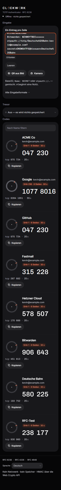
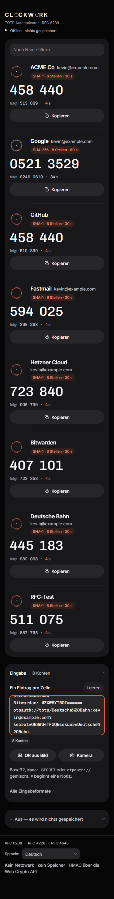
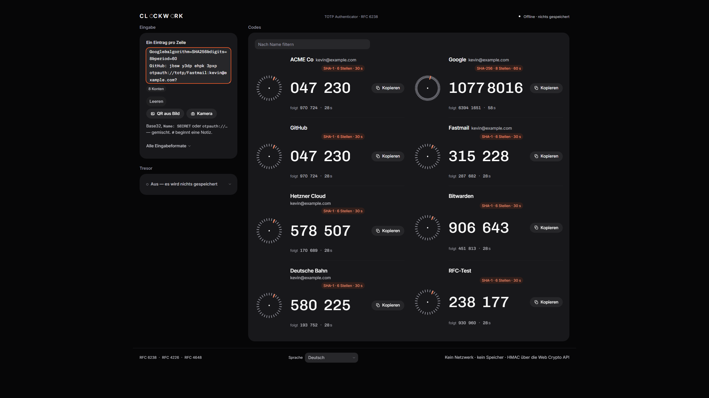
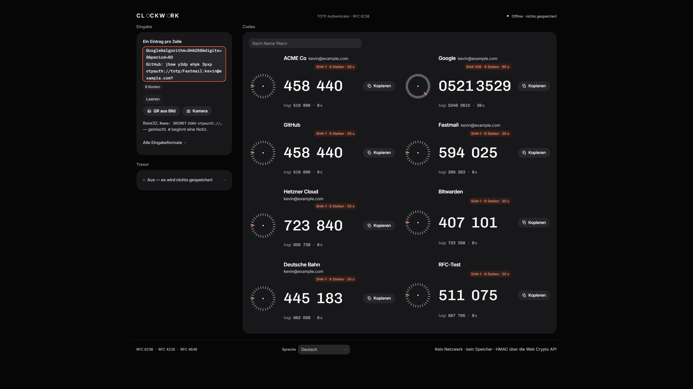
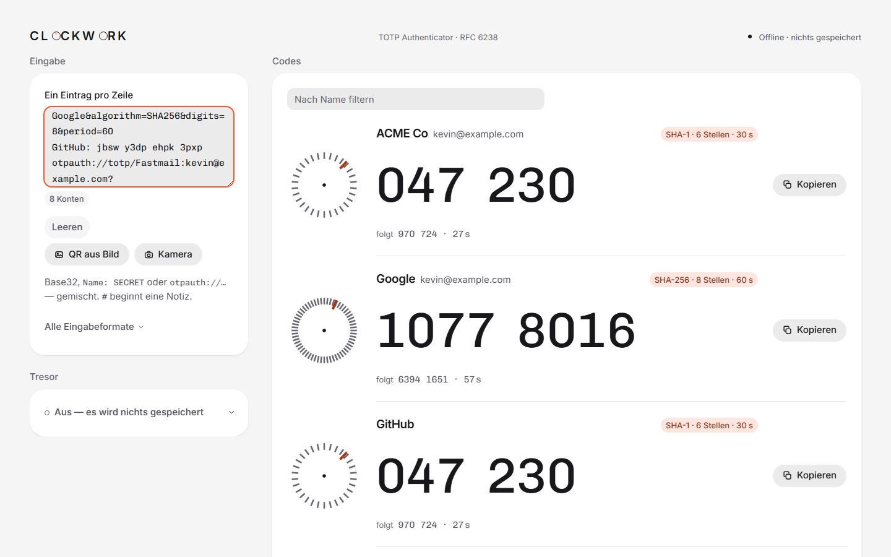
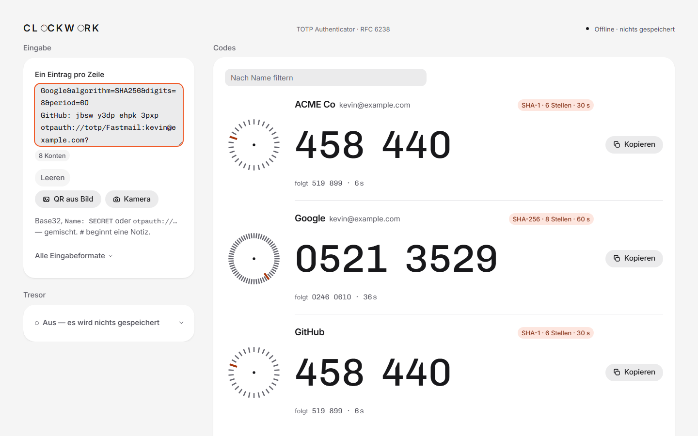
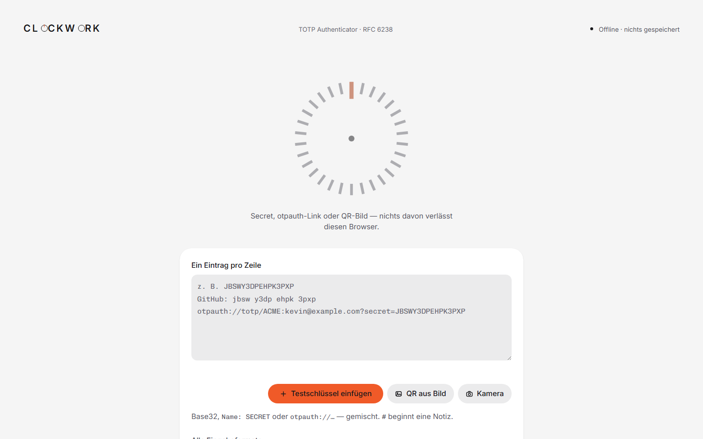

# v1.3.0 → v1.4.0: Erst ablesen, dann einstellen

Der Mobil-Struktur-Pass. Unter 64 rem stellt v1.4.0 die Reihenfolge um: Die
Codes stehen direkt unter dem Kopf, dahinter schrumpft die Bedienung auf zwei
zugeklappte Zeilen — „Eingabe · n Konten" und die Tresor-Statuszeile. Die
Desktop-Shell ist davon **nachgemessen unberührt**: Rail und Bühne stehen über
explizite Rasterspalten an ihren Plätzen, und die Geometrie-Sonde meldet vor
und nach dem Umbau identische Rechtecke auf allen Desktop-Breiten (2560, 1440,
1280, 1024, Leerzustand).

Beide Stände mit derselben Eingabe, derselben Fenstergröße und derselben
Sprache aufgenommen, mit
`node scripts/shoot-compare.mjs <vorher|nachher> docs/v10-vergleich` — einmal
mit ausgechecktem `main` (v1.3.0), einmal mit `v10-mobil`.

|                      | Vorher (v1.3.0)                                | Nachher (v1.4.0)                                |
| -------------------- | ---------------------------------------------- | ----------------------------------------------- |
| 375 px, dunkel       |        |        |
| 2560 px, dunkel      |   |   |
| 1440 px, hell        |  |  |
| Leerzustand, 1440 px |            |            |

Dass die drei Desktop-Zeilen gleich aussehen, ist kein Versehen, sondern die
halbe Zusage des Auftrags. Die Unterschiede dort beschränken sich auf die
Uhr (andere Codes, anderer Zeigerstand) und den Platzhalter im Leerzustand,
der jetzt mit „z. B." beginnt.

## Was sich geändert hat

- **Codes zuerst.** Die Codes-Zone steht im Dokument vor der Bedienseite;
  unter 64 rem ist das die sichtbare Reihenfolge, und dieselbe gilt für
  Tastatur und Screenreader. Der Schreibtisch platziert per Rasterspalten wie
  bisher.
- **Die Eingabe ist eine Zeile.** „Eingabe · 1 Konto" mit Winkel; Tippen
  öffnet den Editor über eine CSS-Schublade (`grid-template-rows`, Federkurve,
  `prefers-reduced-motion` schaltet ab). Der Editor bleibt nur dann von selbst
  offen, wenn der Fokus beim Bühnenwechsel darin liegt — wer gerade tippt, dem
  klappt nichts unter den Fingern zu.
- **Der Tresor ist eine Zeile** — und fällt seit v1.4.0 auch nach dem
  Aufsperren zu: „Offen" sagt die Statuszeile, die Codes stehen längst im
  Feld. Ein gesperrter Tresor öffnet sich weiter von selbst, sein
  Passphrasenfeld ist beim Laden das Wichtigste auf der Seite.
- **„Leeren" wohnt in der Legendenzeile**, rechts oberhalb des Feldes. In der
  Tastenzeile stünde die eine zerstörerische Taste neben den beiden, die etwas
  hereinholen; dort stehen jetzt „QR aus Bild" und „Kamera" als Zweiergitter
  gleicher Breite — ein einzeln umbrechender Knopf ist damit unmöglich.
- **Unter 420 px trägt die Karte ein Kompaktraster:** Blatt 44 px neben dem
  Namen, Code in voller Kartenbreite (14cqi statt 10), Chip unter dem Label,
  Kopiertaste in voller Breite am Kartenende — der Daumenzone.
- **Der Platzhalter beginnt mit „z. B."** — in allen 37 Sprachen, mit dem
  Kürzel der jeweiligen Sprache. Drei plausible Zeilen ohne Markierung sahen
  aus wie echte Einträge.

## Was gemessen wurde

Alle Werte am laufenden Browser bei 375 × 812, hell, deutsch; „vorher" ist der
ausgecheckte v1.3.0-Stand auf einem eigenen Port, kein Archivbild.

| 1 Konto                         | v1.3.0       | v1.4.0                    |
| ------------------------------- | ------------ | ------------------------- |
| Erster Code beginnt bei y =     | **821 px**   | **206 px**                |
| Kopiertaste beim Öffnen im Bild | nein (y=904) | **ja** (y=293)            |
| Breite der Kopiertaste          | 115 px       | **311 px** (Kartenbreite) |
| Höhe der Eingabe-Zone           | 473 px       | **60 px** (zugeklappt)    |
| Seitenhöhe gesamt               | 1193 px      | **812 px** = Fensterhöhe  |

Die letzte Zeile ist das Ziel des Auftrags in einer Zahl: Mit einem Konto
passt die ganze App auf einen Schirm — vorher lag bereits der erste Code
9 Pixel unter der Falz.

| 12 Konten                             | v1.3.0  | v1.4.0     |
| ------------------------------------- | ------- | ---------- |
| Erster Code beginnt bei y =           | 906 px  | **270 px** |
| Kopiertaste des ersten Kontos im Bild | nein    | **ja**     |
| Seitenhöhe gesamt                     | 3936 px | 3473 px    |

Dazu die Zusagen, die unverändert halten müssen — alle nachgemessen:

|                                      | v1.3.0          | v1.4.0            |
| ------------------------------------ | --------------- | ----------------- |
| Desktop-Rechtecke (Geometrie-Sonde)  | —               | **identisch**     |
| Kontrastpaare an gezeichneten Pixeln | 88              | **94** (+6 mobil) |
| Lighthouse mobil, 4×-Drossel         | 98/100/100/100  | 98/100/100/100    |
| Lighthouse Desktop                   | 100/100/100/100 | 100/100/100/100   |
| CLS beim Laden                       | 0,01            | 0,002             |
| `dist/clockwork.html`                | 781 kB dezimal  | 794 kB dezimal    |
| Tests                                | 514             | 514               |

## Der Beweis in 27 Bildern

`node scripts/shoot-mobile.mjs <zielordner>` erzeugt die volle Matrix — 375,
414 und 502 px, je hell, dunkel und Arabisch (RTL), je Leerzustand, 1 Konto
und 12 Konten — und prüft an jeder Aufnahme Reihenfolge, Klappzeilen,
Höhenleiter, Überlauf und das Kompaktraster. Die Bilder liegen nicht im Repo
(27 Aufnahmen wiegen mehr als dieser ganze Vergleich); der Befehl erzeugt sie
in einer Minute neu.
