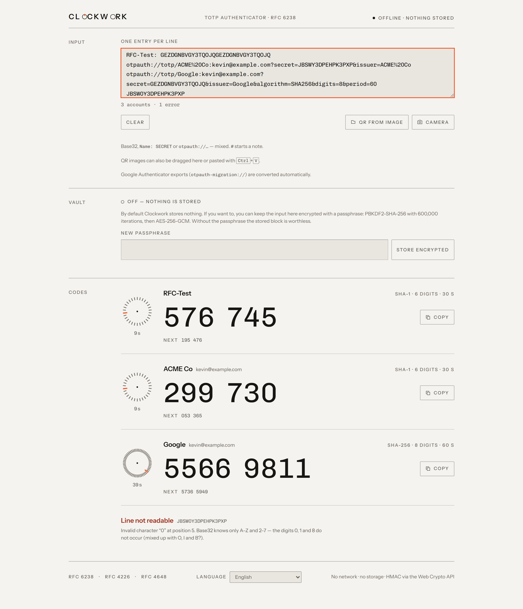
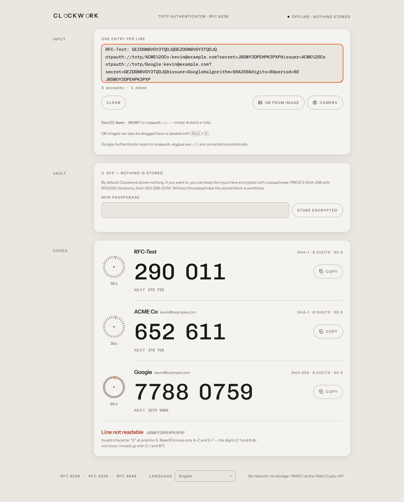
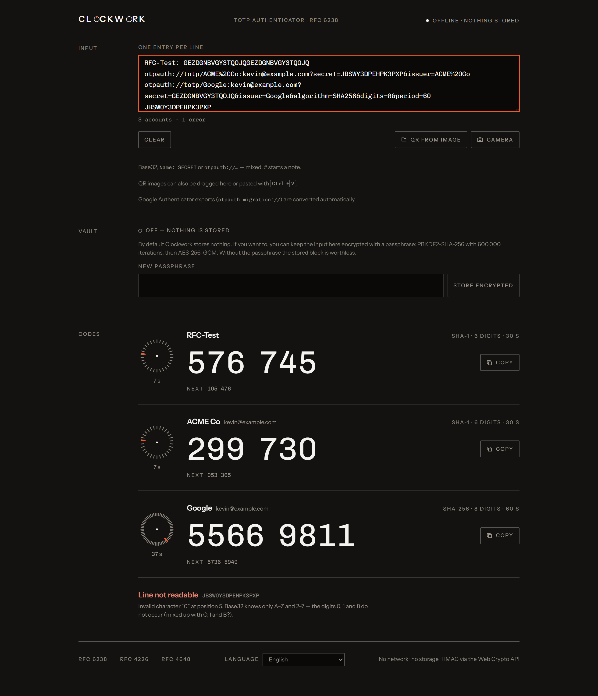
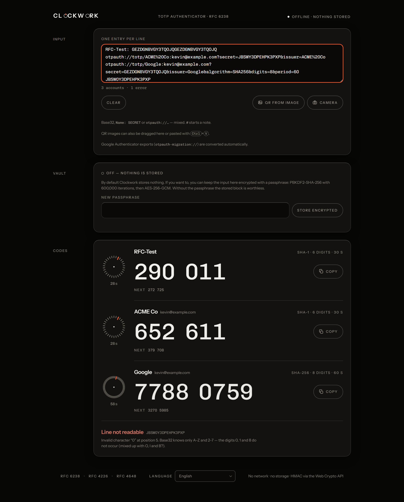
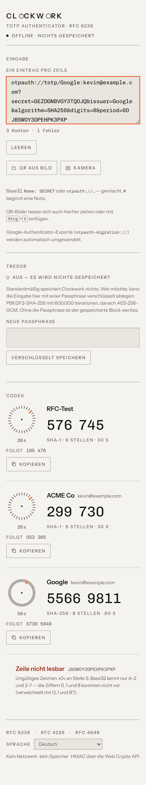
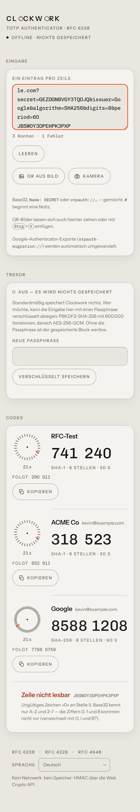
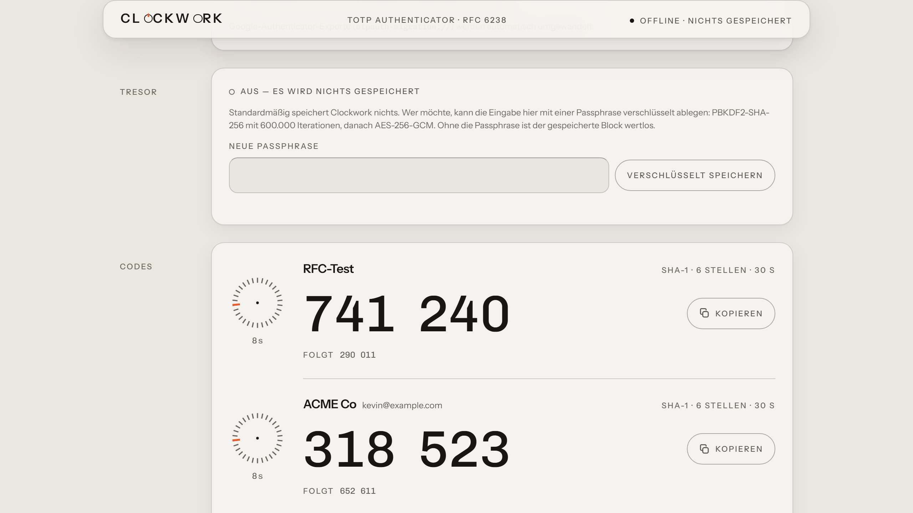
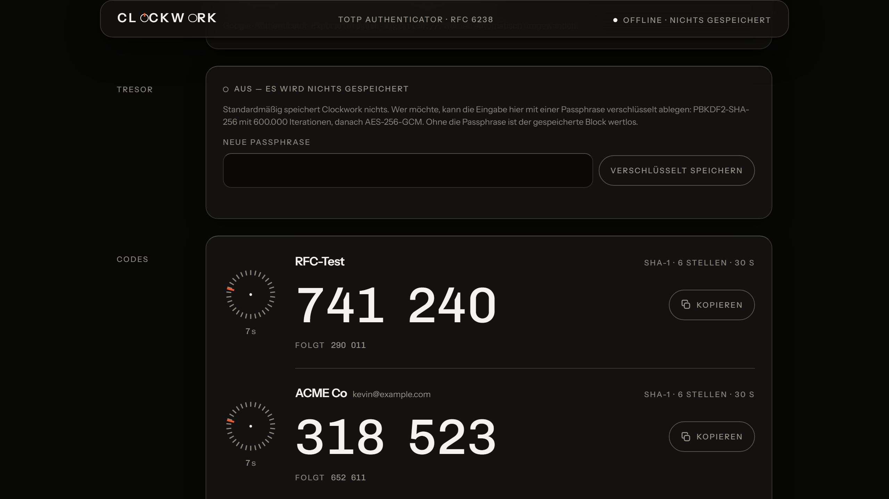

# V4 → V5: „Instrument trifft Apple"

Gleiche Eingabe, gleiche Fenstergröße, gleiche Sprache — nur das Material ist
anders. Alle Aufnahmen entstehen mit `npm run shots`.

|        | Vorher (V4)                     | Nachher (V5)                     |
| ------ | ------------------------------- | -------------------------------- |
| Hell   |      |      |
| Dunkel |  |  |
| 375 px |    |    |

## Was sich geändert hat

- **Die Zonen sind Gehäusegruppen geworden.** Runde Ecken (18 px), Haarlinie,
  eine weiche Erhebung. Der Untergrund liegt eine Stufe tiefer als die
  Gehäusefläche — sonst gäbe es nichts, worüber sich etwas erheben könnte.
- **Die Konten sind KEINE Karten geworden.** Sie bleiben Kanalzüge in einem
  Gehäuse, getrennt durch Haarlinien. Neu ist nur, wo die Fuge anfängt: hinter
  dem Zifferblatt statt an der Gehäusekante.
- **Der Kopf klebt oben** und bekommt Frost, sobald etwas unter ihm liegt.
- **Tasten sind Pillen** und geben beim Druck um 3 % nach — zusätzlich zur
  Umkehrung aus V2, die bleibt.
- **Bedien-Icons sind rund**, Instrument-Elemente bleiben scharf.

## Der Frost

Auf einem gewöhnlichen Standbild steht die Seite ganz oben, und dann ist der
Kopf flach — der interessante Zustand wäre nie zu sehen. Diese beiden
Aufnahmen entstehen deshalb gescrollt:

| Hell                                  | Dunkel                                    |
| ------------------------------------- | ----------------------------------------- |
|  |  |

Die Deckung (78 % hell, 84 % dunkel) ist nachgemessen, nicht geschätzt:
`node scripts/check-contrast.mjs` liest die tatsächlich gezeichneten Pixel
hinter dem Text — samt Weichzeichner — und rechnet daraus den Kontrast.
