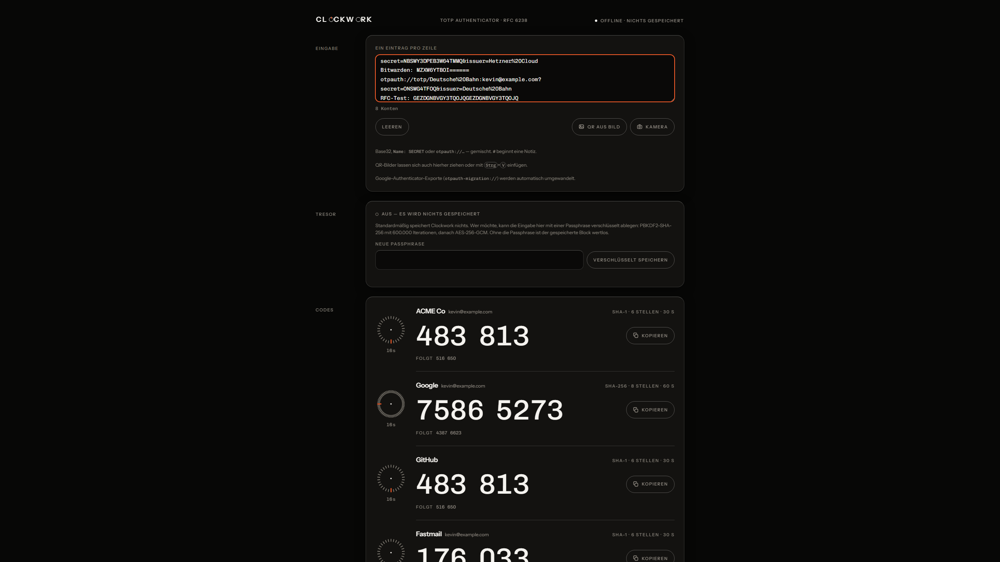
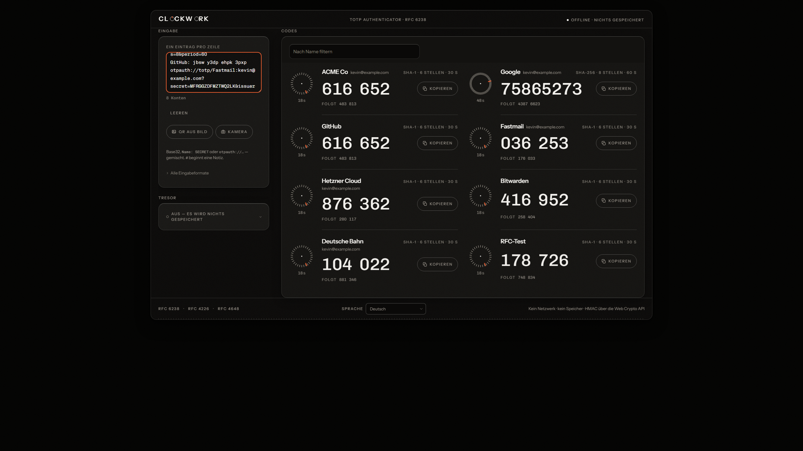
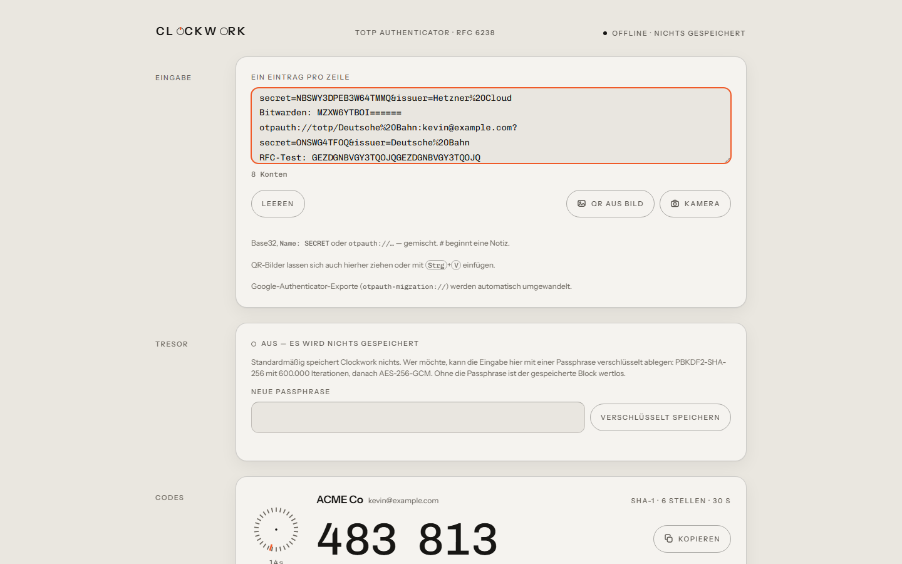
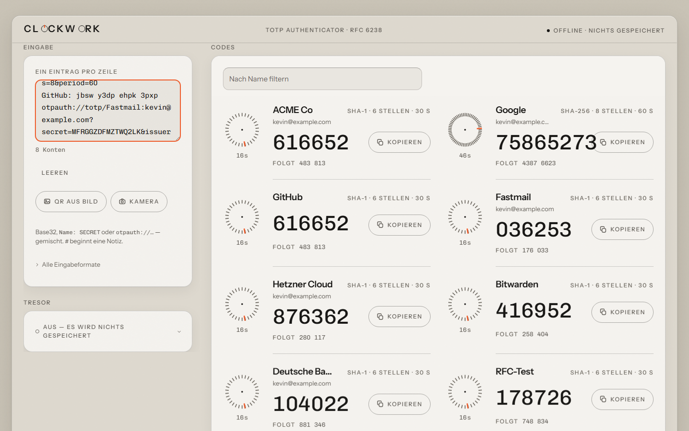
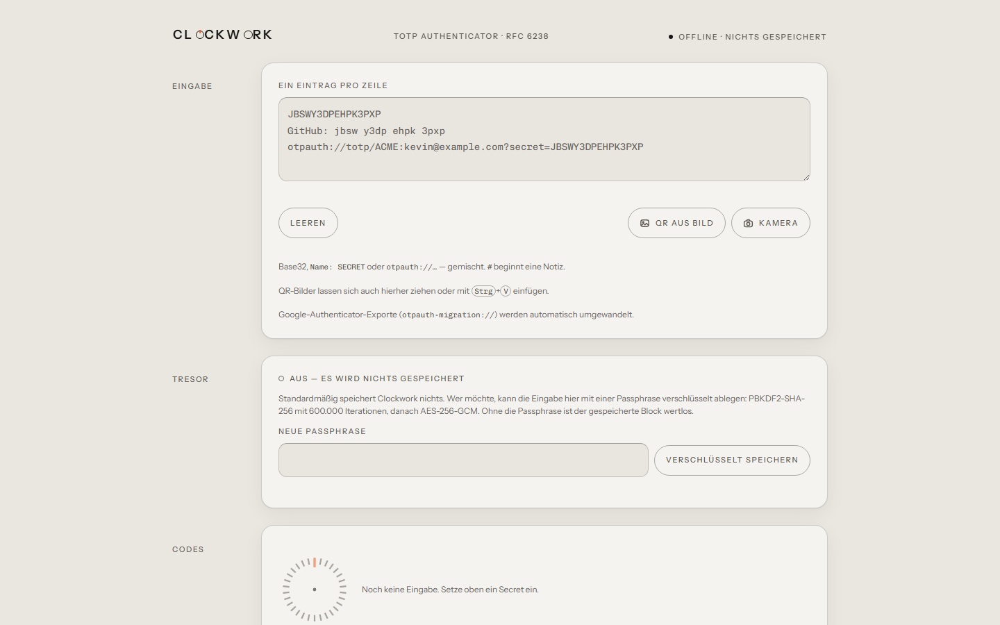
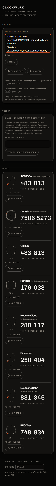
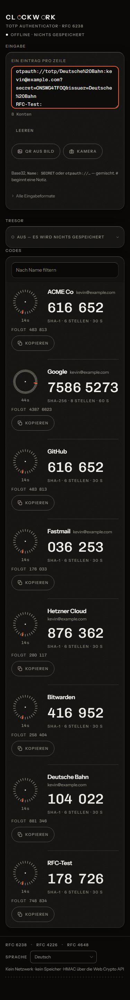

# v1.1.0 → v1.2.0: Struktur zuerst

Zwei Versionen der Gestaltung liegen dazwischen. V6 (Korn, Lichtkante,
Sprach-Listbox, Tick-Trenner) ist nie einzeln veröffentlicht worden — seine
Komposition wurde von V7 ersetzt, seine Bauteile sind geblieben. Der Vergleich
hier zeigt deshalb den Abstand zum letzten RELEASE, nicht zum letzten Commit.

Gleiche Eingabe (acht Konten), gleiche Fenstergröße, gleiche Sprache.
Aufgenommen mit `node scripts/shoot-compare.mjs <vorher|nachher>` — einmal mit
ausgechecktem `main`, einmal mit `v7-struktur`.

|                      | Vorher (v1.1.0)                                | Nachher (v1.2.0)                                |
| -------------------- | ---------------------------------------------- | ----------------------------------------------- |
| 2560 px, dunkel      |   |   |
| 1440 px, hell        |  |  |
| Leerzustand, 1440 px |            |            |
| 375 px, dunkel       |        |        |

## Was auf 2560 px falsch war

Die Seite war eine 62 rem breite Spalte in der Mitte eines leeren Schirms. Sie
lief nicht über und sie war nicht hässlich — sie war bloß nirgends. Rechts und
links standen je 784 px Untergrund, und nichts sagte, wo die App aufhört.

Drei Dinge sind daran geändert worden, und alle drei sind Struktur, nicht
Politur:

- **Das Gehäuse ist eine Fläche geworden.** Bis dahin war „Gehäuse" eine
  Redensart für ein paar Panels auf einem Untergrund. Jetzt hat das Gerät einen
  eigenen Ton, eine Haarlinie, eine Lichtkante nach innen und einen Schatten —
  und es liegt sichtbar auf einer Werkbank. Drei Tonebenen statt zwei.
- **Kopf und Fuß laufen über die volle Gehäusebreite.** Der Fuß ist die
  Bodenplatte des Geräts, kein freischwebender Text darunter.
- **Die Bühne gehört den Codes.** Links eine feste Bedienseite von 23 rem,
  rechts alles andere. Ab 1400 px und acht Konten zweispaltig, ab acht Konten
  mit Filterzeile.

## Zwei Zustände statt einer Komposition

Der eigentliche Fehler war nicht die Spaltenzahl, sondern dass eine einzige
Anordnung zwei völlig verschiedene Situationen bedienen musste. Wer nichts
eingegeben hatte, bekam eine volle Bedienspalte neben einer leeren Kiste.

Der Leerzustand ist jetzt eine eigene Bühne: Emblem, ein Satz, das Eingabefeld
selbst in der Mitte, darunter die drei Wege hinein. Kein Tresor — er ist erst
relevant, wenn es etwas zu speichern gibt. Keine leere Codes-Zone.

Eine Ausnahme mit Grund: Ein **gesperrter** Tresor bleibt sichtbar. Beim Laden
ist das Feld dann leer, gerade weil der Inhalt im Tresor liegt — verschwände die
Zone, wäre das Passphrasenfeld unerreichbar.

## Was gemessen wurde

Beide Stände mit demselben Verfahren nachgemessen, nicht aus Tokens gerechnet:
gemessen wird der **stärkste Sprung über eine Kante** — ein schmaler Streifen
quer über die Oberkante, Zeile für Zeile gemittelt. Was den Sprung erzeugt,
ist der Messung gleichgültig: Tonunterschied, Haarlinie oder Lichtkante.

|                                    | v1.1.0                | v1.2.0     |
| ---------------------------------- | --------------------- | ---------- |
| Panel gegen seinen Grund, hell     | 1,46:1                | **1,55:1** |
| Panel gegen seinen Grund, dunkel   | 2,57:1                | 2,53:1     |
| Gehäuse gegen die Werkbank, hell   | 1,00:1 (kein Gehäuse) | **1,73:1** |
| Gehäuse gegen die Werkbank, dunkel | 1,00:1 (kein Gehäuse) | **1,52:1** |
| Layout-Shift beim Laden            | 0,175                 | **0,001**  |
| Lighthouse Desktop                 | 92                    | **100**    |
| Lighthouse mobil, 4×-Drossel       | 98                    | 98         |

Die zweite Zeile ist der ehrliche Teil: Im dunklen Modus hat sich am Panel
**nichts verbessert**, es ist sogar um 0,04 schlechter geworden. Das ist keine
Nachlässigkeit, sondern Physik. Nacht liegt bei einer relativen Leuchtdichte
von 0,0074; selbst gegen reines Schwarz wären daraus höchstens 1,15:1. Ein
Panel im Dunkeln über seinen TON abzuheben ist nicht möglich — dort trägt die
Lichtkante, und die war schon vorher da.

Was sich im Dunkeln geändert hat, steht in den beiden Zeilen darunter: Es gibt
jetzt überhaupt eine Gerätekante. Vorher war da nichts zu messen.

Im hellen Modus hat die Fläche zugelegt, wenn auch bescheiden: Der reine
Tonabstand zwischen Panel und seinem Grund ist von 1,11:1 auf 1,27:1
gestiegen. Weiter zu gehen hätte den dunkleren Gehäuseton gekostet, auf dem die
Zonengravur steht — sie liegt jetzt bei 5,02:1 und hätte dann keine Reserve
mehr über den geforderten 4,5:1.
