# V7 → V8: Klarheit statt Nebel

V7 hat die Struktur gebaut — Gehäuse, Rail, Bühne, zwei Zustände. V8 hat an
dieser Struktur nichts angefasst und stattdessen die Ausführung nachgezogen:
Flächen, Kontraste, Bauteile. Vorbild waren die Werte von
[HeroUI](../v8-referenzen.md), nachgebaut in eigenem CSS.

Beide Stände mit derselben Eingabe (acht Konten), derselben Fenstergröße und
derselben Sprache aufgenommen, mit
`node scripts/shoot-compare.mjs <vorher|nachher> docs/v8-vergleich` — einmal mit
ausgechecktem `v7-struktur`, einmal mit `v8-klarheit`.

|                      | Vorher (V7)                                | Nachher (V8)                                |
| -------------------- | ------------------------------------------ | ------------------------------------------- |
| 2560 px, dunkel      | 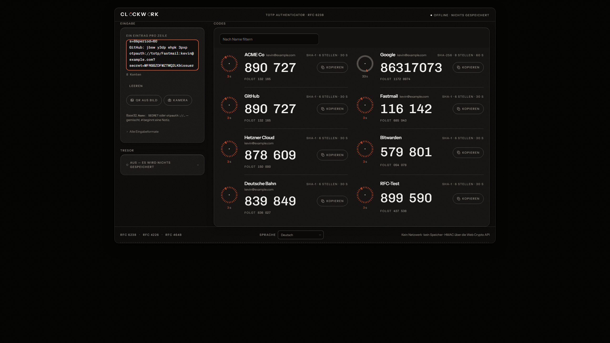  | 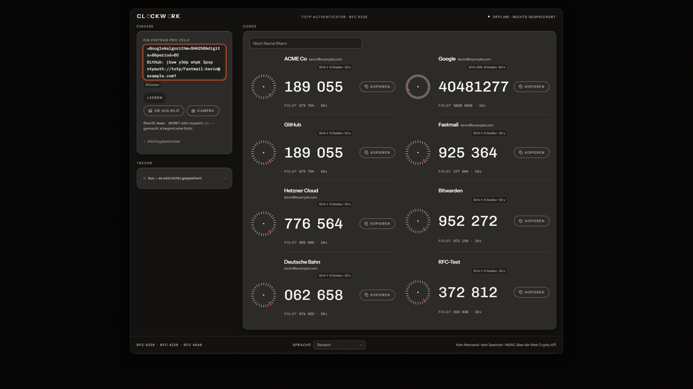  |
| 1440 px, hell        | 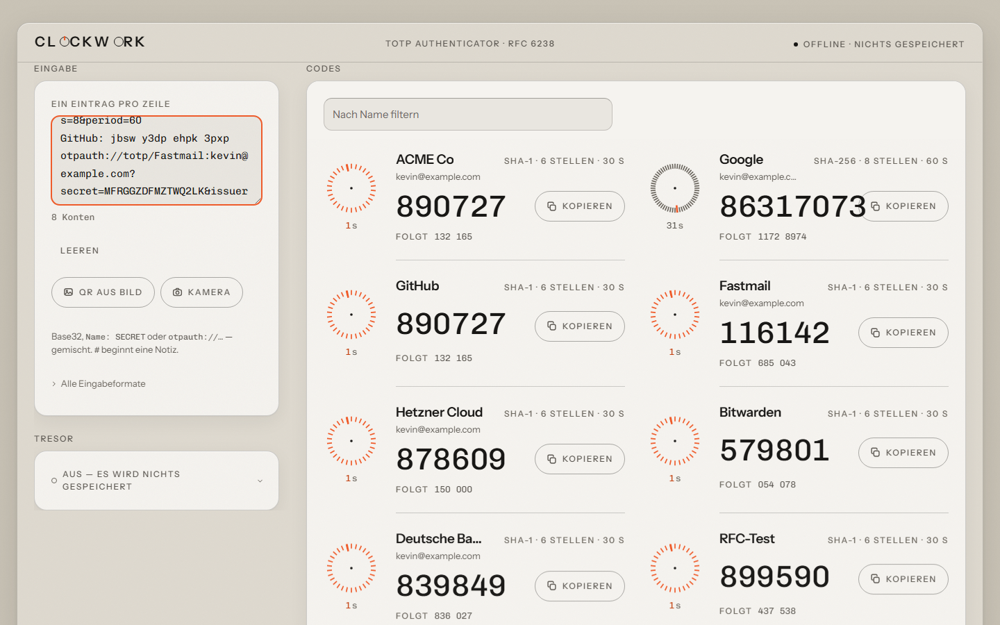 | 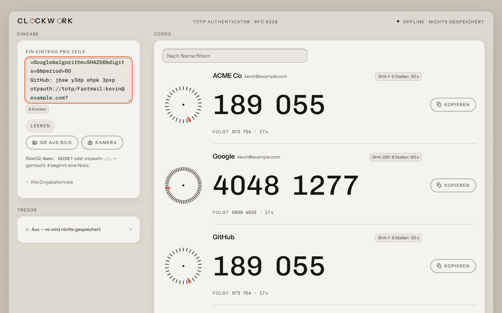 |
| Leerzustand, 1440 px | 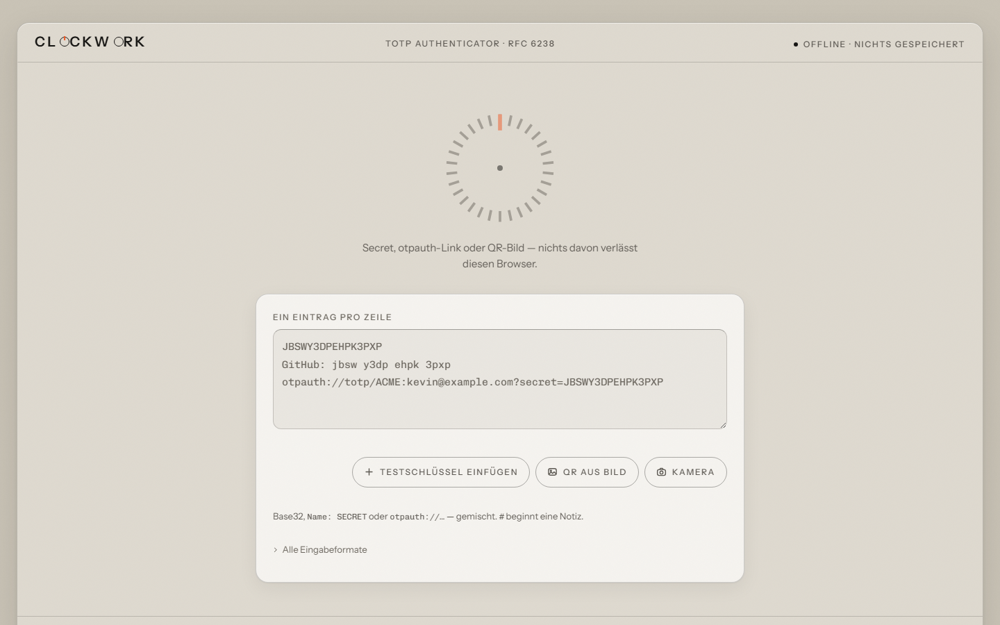           | 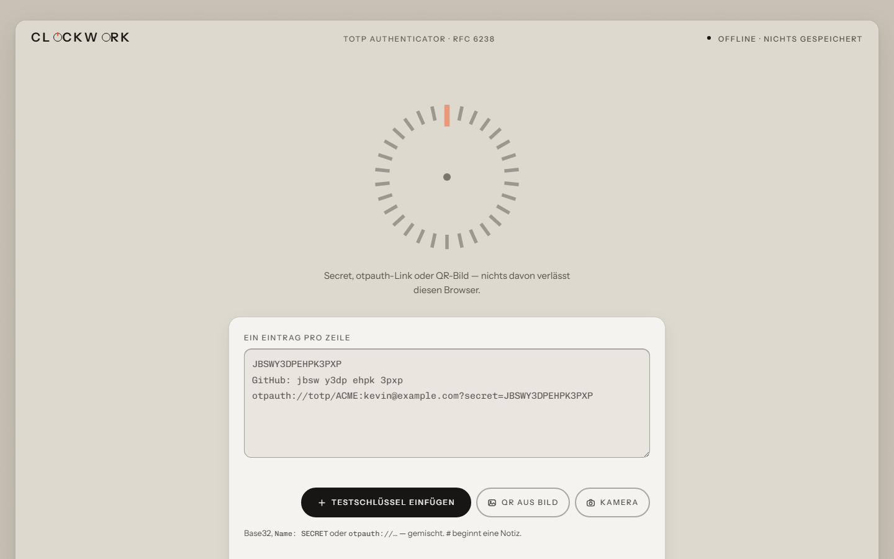           |
| 375 px, dunkel       | 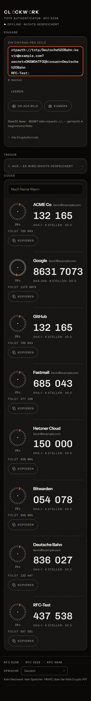       | 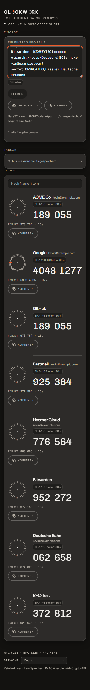       |

Ein Unterschied auf dem 1440-px-Bild ist kein Versehen: V7 stellte dort schon
zwei Code-Spalten nebeneinander, V8 erst ab 98 rem. Die Code-Karte hat seit V8
eine feste Geometrie — Zifferblatt, Code und Kopiertaste auf einer Achse —, und
eine feste Geometrie hat eine Mindestbreite. 1440 px geben sie nicht her.

## Was sich geändert hat

- **Der Frost ist weg.** Der klebende Kopf ist deckend im Gehäuseton. Eine
  Deckplatte, durch die man hindurchsieht, ist keine — und ein deckender Kopf
  hat einen nachrechenbaren Kontrast, weil er nicht mehr davon abhängt, was
  gerade darunter durchfährt.
- **Korn nur noch auf der Werkbank**, also außerhalb des Geräts. Auf einer
  Fläche, die man abliest, ist es keine Materialität, sondern Unruhe.
- **Fünf Flächensprossen statt drei.** Bis V7 stand ein einziges Token sowohl
  für „versenkt" als auch für „berührt", also für das Gegenteil.
- **Die dunkle Leiter läuft nach oben.** Nacht ist das Gehäuse, die Panels
  steigen darüber. Der Grund ist Physik, siehe die Tabelle unten.
- **Drei Knopfvarianten**, feste Höhenleiter, Umrisse mit 2 px statt 1.
- **Chips für Metadaten** statt Streutext in der Ecke.

## Was gemessen wurde

Die Flächenleiter ist als Kontrastverhältnis benachbarter Sprossen gemessen
(Einzelwerte im Kopf von [`../../src/styles/tokens.css`](../../src/styles/tokens.css)),
alles andere an den gezeichneten Pixeln bzw. am laufenden Browser.

|                                            | V7               | V8                   |
| ------------------------------------------ | ---------------- | -------------------- |
| Flächenleiter dunkel, Werkbank bis oben    | 1,102            | **1,690**            |
| Sprossen darin                             | 3 Töne, 2 Stufen | **5 Töne, 4 Stufen** |
| Flächenleiter hell, Werkbank bis Panel     | 1,584            | 1,584                |
| Sprossen darin                             | 4 Töne, 3 Stufen | **5 Töne, 4 Stufen** |
| Geprüfte Kontrastpaare                     | 42               | **92**               |
| Textstufen ≥ 4,5:1 auf JEDER Fläche        | mit 2 Ausnahmen  | **ohne**             |
| Frostflächen (`backdrop-filter`)           | 1, mit Rückfall  | **0**                |
| Compositor-Ebenen im Ruhezustand, 8 Konten | 66               | **18**               |
| Lighthouse Desktop                         | 100              | 100                  |
| Lighthouse mobil, 4×-Drossel               | 98               | 98                   |
| Layout-Shift beim Laden                    | 0,001            | 0,001                |

Die dunkle Leiter ist der eigentliche Gewinn. Zu vergleichen ist dabei nicht
1,102 mit 1,690, sondern der Abstand zu 1,000 — denn 1,000 heißt „kein
Unterschied": 0,102 gegen 0,690, also das 6,8-Fache.

Nacht lag in V7 auf den PANELS, und darunter war kaum noch Platz: höchstens
1,122:1 bis Schwarz, aufgeteilt auf zwei Stufen. Gemessen waren es 1,037 und
1,063 — zwei Grenzen, die man nicht sieht. V8 dreht die Leiter um: Nacht ist
jetzt das Gehäuse, und die Panels steigen darüber. Das Markenhandbuch nennt
Papier und Nacht die _Gehäuseflächen_; das ist die wörtlichere Lesart.

Im hellen Modus stehen dieselben 1,584 auf beiden Seiten, und das ist kein
Tippfehler: V8 hat dort nur eine Sprosse ZWISCHEN bestehende gesetzt
(„berührt"), nicht die Enden verschoben. Die helle Leiter lag schon vor V8
weiter auseinander als die Referenz.

Die beiden Lighthouse-Zeilen stehen unverändert da, und das ist ehrlich so
gemeint: V8 hat nichts am Ladeverhalten geändert. Was es geändert hat, steht
eine Zeile darüber — die 48 Compositor-Ebenen waren Arbeitsspeicher, keine
Ladezeit, und tauchen in keiner Lighthouse-Zahl auf.

### Ein Nebenbefund zur Bildgröße

Dieselben vier Aufnahmen, dieselbe Auflösung, dieselben Bildinhalte:

| Aufnahme        | V7      | V8      | Ersparnis |
| --------------- | ------- | ------- | --------- |
| 2560 px, dunkel | 1031 kB | 621 kB  | 40 %      |
| 1440 px, hell   | 588 kB  | 196 kB  | 67 %      |
| Leerzustand     | 291 kB  | 121 kB  | 58 %      |
| 375 px, mobil   | 696 kB  | 208 kB  | 70 %      |
| **gesamt**      | 2606 kB | 1146 kB | **56 %**  |

Das ist keine Zusage an Nutzer — diese PNGs werden nicht ausgeliefert. Es ist
ein Messwert für etwas, das sich sonst schlecht beziffern lässt: **Korn ist
Rauschen, und Rauschen komprimiert nicht.** Ein Bild, das nach dem Entfernen
zweier Kornlagen halb so groß ist, hatte vorher die Hälfte seiner Daten in
Zufall stecken. Genau das war mit „Matsch" gemeint.

## Rasterbilder zum Abstands-Feinpass

Vier Panels, je vorher und nachher, mit einem 8-px-Raster darüber. Das Raster
hängt am Panel und nicht am Fenster: Interessant ist, wie der Inhalt zu seinem
Panel steht, nicht wie das Panel zum Bildschirm. Jede achte Linie ist kräftiger,
also alle 64 px — ohne diese Betonung zählt man auf einem Bild mit vierzig Linien
nicht mehr mit, und das Zählen ist der Zweck.

Aufgenommen bei 1450 px, dunkel, deutsch, mit
`node scripts/shoot-grid.mjs <vorher|nachher>`. Was hier ersetzt wurde und mit
welchen Messwerten, steht in [`../v8-abstands-audit.md`](../v8-abstands-audit.md).

Diese acht Bilder vergleichen **nicht** V7 mit V8, sondern den Stand vor und
nach dem Abstands-Feinpass — also die letzten beiden Commits auf `v8-klarheit`.

|               | Vorher                               | Nachher                                |
| ------------- | ------------------------------------ | -------------------------------------- |
| Eingabe-Panel | 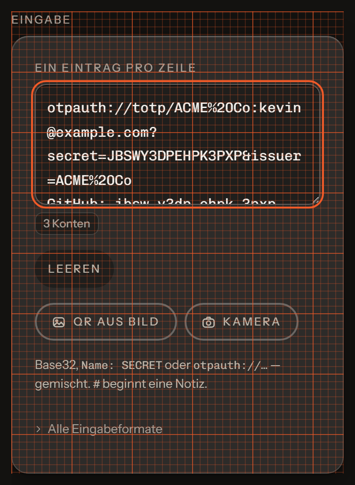 | 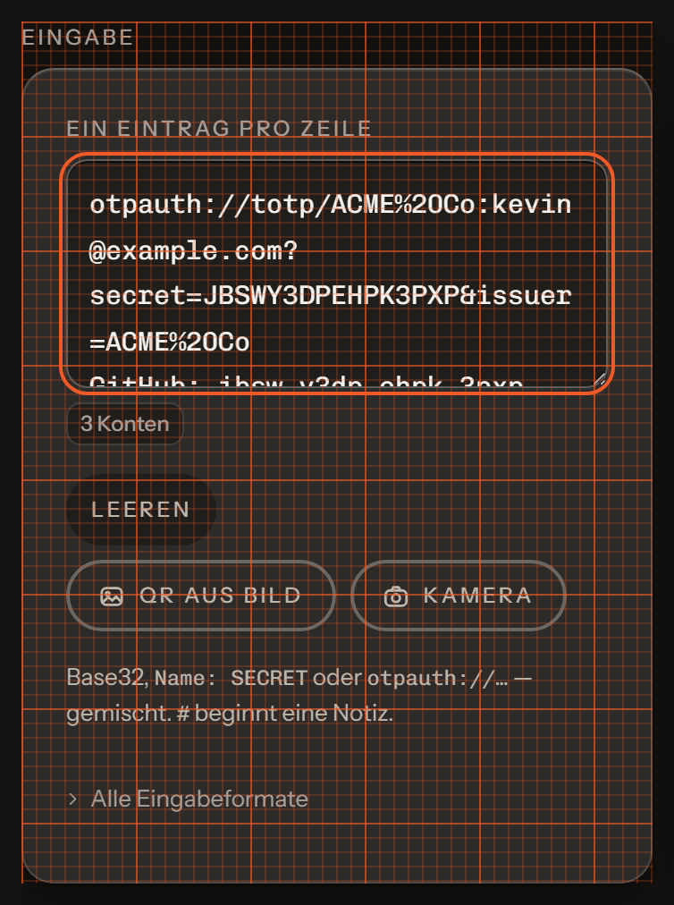 |
| Tresor-Panel  | 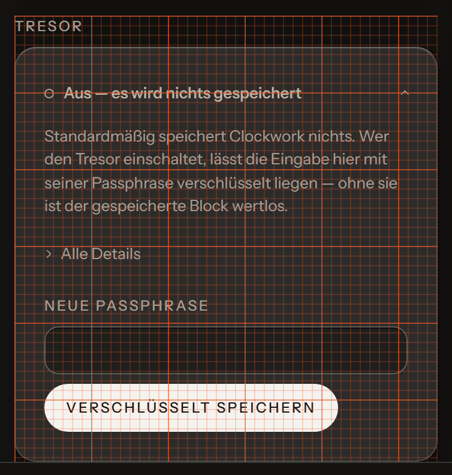  | 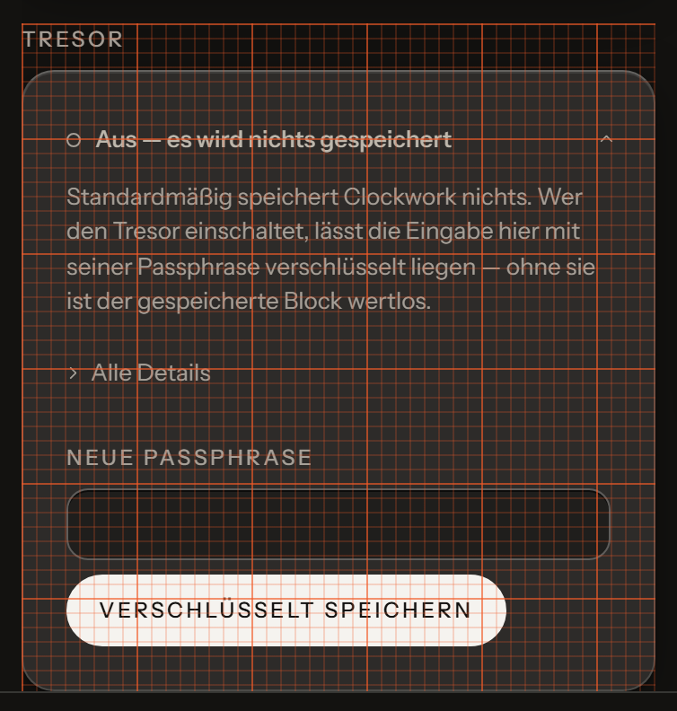  |
| Code-Karte    | 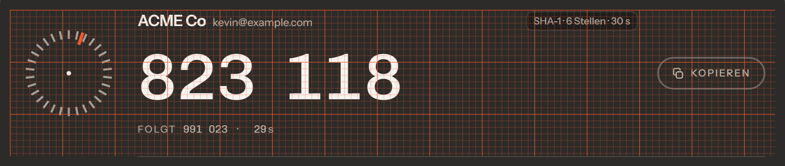   | 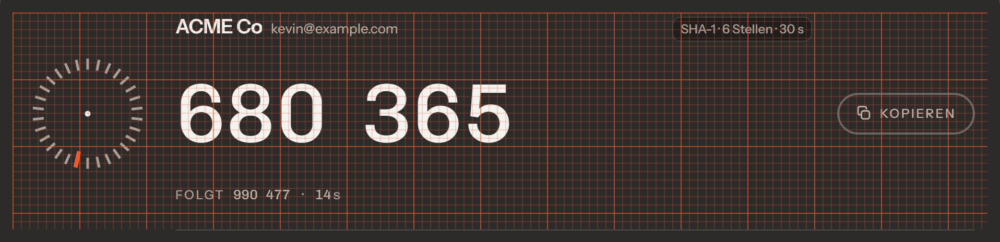   |
| Kopfzeile     | 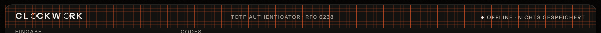    | 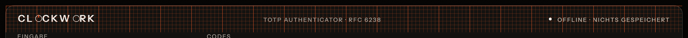    |

### Worauf zu achten ist

**Eingabe-Panel** — unter den Tasten stand eine leere Live-Region und hat 16 px
Fuge gekostet, ohne etwas zu sein. Und der erzwungene Zeilenumbruch der
Tastenzeile kostete 16 px, während zwischen „QR aus Bild" und „Kamera" 8 standen:
dieselbe Gruppe mit zwei verschiedenen Lücken.

**Tresor-Panel** — unterhalb von „Verschlüsselt speichern" lagen 20 px tote Fuge
(die Hülle dreier versteckter Tasten plus die leere Fehlerzeile). Die Statuszeile
brach auf zwei Zeilen, weil ein Satz in gesperrten Versalien stand; Leuchte und
Winkel saßen danach zwischen den Zeilen. Und das Passwortfeld war 51,5 px hoch
neben einem 40-px-Knopf.

**Code-Karte** — Zifferblatt und Kopiertaste lagen 4,5 px neben dem Code, weil sie
über alle drei Zeilen zentriert waren und die drei Zeilen nicht symmetrisch sind.
Der Chip stand 5,75 px neben der Grundlinie des Kontonamens.

**Kopfzeile** — Wortmarke, Markenzeile und Zustand lagen auf drei verschiedenen
Grundlinien (Spanne 8 px), obwohl das CSS sie über `align-items: baseline` auf eine
legte. Ursache war dieselbe wie beim Chip: Ein Flexkasten mit zentrierten Kindern
hat keine Schrift-Grundlinie, sondern eine Ersatzlinie an seiner Unterkante.

Der vollständige Satz (sechs Panels × hell und dunkel) entsteht mit demselben
Befehl und liegt unter `screenshots/` — im Repo stehen nur diese acht, weil
`docs/` ohnehin die Stelle ist, an der dieses Projekt Platz verliert.
